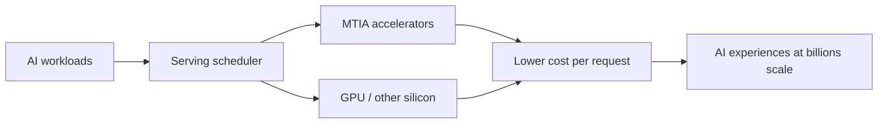

# Four MTIA Chips in Two Years: Scaling AI Experiences for Billions

> 类型：大厂博客/工程文章
> 分类：Industry / Meta AI
> 推荐等级：可收藏
> 创建日期：2026-06-08
> 原文链接：https://ai.meta.com/blog/meta-mtia-scale-ai-chips-for-billions/

## 一句话结论

Meta 介绍两年内四代 MTIA 芯片，核心目标是在全球规模降低多样 AI workload 的 serving 成本。

## 元信息

- 来源：Meta AI Blog
- 作者/机构：Meta AI
- 发布时间：2026-03-11
- 原文：https://ai.meta.com/blog/meta-mtia-scale-ai-chips-for-billions/
- 相关标签：hardware, serving, accelerator

## 专业解读

虽然不是本周最新，但对 AI Infra 仍重要：大厂正在通过自研 ASIC + 异构 silicon portfolio 降低推荐、助手、多模态模型的单位推理成本。对工程师的启发是 serving 系统要面向多硬件后端、模型快速演化和 cost/SLO 联合优化，而不是只绑定 CUDA GPU。

## 通俗解释

Meta 在做自己的 AI 芯片，用来更便宜地服务几十亿用户的推荐和 AI 助手。

## 图示

## 核心要点

- MTIA 是 Meta 自研 AI accelerator 家族。
- 两年四代，强调快速迭代和灵活 silicon portfolio。
- 目标是全球规模 AI experience 的成本效率。

## 对我的影响

- AI Infra：关注异构后端抽象、编译栈和调度。
- LLM 工程：模型结构会越来越受 serving 硬件约束。
- RL / Game AI：大规模在线推理成本会影响训练/部署策略。
- 建议动作：可收藏，作为硬件-模型协同案例。

## 局限性 / 风险

- 大厂自研芯片经验不一定能直接复制到普通团队。
- 公开博客通常不会给出完整 kernel、compiler、TCO 细节。

## 相关链接

- 原文：https://ai.meta.com/blog/meta-mtia-scale-ai-chips-for-billions/

## 标签

#ai-radar #industry #meta #hardware #serving
