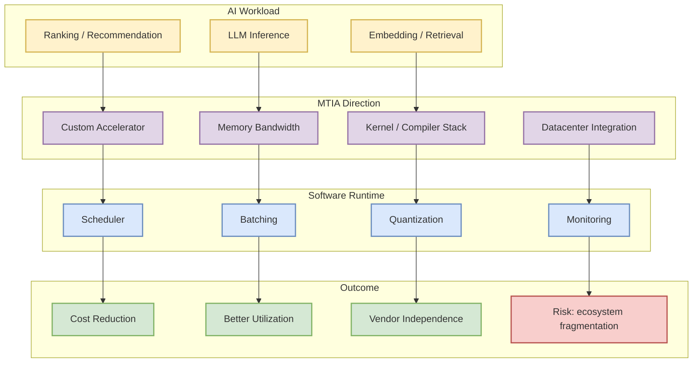
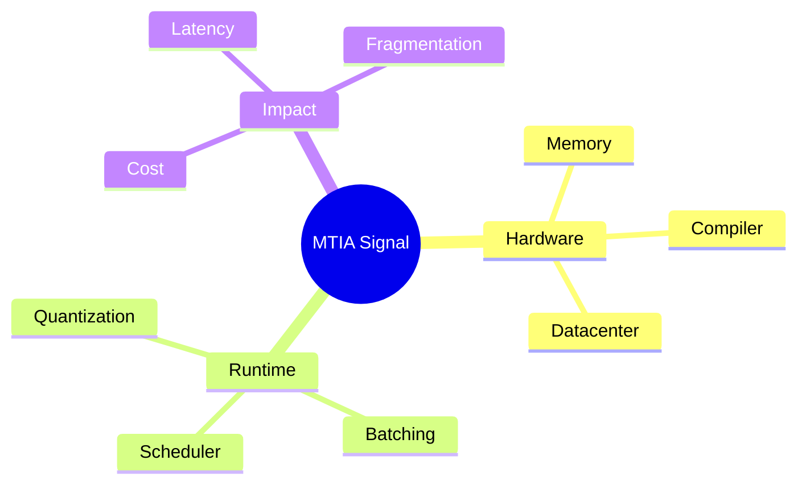

# Meta AI: Four MTIA Chips in Two Years

> 类型：大厂博客
> 大类：大厂资讯 / 工程博客 / Research
> 小类：AI Hardware / Infra
> 推荐等级：可 skim
> 创建日期：2026-06-14
> 原文链接：https://ai.meta.com/blog/
> 网页详情：https://github.com/dyt27666-oss/AI-news-report-obsidians/blob/main/Industry/Meta/Four-MTIA-chips-in-two-years.md
> 返回日报：[[Daily/2026-06-14]]

## 一句话结论

Meta 两年四代 MTIA 芯片的信号说明大厂仍在加速自研 AI 硬件，把模型、runtime 和硬件协同作为成本优化方向。

## TL;DR

- **它是什么**：Meta AI Blog 今日可见的 MTIA 芯片进展条目。
- **为什么重要**：自研硬件会影响 serving runtime、kernel、模型结构和成本曲线。
- **和我相关的点**：推理优化不能只看软件框架，也要看 GPU/NPU/ASIC 的内存、带宽和调度约束。
- **建议动作**：作为硬件趋势观察项，后续跟踪 MTIA 对推理 workload 的适配。

## 元信息

| 字段 | 内容 |
|---|---|
| 发布方/来源 | Meta AI |
| 大厂/实验室 | Meta AI |
| 栏目/来源类型 | Blog / AI Hardware |
| 作者/机构 | Meta AI |
| 发布时间 | 今日扫描到的最新列表项，具体日期需打开原文确认 |
| 原文 | [原文](https://ai.meta.com/blog/) |
| 代码 | 未发现 |
| PDF | 未发现 |
| 标签 | #meta #hardware #serving #ai-infra |

## 信息压缩图示

## 专业解读

MTIA 的快速迭代说明 Meta 这类大厂正在把 AI workload 的成本优化下沉到硬件层。对 AI Infra 工程师而言，软件 serving 框架未来可能需要更强的硬件抽象能力：不同 accelerator 的 kernel、内存层级、通信路径和量化支持会影响最终架构选择。

## 通俗解释

这像大厂不再只买通用发动机，而是为自己的 AI 工厂定制发动机，以降低长期运行成本。

## 关键机制拆解

| 机制 | 解决的问题 | 为什么有效 | 可能的坑 |
|---|---|---|---|
| 自研 accelerator | 通用 GPU 成本高 | 针对内部 workload 优化 | 生态兼容成本高 |
| Runtime 协同 | 硬件能力难发挥 | 调度和 kernel 配套 | 软件栈复杂 |
| Datacenter integration | 大规模部署瓶颈 | 硬件、网络、监控统一设计 | 迁移成本高 |

## 对我的影响

| 维度 | 影响 | 建议动作 |
|---|---|---|
| AI Infra | 硬件差异会影响 serving 选型 | 记录不同 accelerator 支持矩阵 |
| LLM 工程 | 量化和 kernel 适配更重要 | 关注 compiler/runtime |
| RL / Game AI | 批量 rollout 推理受硬件成本影响 | 估算推理吞吐成本 |
| Agent / Eval | 大量并发 agent 需要便宜推理 | 关注低成本 serving |

## 可信度与局限性

- 证据强度：来自 Meta AI Blog 列表抓取。
- 局限性：缺少正文和规格细节。
- 风险：MTIA 生态可能主要服务 Meta 内部，外部可迁移性有限。

## 我应该如何跟进

1. 补读原文确认 MTIA 规格和用途。
2. 关注是否有 compiler/runtime 公开信息。
3. 对照 NVIDIA、TPU、AWS Trainium/Inferentia 做趋势比较。

## 相关链接

- 原文：https://ai.meta.com/blog/
- 网页详情：https://github.com/dyt27666-oss/AI-news-report-obsidians/blob/main/Industry/Meta/Four-MTIA-chips-in-two-years.md
- 相关卡片：[[Daily/2026-06-14]]

## 标签

#ai-radar #meta #hardware #serving #ai-infra
