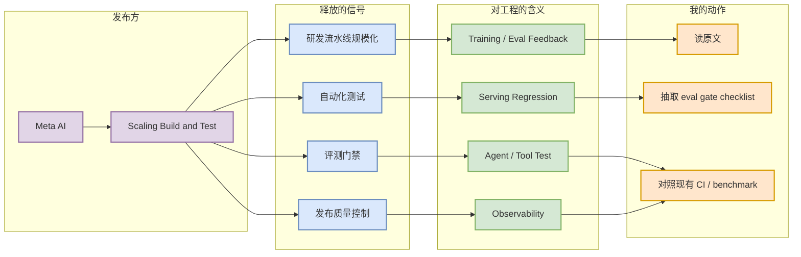
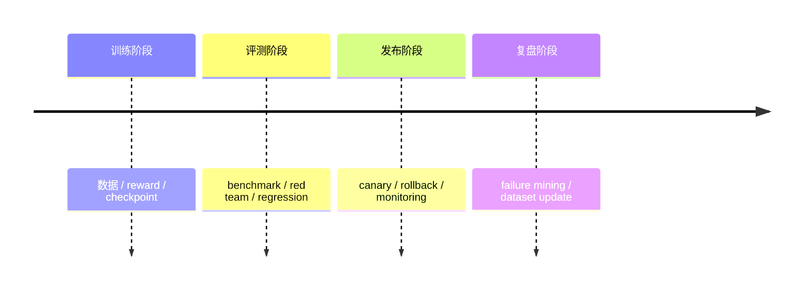

# Meta AI: Scaling How We Build and Test Our Most Advanced AI

> 类型：大厂博客
> 大类：大厂资讯 / 工程博客 / Research
> 小类：Engineering Blog
> 推荐等级：必读
> 创建日期：2026-06-14
> 原文链接：https://ai.meta.com/blog/
> 网页详情：https://github.com/dyt27666-oss/AI-news-report-obsidians/blob/main/Industry/Meta/Scaling-how-we-build-and-test-advanced-ai.md
> 返回日报：[[Daily/2026-06-14]]

## 一句话结论

Meta 把“构建与测试最先进 AI”的规模化放在博客显著位置，释放的不是单个模型信号，而是研发流水线、评测门禁和发布质量控制成为大厂竞争力。

## TL;DR

- **它是什么**：Meta AI Blog 今日可见的工程化主题条目。
- **为什么重要**：大模型团队的瓶颈越来越多来自 eval、测试、发布、回归和数据闭环，而不只是训练规模。
- **和我相关的点**：AI Infra / LLM 工程需要把模型训练、推理、评测和部署放到同一条可观测流水线。
- **建议动作**：把它作为工程流程趋势信号，后续补读原文细节。

## 元信息

| 字段 | 内容 |
|---|---|
| 发布方/来源 | Meta AI |
| 大厂/实验室 | Meta AI |
| 栏目/来源类型 | Blog / Engineering Blog |
| 作者/机构 | Meta AI |
| 发布时间 | 今日扫描到的最新列表项，具体日期需打开原文确认 |
| 原文 | [原文](https://ai.meta.com/blog/) |
| 代码 | 未发现 |
| PDF | 未发现 |
| 标签 | #meta #engineering #eval #ai-infra |

## 信息压缩图示

## 专业解读

大厂模型能力的差异越来越依赖工程流水线：训练产物必须被系统化评测，推理服务必须有回归测试，agent 工具调用必须有模拟环境和失败样本。Meta 选择强调 build/test scale，说明“模型研发平台”本身正在成为护城河。

## 通俗解释

做先进 AI 不只是训练一个大模型，更像运营一座工厂：每个零件都要测试，每次升级都要防止旧功能坏掉。

## 关键机制拆解

| 机制 | 解决的问题 | 为什么有效 | 可能的坑 |
|---|---|---|---|
| Eval gate | 模型升级不可控 | 发布前统一质量门 | benchmark 可能过拟合 |
| Regression test | 新版本破坏旧能力 | 自动发现退化 | 测试集维护成本高 |
| Observability | 线上问题难定位 | 日志和指标闭环 | 隐私和成本压力 |

## 对我的影响

| 维度 | 影响 | 建议动作 |
|---|---|---|
| AI Infra | 需要训练-评测-��理闭环 | 建立日报和实验验收清单 |
| LLM 工程 | 模型更新需要回归门禁 | 把 eval 纳入 CI |
| RL / Game AI | 长 episode 需要自动回放 | 记录 failure cases |
| Agent / Eval | 工具调用必须可测试 | 建模拟任务集 |

## 可信度与局限性

- 证据强度：来自 Meta AI Blog 列表抓取，未完整抽取正文。
- 局限性：原文细节待补读，当前是趋势级解读。
- 风险：大厂流程不一定能直接迁移到小团队。

## 我应该如何跟进

1. 打开原文补读正文。
2. 抽取可落地的 build/test checklist。
3. 对照当前 AI Radar cron 增加自动验收脚本。

## 相关链接

- 原文：https://ai.meta.com/blog/
- 网页详情：https://github.com/dyt27666-oss/AI-news-report-obsidians/blob/main/Industry/Meta/Scaling-how-we-build-and-test-advanced-ai.md
- 相关卡片：[[Daily/2026-06-14]]

## 标签

#ai-radar #meta #ai-infra #eval #engineering
