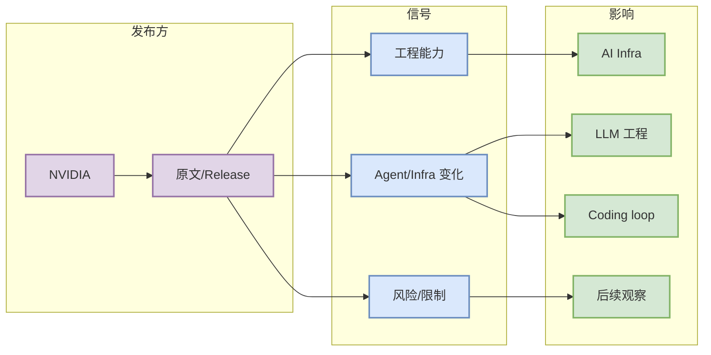

# NVIDIA TensorRT-LLM watched-repo signal

> 类型：Industry
> 大类：Industry
> 小类：NVIDIA
> 推荐等级：必读
> 创建日期：2026-08-13
> 原文链接：https://github.com/NVIDIA/TensorRT-LLM
> 网页详情：https://github.com/dyt27666-oss/AI-news-report-obsidians/blob/main/Industry/NVIDIA/2026-08-13/TensorRT-LLM-direct-watch.md
> 返回日报：[[Daily/2026-08-13]]

## 一句话结论

TensorRT-LLM 是 NVIDIA GPU serving 栈的核心观察对象。

## TL;DR

- **它是什么**：NVIDIA TensorRT-LLM watched-repo signal
- **为什么重要**：对推理优化、runtime、GPU kernel、Blackwell/MoE 适配有长期价值。
- **和我相关的点**：影响 AI Infra / LLM 工程 / Agent loop / coding workflow 的判断。
- **建议动作**：读原文并纳入 watchlist。

## 元信息

| 字段 | 内容 |
|---|---|
| 发布方/来源 | NVIDIA |
| 栏目/来源类型 | Release Notes / Blog / Watchlist |
| 发布时间 | 2026-08-12/2026-08-13 附近，按原文为准 |
| 原文 | [原文](https://github.com/NVIDIA/TensorRT-LLM) |

## 信息压缩图示

### 辅助矩阵

| 维度 | 信号 | 行动 |
|---|---|---|
| 工程价值 | TensorRT-LLM 是 NVIDIA GPU serving 栈的核心观察对象。 | 深读原文 |
| 落地价值 | 对推理优化、runtime、GPU kernel、Blackwell/MoE 适配有长期价值。 | 小样本试用/复核 |
| 风险 | 自动扫描可能不完整 | 以原文为准 |

## 专业解读

对推理优化、runtime、GPU kernel、Blackwell/MoE 适配有长期价值。 对用户而言，重点是把外部发布转成工程决策：是否改变多 agent 监控、权限模式、插件生态、模型接入、推理/训练成本或评测闭环。

## 通俗解释

这条说明相关工具或来源正在发生值得关注的工程变化；今天先记录成可回溯详情页，后续可继续追踪版本差异。

## 关键机制拆解

| 机制 | 解决的问题 | 为什么有效 | 可能的坑 |
|---|---|---|---|
| 官方 release/source | 获取一手变更 | 可信度高 | 可能缺上下文 |
| 工程映射 | 转成可行动建议 | 避免只看新闻 | 需试用验证 |
| Obsidian 详情 | 长期可回溯 | 方便后续对照 | 低置信要标注 |

## 对我的影响

| 维度 | 影响 | 建议动作 |
|---|---|---|
| AI Infra | 识别 infra/runtime 趋势 | 记录约束 |
| LLM 工程 | 影响工具链/上下文策略 | 看 changelog |
| RL / Game AI | 间接影响自动化评测 | 低优先观察 |
| Agent / Eval | 影响 coding loop | 优先试用 |

## 可信度与局限性

- 证据强度：中到高。
- 局限性：依赖公开 release 摘要。
- 还需要确认：完整文档与当前环境兼容性。

## 我应该如何跟进

1. 打开原文确认细节。
2. 检查当前工具版本是否受影响。
3. 把有用机制纳入本地 workflow 试验。

## 相关链接

- 原文：https://github.com/NVIDIA/TensorRT-LLM
- 网页详情：https://github.com/dyt27666-oss/AI-news-report-obsidians/blob/main/Industry/NVIDIA/2026-08-13/TensorRT-LLM-direct-watch.md
- 返回日报：[[Daily/2026-08-13]]

## 标签

#ai-radar #industry
