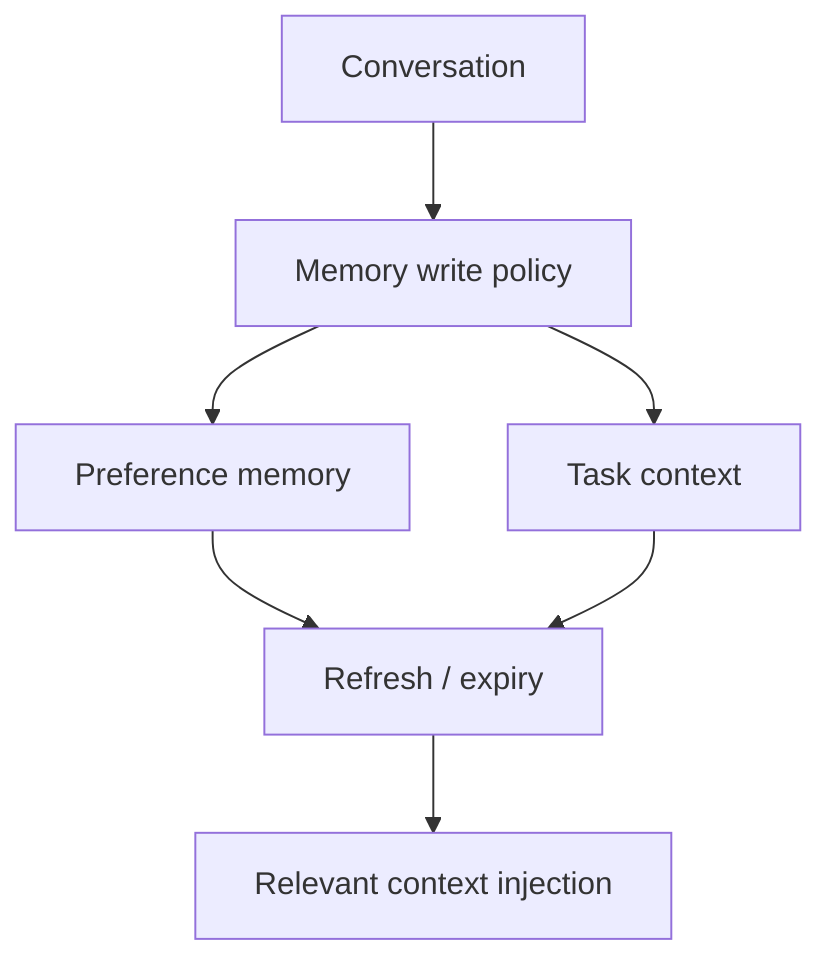

# Dreaming: Better memory for a more helpful ChatGPT

> 类型：大厂博客/工程文章
> 分类：Industry / OpenAI
> 推荐等级：可 skim
> 创建日期：2026-06-08
> 原文链接：https://openai.com/index/chatgpt-memory-dreaming

## 一句话结论

OpenAI RSS 显示 ChatGPT 引入新的 memory system，用于保持长期偏好和上下文新鲜度。

## 元信息

- 来源：OpenAI RSS
- 作者/机构：OpenAI
- 发布时间：2026-06-04
- 原文：https://openai.com/index/chatgpt-memory-dreaming
- 相关标签：memory, agent, personalization
- 置信度：低；正文页 403，基于 RSS 摘要

## 专业解读

由于正文被 403 拦截，本条基于 OpenAI RSS 摘要整理。长期记忆系统对 Agent 产品很关键：它涉及 memory write policy、遗忘/刷新、用户偏好与任务状态分离、隐私和可控性。工程难点不是向量库，而是何时写入、如何合并、如何避免旧记忆污染当前任务。

## 通俗解释

ChatGPT 变得更会记住你的偏好，但也要避免记错、记太多或用错旧信息。

## 图示

## 核心要点

- RSS 摘要称新 memory system 会保持 context fresh and relevant。
- 重点可能是长期偏好和跨会话个性化。
- 需要等可访问正文或技术说明确认机制。

## 对我的影响

- AI Infra：memory service 需要版本、过期、审计和用户控制。
- LLM 工程：Agent 长期记忆要避免 stale context。
- RL / Game AI：长期玩家建模/偏好记忆有参考价值。
- 建议动作：可 skim，待正文可读后补全。

## 局限性 / 风险

- 低置信：正文未访问成功。
- 记忆系统容易引入隐私、过期和错误召回问题。

## 相关链接

- 原文：https://openai.com/index/chatgpt-memory-dreaming

## 标签

#ai-radar #industry #openai #memory #agent
