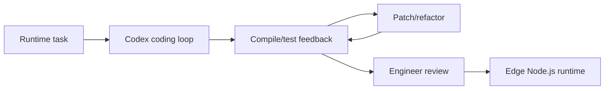

# How Wasmer used Codex to build a Node.js runtime for the edge

> 类型：大厂博客/工程文章
> 分类：Industry / OpenAI / Wasmer
> 推荐等级：可 skim
> 创建日期：2026-06-08
> 原文链接：https://openai.com/index/wasmer

## 一句话结论

OpenAI RSS 称 Wasmer 使用 Codex/GPT-5.5 构建 edge Node.js runtime，开发加速 10x-20x。

## 元信息

- 来源：OpenAI RSS
- 作者/机构：OpenAI / Wasmer
- 发布时间：2026-06-03
- 原文：https://openai.com/index/wasmer
- 相关标签：codex, coding-agent, systems
- 置信度：低；正文页 403，基于 RSS 摘要

## 专业解读

这更像工程案例而非论文，但对 AI coding agent 落地有参考：高杠杆场景是有清晰测试、编译反馈、模块边界和资深工程师 review 的系统软件项目。真正值得关注的是 Codex 如何融入 runtime 开发循环：生成代码、跑测试、修复编译错误、迁移 API、补文档，而不是简单写代码更快。

## 通俗解释

这是一个用 AI 编程助手做复杂系统软件的案例，说明 Agent 在有测试反馈的工程中能明显提速。

## 图示

## 核心要点

- RSS 摘要称开发加速 10x 到 20x。
- 任务是 edge Node.js runtime，属于复杂系统工程。
- 正文 403，细节需后续补读。

## 对我的影响

- AI Infra：Agent coding 需要沙箱、测试、权限和审查闭环。
- LLM 工程：适合作为 coding agent workflow 案例。
- RL / Game AI：可借鉴到模拟器/环境代码生成和重构。
- 建议动作：可 skim，等待可访问技术细节。

## 局限性 / 风险

- 低置信：正文未访问成功。
- 10x-20x 是案例口径，不能直接外推到所有工程任务。

## 相关链接

- 原文：https://openai.com/index/wasmer

## 标签

#ai-radar #industry #openai #codex #coding-agent
