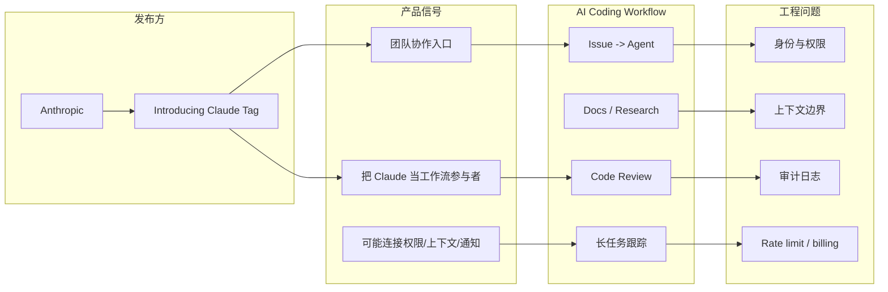
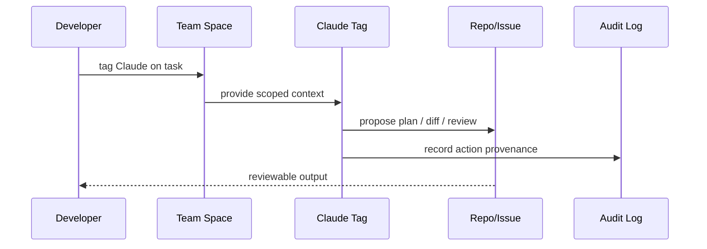

# Claude Tag：团队级 Claude 工作流信号

> 类型：Coding 工具 / AI 工具功能更新  
> 大类：Industry  
> 小类：Coding Agent / Team Workflow  
> 推荐等级：必读  
> 创建日期：2026-06-25  
> 原文链接：https://www.anthropic.com/news  
> 网页详情：https://github.com/dyt27666-oss/AI-news-report-obsidians/blob/main/Industry/Tools/2026-06-25/claude-tag-team-agent-workflow.md  
> 返回日报：[[Daily/2026-06-25]]

## 一句话结论
Anthropic News 显示 2026-06-23 发布 “Introducing Claude Tag”，这是 Claude 从个人助手走向团队协作对象的产品信号。

## TL;DR
- **工具/厂商**：Claude / Anthropic。
- **来源类型**：Product Announcement / News。
- **功能变化**：Claude Tag，被描述为 teams work with Claude 的新方式。
- **对我的影响**：团队内显式 @/tag agent 会改变 coding review、issue triage、长任务分派和权限审计方式。

## 信息压缩图示

## 专业解读
Claude Tag 的关键不是一个 UI 入口，而是团队把 agent 纳入协作图谱：谁唤起 agent、agent 能看哪些上下文、能不能改代码、输出如何 review、费用和 rate limit 如何归属。这些问题与 AI coding workflow 的生产化高度相关。

## 通俗解释
这像在团队聊天或任务系统里直接 @ 一个 AI 同事。真正要解决的是：它看什么、做什么、谁批准、谁付费、出了错怎么查。

## 关键机制拆解
| 机制 | 解决的问题 | 为什么有效 | 可能的坑 |
|---|---|---|---|
| Tag 入口 | 团队里难以分派 AI 任务 | 把 agent 变成协作对象 | 权限边界不清会越权 |
| 上下文注入 | agent 不知道团队背景 | 从任务空间带入上下文 | 上下文污染或泄露 |
| 审计链路 | 输出需要 review | 记录谁触发、做了什么 | 产品细节仍需确认 |

## 对我的影响
| 维度 | 影响 | 建议动作 |
|---|---|---|
| AI Infra | agent 身份与权限成为平台能力 | 关注 org/team policy |
| LLM 工程 | 代码任务分派会更接近 issue queue | 设计 tag-to-task eval |
| RL / Game AI | 弱相关 | 可借鉴多人协作轨迹记录 |
| Agent / Eval | 真实团队交互产生更好 eval traces | 记录任务边界和人工修正 |

## 可信度与局限性
- 证据强度：Anthropic News 页面可访问并出现 Claude Tag 条目。
- 局限性：当前抓取只确认新闻卡片级信息，具体产品细节需进入原文继续核验。
- 潜在风险：团队级 agent 会放大权限、隐私和审计问题。

## 我应该如何跟进
1. 读取 Claude Tag 原文细节，确认支持哪些团队空间和权限模型。
2. 对比 Cursor Customize、Copilot CLI、Qwen Code remote LSP 的团队/远程能力。
3. ��计 team-agent workflow checklist：scope、approval、audit、rollback。

## 标签
#ai-radar #claude #coding-tools #team-agent #anthropic
