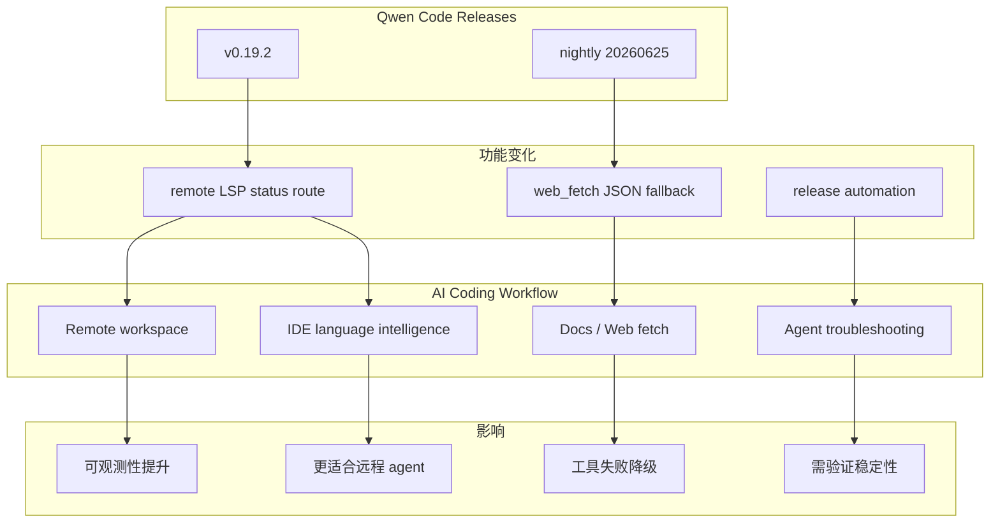
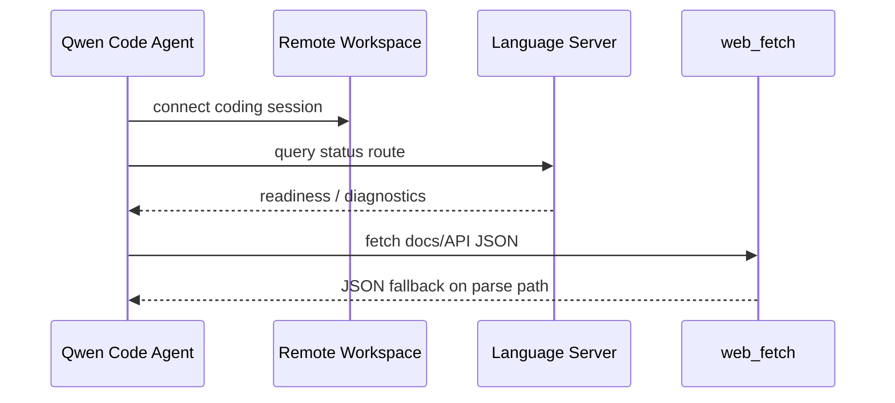

# Qwen Code v0.19.2：remote LSP status route 与 web_fetch JSON fallback

> 类型：Coding 工具 / AI 工具功能更新  
> 大类：Industry  
> 小类：Coding Agent / CLI / Remote IDE  
> 推荐等级：可 skim  
> 创建日期：2026-06-25  
> 原文链接：https://github.com/QwenLM/qwen-code/releases/tag/v0.19.2  
> 网页详情：https://github.com/dyt27666-oss/AI-news-report-obsidians/blob/main/Industry/Tools/2026-06-25/qwen-code-remote-lsp-status.md  
> 返回日报：[[Daily/2026-06-25]]

## 一句话结论
Qwen Code v0.19.2 在 release notes 中出现 remote LSP status route，nightly 又修复 web_fetch JSON fallback，说明 coding agent 正在补齐远程开发与工具健壮性细节。

## TL;DR
- **工具/厂商**：Qwen Code / Alibaba Qwen。
- **来源类型**：GitHub Release。
- **release tag**：v0.19.2（2026-06-24），nightly v0.19.2-nightly.20260625。
- **功能变化**：remote LSP status route；web_fetch JSON fallback 修复。
- **影响**：远程执行、IDE/LSP 状态可观测性和 web_fetch fallback 都会影响 coding agent 稳定性。

## 信息压缩图示

## 专业解读
小 release 也值得看，因为 coding agent 的真实体验常被“边缘稳定性”决定。LSP status route 能让远程 agent 更清楚语言服务是否 ready，web_fetch fallback 则降低外部文档读取失败率。这些能力和 Claude Code/Codex/Cursor 的远程执行、MCP、IDE 集成方向一致。

## 通俗解释
这不是炫酷大功能，而是让远程写代码的 agent 少踩坑：知道语言服务是否启动，抓网页文档失败时有备用路径。

## 关键机制拆解
| 机制 | 解决的问题 | 为什么有效 | 可能的坑 |
|---|---|---|---|
| Remote LSP status | 远程语言服务不可见 | agent 能查询 ready 状态 | 需要 IDE/服务端配合 |
| web_fetch JSON fallback | 文档/API 返回格式变化 | 降级解析减少失败 | fallback 质量需验证 |
| release automation | 更新频率高 | 快速修复边缘问题 | nightly 可能不稳定 |

## 对我的影响
| 维度 | 影响 | 建议动作 |
|---|---|---|
| AI Infra | 远程 agent 需要可观测服务 | 关注状态路由/health check |
| LLM 工程 | coding agent 更依赖 LSP 与 docs | 做远程 repo smoke test |
| RL / Game AI | 弱相关 | 无动作 |
| Agent / Eval | 工具失败率可进入 eval 指标 | 记录 LSP/web_fetch failure |

## 标签
#ai-radar #qwen-code #coding-agent #release-notes #remote-lsp
