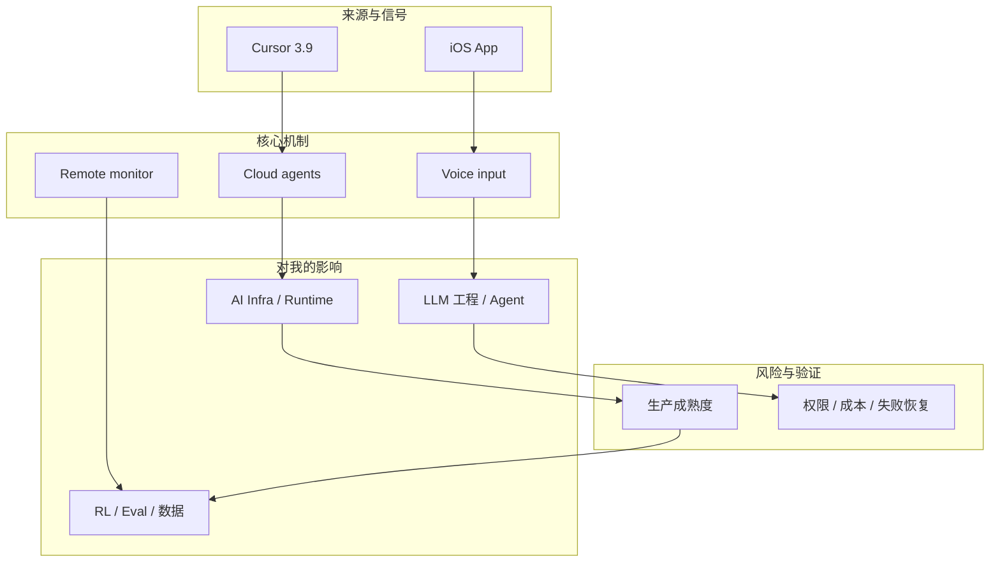
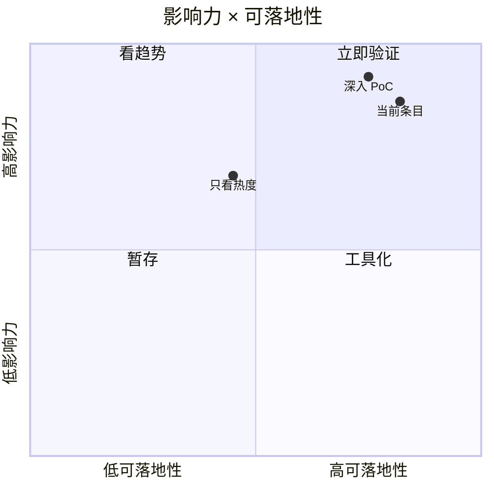

# Cursor 3.9：Mobile App for iOS 与 Always-on Agents

> 类型：Coding 工具更新  
> 大类：Industry / Tools  
> 小类：AI IDE / Always-on Agents  
> 推荐等级：必读  
> 创建日期：2026-06-30  
> 原文链接：https://cursor.com/changelog  
> 网页详情：https://github.com/dyt27666-oss/AI-news-report-obsidians/blob/main/Industry/Tools/2026-06-30/cursor-mobile-always-on-agents.md  
> 返回日报：[[Daily/2026-06-30]]

## 一句话结论
Cursor 把 cloud/always-on agent 管理扩展到 iOS，说明 coding agent 正从 IDE 内补全走向随时派单和远程监督。

## TL;DR
- **它是什么**：Cursor 3.9 changelog 中的 iOS app public beta，可从移动端启动和管理 always-on agents。
- **为什么重要**：agent 工作流开始脱离桌面 IDE，变成可远程排队、监控、接力的任务系统。
- **和我相关的点**：对 tmux 多 agent、远程开发、代码审查排队都有启发。
- **建议动作**：观察其权限、repo 选择、模型选择、通知和失败恢复设计。

## 元信息
| 字段 | 内容 |
|---|---|
| type | Coding 工具更新 |
| major | Industry / Tools |
| minor | AI IDE / Always-on Agents |
| rank | 必读 |
| vendor | Cursor |
| published | 2026-06-29 |
| source | Cursor Changelog |

## 信息压缩图示

## 专业解读
对 AI coding 平台来说，移动端不是噱头，而是把 agent 当成远程 worker 管理的信号。关键问题会从 autocomplete 质量转向任务生命周期：启动、暂停、审查、合并、通知、权限、成本与失败恢复。

## 通俗解释
这像把“让 AI 改代码”从电脑前的一次聊天，变成手机上也能派一个远程工程助手去跑任务。

## 关键机制拆解
| 机制 | 解决的问题 | 为什么有效 | 可能的坑 |
|---|---|---|---|
| Mobile control | 不在电脑前也能派任务 | 降低异步 agent 使用成本 | 权限和误触风险 |
| Always-on agents | 长任务持续运行 | 适合大改动/探索任务 | 需要强审计和中断机制 |
| Voice input | 快速描述想法 | 降低启动任务摩擦 | 需求表达可能不精确 |

## 对我的影响
| 维度 | 影响 | 建议动作 |
|---|---|---|
| AI Infra | 需要任务队列、通知、审计 | 对照 Hermes cron/kanban/gateway |
| Coding Workflow | 支持远程派单和巡检 | 设计 tmux/agent dashboard |
| Eval | 可记录 agent lifecycle 指标 | 看成功率和人工返工率 |

## 可信度与局限性
- 证据强度：来自可访问原始页面、GitHub snapshot 或公开 changelog。
- 局限性：star/release/news 只能说明关注度或发布信号，不等于生产成熟。
- 验证要求：需要继续看 README、examples、issue、release diff、benchmark 和失败恢复机制。

## 我应该如何跟进
1. 把该条目放入 AI Infra / Agent runtime 对照表。
2. 如果与当前工作流直接相关，做 30-60 分钟 PoC。
3. 记录工具边界、成本、失败模式和可观测性。

## 相关链接
- 原文：https://cursor.com/changelog
- 网页详情：https://github.com/dyt27666-oss/AI-news-report-obsidians/blob/main/Industry/Tools/2026-06-30/cursor-mobile-always-on-agents.md

## 标签
#ai-radar #daily #ai-infra #llm #agent
