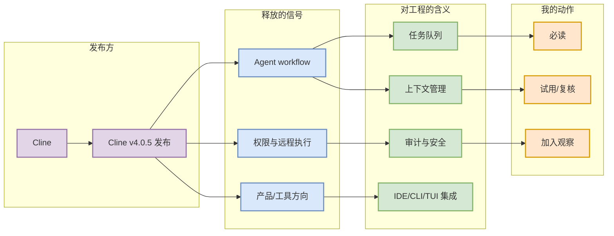

# Cline v4.0.5 发布

> 日期：2026-07-01  
> 发布方/大厂：Cline  
> 栏目/来源类型：GitHub Release  
> 原文：https://github.com/cline/cline/releases/tag/v4.0.5

## 一句话结论
Cline 在 6/30 发布 v4.0.5，4.x 分支连续迭代，说明 VS Code agent extension 进入稳定化阶段。

## TL;DR
- 发布方：Cline
- 来源类型：GitHub Release
- 发布时间 / release tag：见原文页面；本日报按 2026-07-01 扫描结果记录。
- 对我的影响：需要关注 MCP、tools、上下文窗口、权限提示和破坏性变更，避免影响现有 AI coding 工作流。

## 元信息表
| 字段 | 内容 |
|---|---|
| 发布方 | Cline |
| 来源类型 | GitHub Release |
| 原文链接 | https://github.com/cline/cline/releases/tag/v4.0.5 |
| 主题 | AI coding workflow / Agent / AI Infra |

## 信息压缩图示

## 专业解读
需要关注 MCP、tools、上下文窗口、权限提示和破坏性变更，避免影响现有 AI coding 工作流。 对 AI Infra 工程师来说，关键是把产品更新翻译成系统需求：队列、权限、上下文、模型选择、远程执行、失败恢复和可观测性。

## 通俗解释
这类更新意味着 AI 编程助手不再只是“在编辑器里聊天”，而是更像可以被分派任务、远程运行、回传结果的工程协作者。

## 关键机制拆解
| 机制 | 影响 | 跟进 |
|---|---|---|
| Agent mode / remote execution | 任务可异步运行 | 验证权限边界 |
| IDE / CLI integration | 降低接入成本 | 对比现有 tmux 多 agent 流程 |
| Changelog cadence | 迭代快 | 关注 breaking changes |

## 对我的影响
- 影响 AI coding workflow 的任务分派、代码审查、远程执行和 multi-agent 监控。
- 可作为 Hermes/Codex/Claude Code 使用方式的外部参照。

## 可信度与局限性
页面可访问但部分页面为动态渲染或 GitHub 页面，具体功能细节需点原文复核；本页只记录高层工程信号。

## 我应该如何跟进
1. 打开原文确认 release note 细节。
2. 若涉及远程 agent，评估安全和审计模型。
3. 选择一个真实 repo 做最小任务试用。

## 相关链接
- 原文：https://github.com/cline/cline/releases/tag/v4.0.5
- 今日日报：[[Daily/2026-07-01]]

#ai-radar #industry #coding-tools
