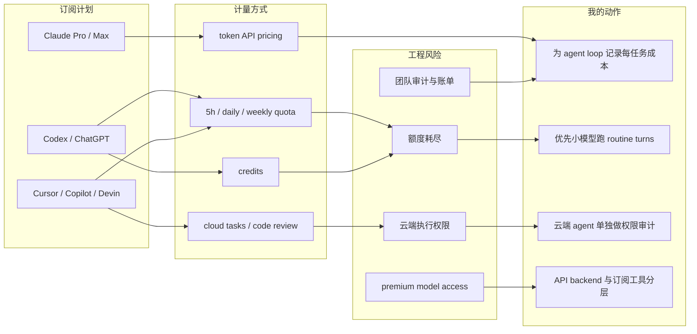

# Coding Agent Pricing / Plan Scan - 2026-07-01

> 日期：2026-07-01  
> 发布方/大厂：OpenAI, Anthropic, Google, DeepSeek, xAI, Cursor, GitHub, Devin/Windsurf, Alibaba  
> 栏目/来源类型：Pricing / Plans / API docs  
> 原文：见下方来源表

## 一句话结论

今天的价格/计划扫描显示：coding agent 成本正在从“单一订阅费”变成“订阅额度 + token/credit + cloud task + premium model 权限”的混合模型；真正需要关注的是额度耗尽、模型可用性、云端 agent 权限和团队审计，而不只是每月价格。

## TL;DR

- OpenAI Codex 已明确包含在 ChatGPT Free/Go/Plus/Pro/Business/Edu/Enterprise 中；Plus 为 20 美元/月，Pro 从 100 美元/月起，并支持用 ChatGPT credits 延展使用。
- Codex API key 模式不含云端 code review / Slack 等云功能，按 API token 价格计费；Codex 文档还给出 GPT-5.5 / GPT-5.4 / GPT-5.4 mini 的 credit rate card。
- Claude API 文档显示 Sonnet 5 到 2026-08-31 为 2/10 美元每 MTok input/output，9 月起回到 3/15；Claude Pro 为 20 美元月付或 200 美元年付，Max 从 100 美元/月起。
- Gemini 3.5 Flash API 为 1.50/9.00 美元每百万 input/output token，Google Search / Maps grounding 超过免费额度后为 14 美元 / 1000 queries。
- Cursor/Devin/GitHub Copilot 继续以订阅套餐包装 agent quota；xAI Grok Build 和 DeepSeek 则更接近低价 token API，适合 agent backend 成本对照。

## 元信息

| 字段 | 内容 |
|---|---|
| 扫描日期 | 2026-07-01 |
| 扫描主题 | coding agent pricing, API token pricing, quotas, plan limits |
| 可信度 | 中高；多数来自官方 docs/pricing 页面，OpenAI ChatGPT marketing pricing 页面受 Cloudflare 影响，Codex docs 可访问 |
| 适用范围 | AI coding workflow / agent infra / cost planning |
| 今日日报 | [[Daily/2026-07-01]] |

## 信息压缩图示

## 价格 / 计划来源表

| 工具/模型 | 来源类型 | 已验证信息 | 对 AI coding 工作流的影响 | 可信度 | 原文 |
|---|---|---|---|---|---|
| OpenAI Codex | 官方 Codex pricing docs | Codex 包含在 ChatGPT Free/Go/Plus/Pro/Business/Edu/Enterprise；Go 8 美元/月，Plus 20 美元/月，Pro 从 100 美元/月起；API key 模式按 API token 价格计费且不含云端 code review / Slack。 | local CLI、IDE extension、iOS 与 cloud task 共享额度；大任务要关注 5h window 与 credits。 | 高 | https://developers.openai.com/codex/pricing |
| OpenAI API | 官方 API pricing docs | gpt-5.5 为 5/30 美元每百万 input/output token，cached input 0.50；gpt-5.5-pro 为 30/180；Codex 专项 gpt-5.3-codex 为 1.75/14。 | API key 跑自动化 agent 时需要按 token 预算，不等同 ChatGPT 订阅额度。 | 高 | https://developers.openai.com/api/docs/pricing |
| Anthropic Claude API | 官方 Claude Platform pricing docs | Claude Sonnet 5 到 2026-08-31 为 2/10 美元每 MTok input/output，2026-09-01 起为 3/15；Opus 4.8 为 5/25；Fable/Mythos 5 为 10/50。 | Claude Code/agent backend 成本需要区分模型与 prompt cache；Sonnet 5 临时价窗口值得记录。 | 高 | https://platform.claude.com/docs/en/about-claude/pricing |
| Claude subscription | 官方 pricing 页面 | Free 0；Pro 为 17 美元/月年付折扣或 20 美元月付；Max 从 100 美元/月起；页面列出 Claude Code、Desktop extensions、web search、voice 等能力。 | 订阅适合交互式 Claude Code/桌面 workflow；高强度 agent loop 仍需关注 usage limits。 | 中高 | https://claude.com/pricing |
| Gemini API | 官方 Gemini API pricing docs | Gemini 3.5 Flash 为 1.50/9.00 美元每百万 input/output token；context caching 0.15；Google Search / Maps grounding 超过免费额度后 14 美元 / 1000 queries。 | grounding/search 会成为 agent research loop 的额外成本项，不能只看 token 价。 | 高 | https://ai.google.dev/gemini-api/docs/pricing |
| DeepSeek API | 官方 API docs | deepseek-v4-flash cache miss input 0.14、cache hit 0.0028、output 0.28 美元每百万 token；deepseek-v4-pro cache miss 0.435、output 0.87。 | 适合低成本批处理/长上下文 agent backend，但需实测质量、稳定性和速率限制。 | 高 | https://api-docs.deepseek.com/quick_start/pricing |
| xAI Grok Build | 官方 xAI model docs | grok-build-0.1 / aliases grok-code-fast：256k context，input 1.00、cached 0.20、output 2.00 美元每百万 token，定位 agentic coding workflows。 | 低价 coding model 值得作为 routine coding turn 的成本参照。 | 高 | https://docs.x.ai/developers/models/grok-build-0.1 |
| Cursor | 官方 pricing 页面 | Hobby free；Pro 20 美元/月；Pro+ 60 美元/月；Teams 40 美元/user/月；Enterprise custom；Pro+ 给 3x Pro Agent limits、cloud agents、frontier models。 | Agent quota 与 cloud agents 是主要差异；适合关注团队权限、MCP、hooks 和 usage analytics。 | 高 | https://cursor.com/pricing |
| GitHub Copilot | 官方 plans 页面 | Free 0；Pro 10 美元/user/月；Pro+ 39；Max 100；Pro 包含 cloud agent/code review、3rd party agents、model selection 与 15 美元 monthly credits。 | Copilot 开始把 Claude Code/Codex third-party agents 纳入套餐，可能影响团队采购与权限治理。 | 高 | https://github.com/features/copilot/plans |
| Devin Desktop / Windsurf | 官方 pricing 页面（windsurf 跳转 Devin） | Free 0；Pro 20 美元/月；Max 200；Teams 80 美元/月团队计划 + 40 美元/月每 full dev seat；Pro 包含 frontier models、SWE 1.6、cloud agents。 | Windsurf/Devin 合并后需要按 Devin quota 体系看待，不再只看 IDE 内补全。 | 高 | https://devin.ai/pricing |
| Alibaba Model Studio / Qwen | 官方百炼模型页 | 页面显示 qwen3.7-max、qwen3.7-plus、qwen3.6-flash，并提供 Coding Plan / Qwen Code 工具入口；具体计费需进一步进入模型调用计费页复核。 | Qwen Code 与百炼模型/Token Plan/Coding Plan 需要合并跟踪，避免只看 GitHub release。 | 中 | https://help.aliyun.com/zh/model-studio/models |

## 专业解读

Coding agent 成本结构有三个方向：第一，ChatGPT/Codex、Claude、Cursor、Copilot、Devin 这类产品把 agent 能力放进订阅套餐，并用 5h window、daily/weekly quota、credits 或 premium model access 控制边际成本；第二，OpenAI API、Claude API、Gemini、DeepSeek、xAI 把成本暴露为 token 价格，适合自建 agent backend 和批处理；第三，cloud agent、code review、Slack/GitHub 集成、mobile control 这类功能通常只在订阅或团队/企业计划里出现，影响权限、审计和采购而不只是模型成本。

对 AI Infra 来说，最重要的不是谁每月便宜 10 美元，而是能否把不同任务路由到不同成本层：routine edit 用低价/mini/cached model，复杂架构和 code review 用 premium model，长期异步任务用 cloud agent 但单独审计权限。否则 agent loop 很容易因为上下文膨胀、工具输出、图片/搜索/grounding 调用而快速耗尽 quota。

## 通俗解释

以前买编程 AI 工具像买会员；现在更像买一套“会员 + 流量包 + 云服务器权限”。同样是 20 美元/月，不同工具给你的模型、云端任务、代码审查、团队管理和超额购买方式都不同。真正要比较的是：你一天能跑多少任务，跑到一半会不会没额度，能不能用更便宜模型处理简单任务，以及云端 agent 能不能安全地碰你的代码库。

## 关键机制拆解

| 机制 | 代表来源 | 工程含义 | 跟进动作 |
|---|---|---|---|
| 订阅额度 | Codex, Cursor, Copilot, Devin | 易用但额度不透明，任务大小会影响消耗 | 为常见任务记录实际消息数/credit 消耗 |
| Token API | OpenAI API, Claude API, Gemini, DeepSeek, xAI | 成本可建模，适合自动化 backend | 建立每任务 token/cost logging |
| Prompt cache / cached tokens | OpenAI, Anthropic, DeepSeek, xAI | 长上下文 agent 可显著降成本 | 固化 repo summary / tool docs cache |
| Cloud agent / code review | Codex, Cursor, Copilot, Devin | 带来远程执行和 repo 权限风险 | 单独设计 allowlist、audit log、sandbox |
| Search / grounding | Gemini, OpenAI tools | research agent 成本不只 token | 单独记录 web/search call 数 |

## 对我的影响

- AI Radar / Obsidian 自动研究：要把 web search、GitHub scan、detail page 生成拆分为不同模型和工具成本层。
- Coding agent 使用：本地 routine turn 可优先低价/mini/cached 模型；复杂 refactor 和 review 再切 premium。
- 团队/企业采购：Copilot/Cursor/Devin 的 cloud agent、code review、MCP/permission controls 比单人价格更重要。
- 自建 agent runtime：DeepSeek/xAI/Gemini/OpenAI API 价格适合做 backend cost baseline，但必须实测质量和失败恢复。

## 可信度与局限性

- OpenAI ChatGPT marketing pricing 页面被 Cloudflare challenge；Codex docs 和 API docs 可访问，故 OpenAI 订阅信息以 Codex docs 为准。
- Claude subscription 页面可访问但 usage limits 细节没有完全量化；Claude API 价格来自官方 docs。
- Alibaba 百炼页面本次只确认模型/工具入口，具体 Coding Plan 与模型调用计费需要后续进入对应计费页复核。
- 所有价格都应在实际采购/接入前再次确认，因为模型和套餐调整频率很高。

## 我应该如何跟进

1. 在 Hermes/Codex/Claude Code 的实际任务中记录每轮 token、credit 或 quota 消耗。
2. 建一个 routing policy：routine edit、测试修复、长上下文 review、research scan 分别走不同模型/工具。
3. 对 cloud agent 功能单独做权限表：能读哪些 repo、能否执行命令、能否联网、日志在哪里。
4. 下次 AI Radar 把 Alibaba Coding Plan / Qwen Code、Gemini Code Assist 和 Copilot credits 做更细的变更跟踪。

## 相关链接

- OpenAI Codex pricing: https://developers.openai.com/codex/pricing
- OpenAI API pricing: https://developers.openai.com/api/docs/pricing
- Anthropic API pricing: https://platform.claude.com/docs/en/about-claude/pricing
- Claude pricing: https://claude.com/pricing
- Gemini API pricing: https://ai.google.dev/gemini-api/docs/pricing
- DeepSeek pricing: https://api-docs.deepseek.com/quick_start/pricing
- xAI Grok Build: https://docs.x.ai/developers/models/grok-build-0.1
- Cursor pricing: https://cursor.com/pricing
- GitHub Copilot plans: https://github.com/features/copilot/plans
- Devin pricing: https://devin.ai/pricing
- Alibaba Model Studio models: https://help.aliyun.com/zh/model-studio/models
- 今日日报：[[Daily/2026-07-01]]

#ai-radar #coding-tools #pricing #agent-infra
