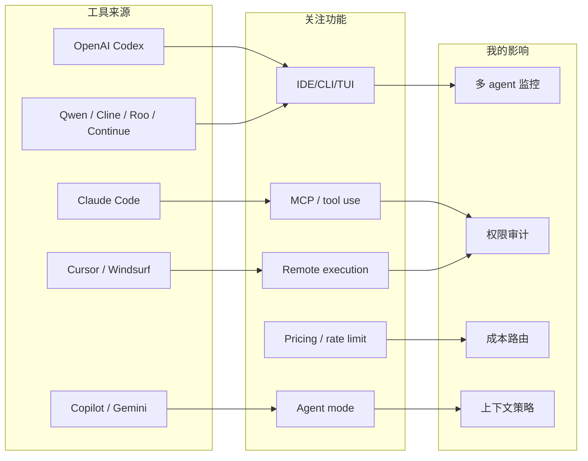
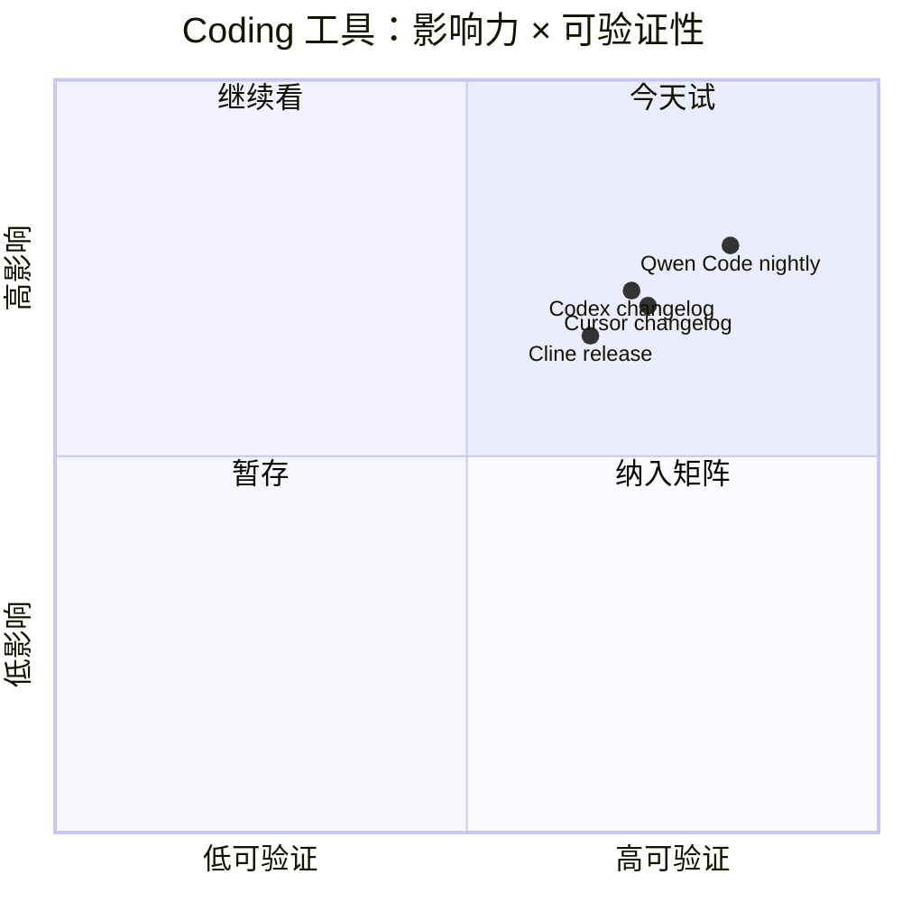

# Coding 工具 / AI 工具功能更新扫描 - 2026-07-02

> 类型：Coding 工具矩阵  
> 返回日报：[[Daily/2026-07-02]]

## 一句话结论
今天最明确的新信号是 Qwen Code 7/2 nightly；Codex、Cursor、Copilot、Gemini Code Assist 等页面可访问但未确认当天强相关新增；Cline/Roo/Continue 保持近版本观察。

## 信息压缩图示

### 辅助图：工具更新优先级

## Coding 工具扫描矩阵
| 工具 | 厂商 | 来源类型 | 今日状态 | 代表更新 | 对我的影响 | 原文 |
|---|---|---|---|---|---|---|
| Claude Code | Anthropic | Changelog / Release Notes | 页面待深扫 / 低置信 | 继续观察 Claude Tag、permissions、context、remote execution | 影响团队 agent workflow 与权限边界 | https://docs.anthropic.com/en/release-notes/claude-code |
| OpenAI Codex | OpenAI | Changelog / Docs | 页面可访问 | Codex changelog 可访问，未确认 7/2 强相关新增 | 继续观察 CLI/IDE、background mode、MCP、rate limits | https://developers.openai.com/codex/changelog |
| Cursor | Cursor | Changelog | 页面可访问 | 继续观察 mobile/cloud agent/remote control | 影响远程 agent 监控和任务接力 | https://cursor.com/changelog |
| Windsurf | Windsurf | Changelog | 页面可访问 / 低置信 | Agent Command Center / Devin Docs 线索待复核 | 影响 ACP/CLI/远程 agent 工作流 | https://windsurf.com/changelog |
| GitHub Copilot | GitHub | Changelog / Blog | 页面可访问 | Copilot changelog 标签页可访问 | 继续观察 terminal interface、agent mode、pricing | https://github.blog/changelog/label/copilot/ |
| Gemini Code Assist | Google | Release Notes | 页面可访问 | Release notes 页面可访问 | 观察 Google coding agent 与企业 IDE 集成 | https://cloud.google.com/gemini/docs/codeassist/release-notes |
| Qwen Code | Alibaba/Qwen | GitHub Releases | 有今日 release | v0.19.4-nightly.20260702.46814e4f1 / v0.19.4 | 开源 CLI/TUI agent 对照试用 | https://github.com/QwenLM/qwen-code/releases/tag/v0.19.4-nightly.20260702.46814e4f1 |
| Roo Code | Roo Code | GitHub Releases | 无今日新 release | 最新页显示 v3.54.0 | VS Code agent extension 继续观察 | https://github.com/RooCodeInc/Roo-Code/releases |
| Cline | Cline | GitHub Releases | 近更新 | v4.0.5 | MCP/tools/权限/上下文策略继续观察 | https://github.com/cline/cline/releases/tag/v4.0.5 |
| Continue | Continue | GitHub Releases | 无今日新 release | v2.1.0-vscode / v2.0.0-vscode | IDE extension 观察，今日无明确新功能 | https://github.com/continuedev/continue/releases |

## 可信度与局限性
- 页面可访问只说明源已扫描，不等于有当天新功能。
- GitHub release tag 是当前最可靠信号；商业站点 changelog 需二次解析正文。

#ai-radar #coding-tools #ai-coding
