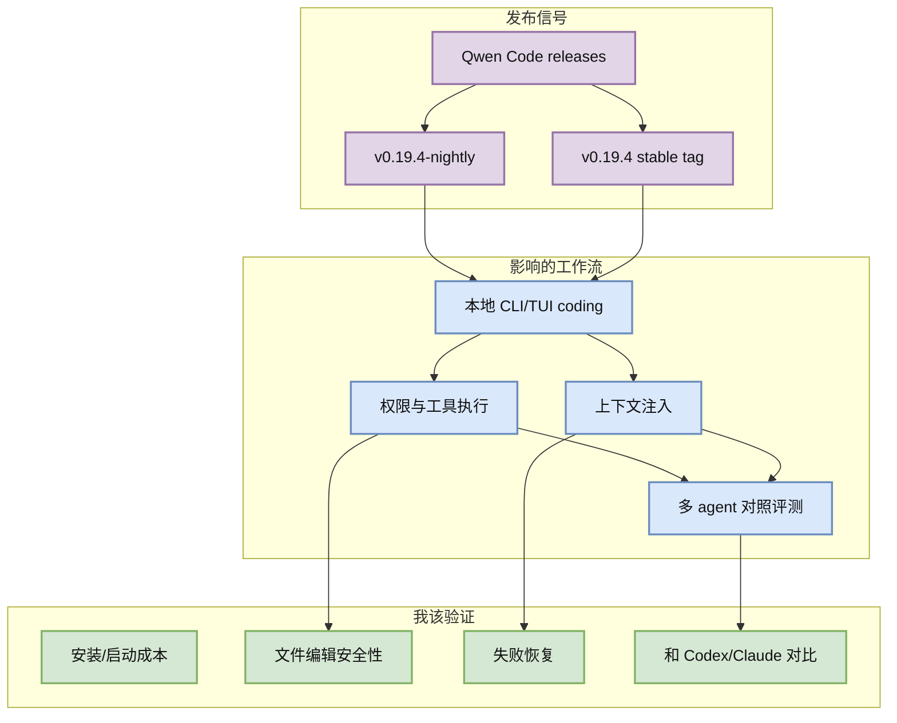
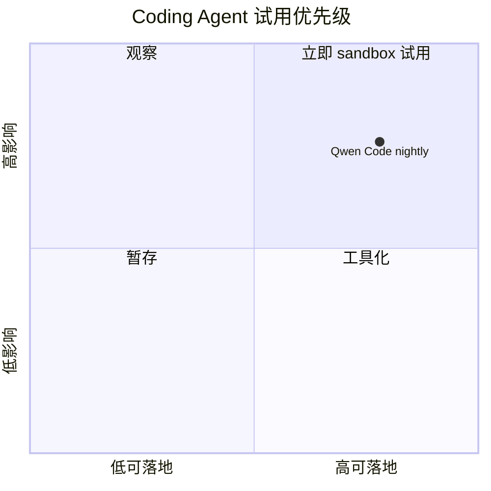

# Qwen Code v0.19.4 nightly / release watch

> 类型：Coding 工具更新  
> 大类：Coding 工具 / AI Agent CLI  
> 小类：Open-source coding agent  
> 推荐等级：必读  
> 创建日期：2026-07-02  
> 原文链接：https://github.com/QwenLM/qwen-code/releases/tag/v0.19.4-nightly.20260702.46814e4f1  
> 网页详情：https://github.com/dyt27666-oss/AI-news-report-obsidians/blob/main/Industry/Tools/2026-07-02/qwen-code-nightly-release-watch.md  
> 返回日报：[[Daily/2026-07-02]]

## 一句话结论
Qwen Code 在 2026-07-02 继续发布 `v0.19.4-nightly.20260702.46814e4f1`，说明开源 coding agent CLI/TUI 仍处在高频迭代期，适合纳入 Codex/Claude Code 对照试用。

## TL;DR
- **它是什么**：Alibaba/Qwen 的开源 coding agent 项目 release/nightly。
- **为什么重要**：开源 agent CLI 可以用于验证权限模式、上下文注入、工具调用和本地 TUI 体验。
- **和我相关的点**：适合和 Codex CLI、Claude Code、Hermes 多 agent cron workflow 做横向对比。
- **建议动作**：只在 sandbox repo 试用；重点看权限、上下文窗口、工具执行和失败恢复。

## 元信息
| 字段 | 内容 |
|---|---|
| 工具/厂商 | Qwen Code / Alibaba Qwen |
| 来源类型 | GitHub Release |
| 发布时间 / release tag | v0.19.4-nightly.20260702.46814e4f1；同时页面显示 v0.19.4 |
| 原文 | [原文](https://github.com/QwenLM/qwen-code/releases/tag/v0.19.4-nightly.20260702.46814e4f1) |
| 功能变化 | release 页面可见 nightly/tag，具体 changelog 需点开复核 |
| 对我的影响 | 开源 coding agent CLI/TUI 对照组；关注 remote execution、permissions、context、MCP/IDE 集成 |

## 信息压缩图示

### 辅助图：试用优先级

## 专业解读
Qwen Code 的价值不是单个 nightly tag 本身，而是它代表开源 coding agent 正在以接近商业工具的节奏迭代。对 AI Infra 工程师来说，开源 agent CLI 可以被纳入可观测、可审计、可 sandbox 的本地工作流；对 coding workflow 来说，它是 Codex/Claude Code 之外的成本与能力对照组。

## 通俗解释
这相当于多了一个可以本地跑的“代码代理助手”。它更新很快，所以不要直接信任生产使用，但很适合拿来做横向试验。

## 关键机制拆解
| 机制 | 解决的问题 | 为什么有效 | 可能的坑 |
|---|---|---|---|
| GitHub release/nightly | 高频能力交付 | 可追踪 tag 与回滚 | nightly 可能不稳定 |
| CLI/TUI agent | 本地编码自动化 | 适合 terminal workflow | 权限边界需验证 |
| 开源实现 | 可审计/可对照 | 便于比较 prompt、tool、context | 文档与实现可能不同步 |

## 对我的影响
| 维度 | 影响 | 建议动作 |
|---|---|---|
| AI Infra | 可测试 agent runtime 与工具执行边界。 | sandbox 试用，不接生产凭证。 |
| LLM 工程 | 可比较模型路由与上下文策略。 | 记录任务成功率/成本/失败模式。 |
| RL / Game AI | 可用于批量生成仿真/规则测试代码。 | 限制写权限，人工 review。 |
| Agent / Eval | 可加入 coding agent benchmark。 | 用同一任务对比 Codex/Claude/Qwen。 |

## 可信度与局限性
- 证据强度：中；GitHub release 页面可访问并解析到 tag。
- 局限性：本轮未展开 release body，功能变化需二次复核。
- 潜在风险：nightly 破坏性变更、权限默认值不符合本地安全要求。

## 我应该如何跟进
1. 在临时 repo 跑同一 bugfix 任务，对比 Codex/Claude/Qwen。
2. 记录工具调用权限、上下文压缩和失败恢复。
3. 若稳定，再做成本/速度/质量表。

#ai-radar #coding-agent #qwen-code #tools
