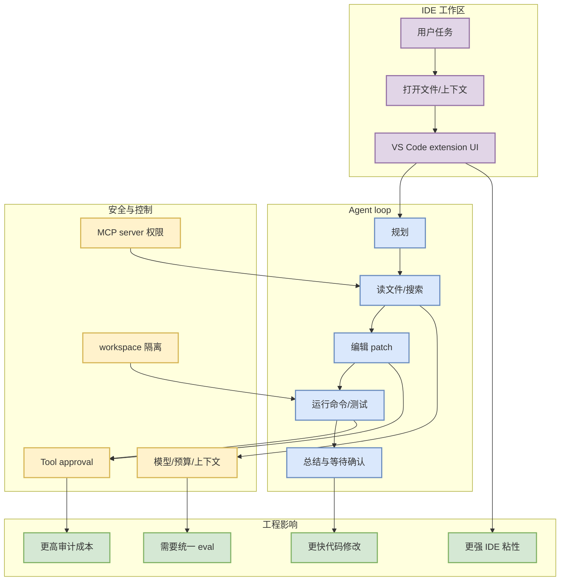

# Cline v4.0.6 release watch

> 类型：Coding 工具更新  
> 大类：Coding 工具 / AI IDE Extension  
> 小类：IDE agent / MCP / tools  
> 推荐等级：必读  
> 创建日期：2026-07-03  
> 原文链接：https://github.com/cline/cline/releases/tag/v4.0.6  
> 网页详情：https://github.com/dyt27666-oss/AI-news-report-obsidians/blob/main/Industry/Tools/2026-07-03/cline-v4-0-6-release-watch.md  
> 返回日报：[[Daily/2026-07-03]]

## 一句话结论

Cline v4.0.6 是今日可见的 IDE agent release，值得用作 MCP、tool approval、上下文管理和 VS Code agent UX 的观察样本。

## TL;DR

- **它是什么**：Cline 的 GitHub Release，面向 VS Code 的 coding agent extension。
- **为什么重要**：IDE agent 是 coding workflow 的主战场，权限、工具调用、上下文和 UI 决策直接影响生产效率。
- **和我相关的点**：可和 Codex CLI、Claude Code、Qwen Code、Roo Code 对照，拆出统一 agent-loop eval 表。
- **建议动作**：复核 release diff，重点看 MCP/tools、approval、模型路由、上下文窗口和 remote/workspace 行为。

## 元信息

| 字段 | 内容 |
|---|---|
| 发布方/来源 | Cline / GitHub Releases |
| 大厂/实验室 | Cline |
| 栏目/来源类型 | GitHub Release / IDE Extension |
| 作者/机构 | Cline |
| 发布时间 | 2026-07-02T18:12:42Z（北京时间今日可见） |
| 原文 | [v4.0.6](https://github.com/cline/cline/releases/tag/v4.0.6) |
| 代码 | https://github.com/cline/cline |
| PDF | 无 |
| 标签 | #coding-agent #cline #vscode #mcp #ide-agent |

## 信息压缩图示

### 主图：IDE agent 关键路径

### 辅助图：对 AI coding workflow 的影响矩阵

| 维度 | 观察点 | 为什么重要 | 今日动作 |
|---|---|---|---|
| MCP | server 配置、权限、工具暴露 | 决定 agent 能访问哪些外部能力 | 复核 release diff |
| Tool approval | 命令/文件写入确认 | 决定安全边界和打断频率 | 与 Codex/Claude Code 对比 |
| 上下文 | 文件选择、压缩、会话记忆 | 决定长任务稳定性 | 设计同题 benchmark |
| IDE UX | diff 展示、状态、错误恢复 | 决定实际生产效率 | 本地试跑小任务 |

## 专业解读

Cline 的关键价值在于它站在 IDE 这个执行上下文里。CLI agent 适合 terminal-first workflow，但 IDE extension 能直接读取编辑器状态、展示 diff、接入用户确认流程，并利用 MCP 或插件生态扩展工具。对工程师来说，真正要关注的不是版本号本身，而是它如何平衡“自动执行效率”和“安全可控”。

v4.0.6 的 release 元信息说明 Cline 仍在高频维护。今日未深入解析完整 diff，因此这张卡片把它定位为 release watch：先把它纳入固定工具矩阵，再安排后续复核具体功能变化。

## 通俗解释

Cline 就像 VS Code 里的 coding agent。它能看代码、改代码、运行命令，但越能干就越需要控制边界：什么时候要问你、什么时候能自己跑、出错后怎么恢复。

## 关键机制拆解

| 机制 | 解决的问题 | 为什么有效 | 可能的坑 |
|---|---|---|---|
| IDE extension agent | 在编辑器中完成读改测循环 | 上下文贴近真实开发 | 过度依赖 IDE 状态，自动化难度高 |
| Tool approval | 控制命令和写操作 | 降低破坏性操作风险 | 过多确认会降低效率 |
| MCP / tools | 扩展外部能力 | 能连接知识库、浏览器、服务 | 权限和 prompt injection 风险更高 |

## 对我的影响

| 维度 | 影响 | 建议动作 |
|---|---|---|
| AI Infra | IDE agent 需要本地命令、测试、容器权限治理 | 看权限模型是否可迁移到 harness |
| LLM 工程 | 上下文选择影响长文件修改质量 | 设计同题对比测试 |
| RL / Game AI | 可用于快速搭建 simulator / evaluator | 用 rummy rules task 试跑 |
| Agent / Eval | 是 loop engineering 的实际产品样本 | 加入 coding-agent eval matrix |

## 可信度与局限性

- 证据强度：中；release 元数据可靠，但具体变更未解析。
- 局限性：需要阅读 changelog/commit diff 才能确认功能变化。
- 潜在风险：IDE agent 的权限、MCP 工具暴露和 workspace 写入需要审计。
- 还需要确认：v4.0.6 是否包含 MCP、approval、模型路由、上下文或 remote execution 相关变化。

## 我应该如何跟进

1. 打开 release diff，提取功能变化和 bugfix。
2. 与 Qwen Code / Codex CLI / Claude Code 跑同一小任务。
3. 把结果写入 `Coding 工具扫描矩阵` 的可执行 checklist。

## 相关链接

- 原文：https://github.com/cline/cline/releases/tag/v4.0.6
- 代码：https://github.com/cline/cline
- 相关卡片：[[Industry/Tools/2026-07-03/coding-tools-update-matrix]]

## 标签

#ai-radar #coding-agent #cline #vscode #mcp #ide-agent
