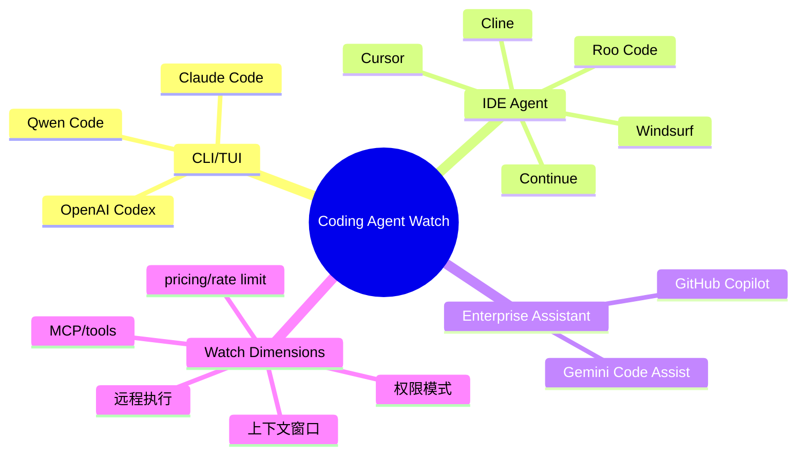

# Coding 工具扫描矩阵 - 2026-07-03

> 类型：扫描矩阵  
> 返回日报：[[Daily/2026-07-03]]

## 一句话结论

今日明确新信号来自 Qwen Code nightly 和 Cline v4.0.6；其它固定工具源保留低置信观察位，避免误判为未扫描。

## 工具矩阵

| 工具 | 厂商 | 来源类型 | 今日状态 | 代表更新 | 对我的影响 | 原文 |
|---|---|---|---|---|---|---|
| Claude Code | Anthropic | Changelog / Release Notes | 低置信 / 未确认今日新增 | 观察 Claude Tag、permissions、context、remote execution | 团队 agent workflow 和权限边界 | https://docs.anthropic.com/en/release-notes/claude-code |
| OpenAI Codex | OpenAI | Changelog / Docs | 低置信 / 未确认今日新增 | CLI/IDE、background mode、MCP、rate limits | Codex CLI 与 Hermes 多 agent 编排 | https://developers.openai.com/codex/changelog |
| Cursor | Cursor | Changelog | 低置信 / 未确认今日新增 | mobile/cloud agent/remote control | 远程 agent 监控和任务接力 | https://cursor.com/changelog |
| Windsurf | Windsurf | Changelog | 低置信 / 未确认今日新增 | Agent Command Center / ACP | IDE 内 agent 编排 | https://windsurf.com/changelog |
| GitHub Copilot | GitHub | Changelog / Blog | 低置信 / 未确认今日新增 | agent mode、terminal interface、pricing | 企业 IDE agent 标准形态 | https://github.blog/changelog/label/copilot/ |
| Gemini Code Assist | Google | Release Notes | 低置信 / 未确认今日新增 | 企业 IDE 集成和 policy controls | Google 生态 coding assistant | https://cloud.google.com/gemini/docs/codeassist/release-notes |
| Qwen Code | Alibaba/Qwen | GitHub Releases | 有今日 release | `v0.19.5-nightly.20260703.b16baf1ff` | 开源 CLI/TUI agent 对照试用 | https://github.com/QwenLM/qwen-code/releases/tag/v0.19.5-nightly.20260703.b16baf1ff |
| Roo Code | Roo Code | GitHub Releases | 无今日新 release | `v3.54.0` | VS Code agent extension 继续观察 | https://github.com/RooCodeInc/Roo-Code/releases/tag/v3.54.0 |
| Cline | Cline | GitHub Releases | 有北京时间今日 release | `v4.0.6` | MCP/tools/权限/上下文策略继续观察 | https://github.com/cline/cline/releases/tag/v4.0.6 |
| Continue | Continue | GitHub Releases | 无今日新 release | `v2.1.0-vscode` | IDE extension 观察 | https://github.com/continuedev/continue/releases/tag/v2.1.0-vscode |

## 结构图

## 建议动作

1. 用同一个小型 repo 修改任务对比 Qwen Code、Cline、Codex、Claude Code。
2. 记录权限确认次数、失败恢复质量、上下文选择、日志可审计性。
3. 把结果沉淀到 loop engineering eval checklist。

## 标签

#ai-radar #coding-tools #agent-loop
