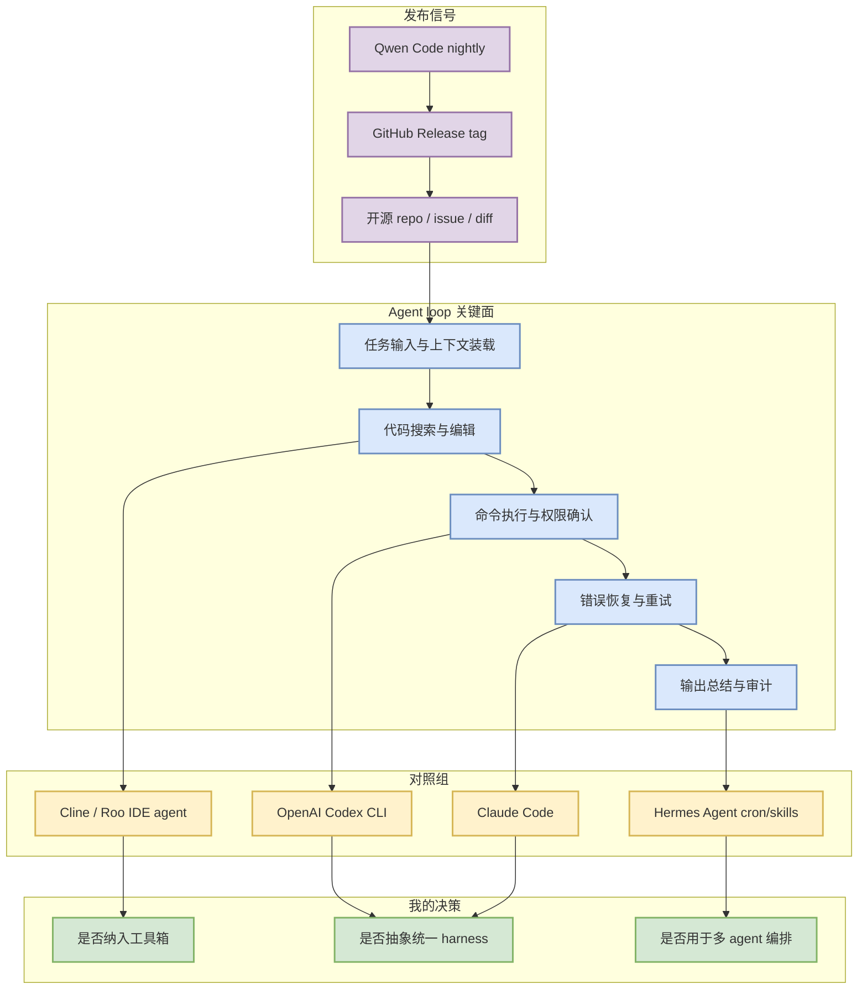
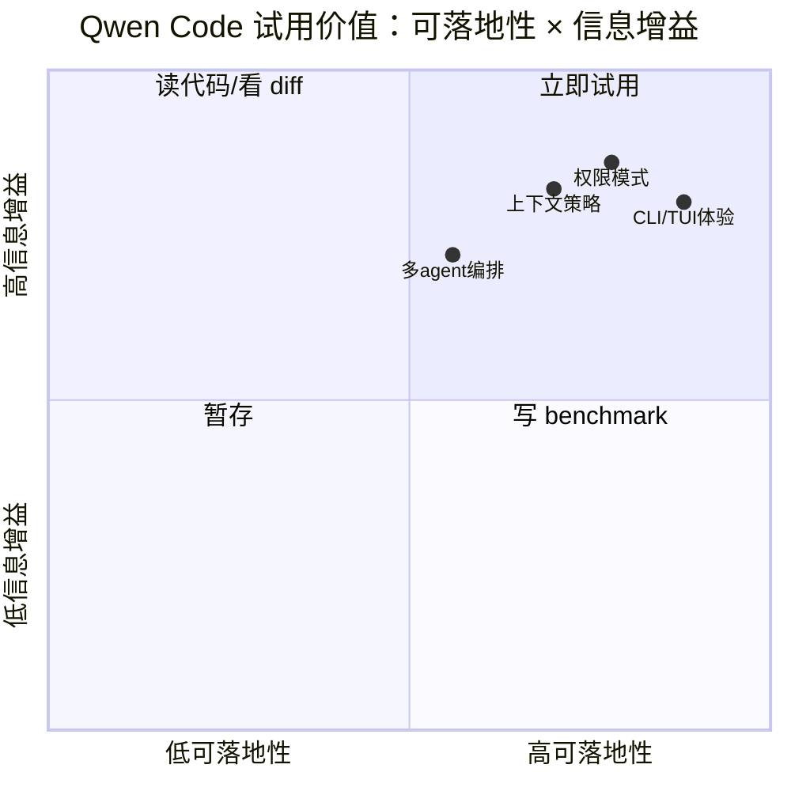

# Qwen Code v0.19.5 nightly release watch

> 类型：Coding 工具更新  
> 大类：Coding 工具 / AI Agent CLI  
> 小类：Open-source coding agent  
> 推荐等级：必读  
> 创建日期：2026-07-03  
> 原文链接：https://github.com/QwenLM/qwen-code/releases/tag/v0.19.5-nightly.20260703.b16baf1ff  
> 网页详情：https://github.com/dyt27666-oss/AI-news-report-obsidians/blob/main/Industry/Tools/2026-07-03/qwen-code-nightly-release-watch.md  
> 返回日报：[[Daily/2026-07-03]]

## 一句话结论

Qwen Code 今日继续发布 nightly，是观察开源 CLI/TUI coding agent 工程形态的高价值样本。

## TL;DR

- **它是什么**：QwenLM 维护的开源 coding-agent CLI/TUI release stream。
- **为什么重要**：大厂 coding agent 往往只给产品 changelog，而 Qwen Code release 可直接观察开源实现、打包和迭代节奏。
- **和我相关的点**：可拿来对照 Codex CLI、Claude Code、Hermes 多 agent cron 的权限、上下文、工具调用和失败恢复。
- **建议动作**：在 sandbox 中安装/跑一次，记录权限确认、文件编辑、命令执行、上下文压缩和失败恢复体验。

## 元信息

| 字段 | 内容 |
|---|---|
| 发布方/来源 | QwenLM / GitHub Releases |
| 大厂/实验室 | Alibaba/Qwen |
| 栏目/来源类型 | GitHub Release / Nightly |
| 作者/机构 | QwenLM |
| 发布时间 | 2026-07-03T00:47:12Z |
| 原文 | [v0.19.5-nightly.20260703.b16baf1ff](https://github.com/QwenLM/qwen-code/releases/tag/v0.19.5-nightly.20260703.b16baf1ff) |
| 代码 | https://github.com/QwenLM/qwen-code |
| PDF | 无 |
| 标签 | #coding-agent #qwen-code #cli #tui #agent-loop |

## 信息压缩图示

### 主图：开源 coding agent 观察框架

### 辅助图：试用优先级

## 专业解读

Qwen Code 的价值不只在于“又发了一个 nightly”，而在于它是一个可观察、可安装、可对比的开源 coding agent。对 AI Infra / LLM 工程师来说，coding agent 本质上是一个受控执行 runtime：它要把自然语言任务转成文件搜索、patch、terminal、测试、总结等动作，还要处理权限、失败恢复、上下文裁剪和审计。

今日 release 的元信息说明 Qwen Code 仍处于高频迭代期。即使 release notes 没有展开所有功能 diff，也值得把它加入固定监控，因为开源项目能提供大厂闭源工具不给的实现细节：prompt/harness 结构、工具协议、错误处理、CLI/TUI 状态机、配置方式和测试覆盖。

## 通俗解释

把 Qwen Code 当成一个“开源版 coding agent 实验台”。Claude Code / Codex 可能更强，但很多内部机制看不到；Qwen Code 让我们能看到工具如何组织命令、读写文件、展示状态，以及失败时怎么恢复。

## 关键机制拆解

| 机制 | 解决的问题 | 为什么有效 | 可能的坑 |
|---|---|---|---|
| CLI/TUI agent loop | 把任务拆成连续工具调用 | 更适合长任务和可审计执行 | TUI 状态可能难自动化测试 |
| GitHub release cadence | 捕捉功能变化 | 高频 nightly 能快速暴露方向 | release note 可能不完整 |
| 开源实现 | 可读代码、可复现 | 能抽 harness / prompts / tools 协议 | 工程成熟度需本地验证 |

## 对我的影响

| 维度 | 影响 | 建议动作 |
|---|---|---|
| AI Infra | 可作为 agent runtime 的轻量样本 | 看它如何封装工具、日志和状态 |
| LLM 工程 | 可对比上下文窗口与指令组织 | 记录 prompt/context 策略 |
| RL / Game AI | 间接帮助自动生成/评测环境代码 | 用小型 rummy simulator 任务试跑 |
| Agent / Eval | 适合做 coding-agent benchmark | 和 Codex/Claude Code 同题对比 |

## 可信度与局限性

- 证据强度：中；GitHub release 元数据可靠，但未深入解析 release diff。
- 局限性：nightly 不代表稳定版；功能变化可能需要查看 commit diff。
- 潜在风险：开源 agent 的安全边界、命令执行隔离和 prompt injection 防护需要单独验证。
- 还需要确认：本次 tag 具体包含哪些 CLI/TUI、权限、模型路由或工具调用变化。

## 我应该如何跟进

1. 在隔离目录跑一个小型代码修改任务，对比 Codex CLI 和 Claude Code。
2. 记录权限确认、失败恢复、上下文压缩、日志可读性四个维度。
3. 如果表现稳定，把试用流程沉淀到 loop engineering checklist。

## 相关链接

- 原文：https://github.com/QwenLM/qwen-code/releases/tag/v0.19.5-nightly.20260703.b16baf1ff
- 代码：https://github.com/QwenLM/qwen-code
- 相关卡片：[[Industry/Tools/2026-07-03/coding-tools-update-matrix]]

## 标签

#ai-radar #coding-agent #qwen-code #cli #tui #agent-loop
