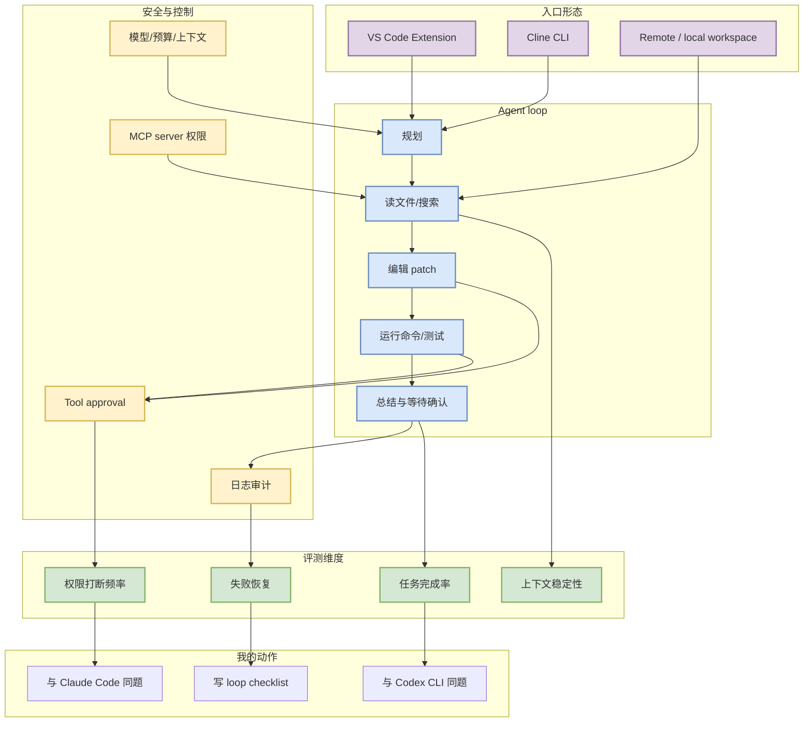

# Cline CLI v3.0.36 release watch

> 类型：Coding 工具更新  
> 大类：Coding 工具 / AI Agent CLI + IDE Extension  
> 小类：CLI / IDE agent / MCP / tools  
> 推荐等级：必读  
> 创建日期：2026-07-04  
> 原文链接：https://github.com/cline/cline/releases/tag/cli-v3.0.36  
> 网页详情：https://github.com/dyt27666-oss/AI-news-report-obsidians/blob/main/Industry/Tools/2026-07-04/cline-cli-v3-0-36-release-watch.md  
> 返回日报：[[Daily/2026-07-04]]

## 一句话结论

Cline 在 2026-07-03T20:49:27Z 发布 `cli-v3.0.36`，说明 Cline 不只是 VS Code extension，也在强化 CLI 形态；这对统一 CLI/TUI/IDE coding-agent 评测很关键。

## TL;DR

- **它是什么**：Cline 的 GitHub Release，tag 为 `cli-v3.0.36`。
- **为什么重要**：IDE agent 与 CLI agent 的边界正在变薄，Cline CLI 信号适合观察权限、MCP、上下文、命令执行和远程/本地 workspace 之间的关系。
- **和我相关的点**：可与 Codex CLI、Claude Code、Qwen Code 做同题评测，抽出统一 agent-loop eval 表。
- **建议动作**：复核 release diff，重点看 CLI 命令、配置、MCP/tool approval、模型路由、日志和 workspace 隔离。

## 元信息

| 字段 | 内容 |
|---|---|
| 发布方/来源 | Cline / GitHub Releases |
| 大厂/实验室 | Cline |
| 栏目/来源类型 | GitHub Release / CLI |
| 作者/机构 | Cline |
| 发布时间 | 2026-07-03T20:49:27Z |
| Release tag | `cli-v3.0.36` |
| 原文 | [cli-v3.0.36](https://github.com/cline/cline/releases/tag/cli-v3.0.36) |
| 代码 | https://github.com/cline/cline |
| PDF | 无 |
| 标签 | #coding-agent #cline #cli #vscode #mcp #ide-agent |

## 信息压缩图示

### 主图：Cline CLI / IDE agent 双形态

### 辅助结构：对 AI coding workflow 的影响矩阵

| 维度 | 观察点 | 为什么重要 | 今日动作 |
|---|---|---|---|
| CLI | 命令、配置、日志、workspace 入口 | 决定能否进入 tmux / cron / remote agent workflow | 复核 release diff |
| MCP | server 配置、权限、工具暴露 | 决定 agent 能访问哪些外部能力 | 与 Codex/Claude 对比 |
| Tool approval | 命令/文件写入确认 | 决定安全边界和打断频率 | 设计同题 benchmark |
| 上下文 | 文件选择、压缩、会话记忆 | 决定长任务稳定性 | 记录失败模式 |

## 专业解读

Cline 的关键价值在于它横跨 IDE 和 CLI 两种工作形态。IDE extension 能直接接触编辑器状态、展示 diff 和接入用户确认；CLI 则更适合 remote、tmux、CI、cron、多 agent 编排和可脚本化评测。`cli-v3.0.36` 说明 Cline 正在把 agent loop 的一部分能力从 IDE 中抽出来，这对统一 coding-agent harness 非常重要。

对 AI Infra 工程师来说，要关注的不是 release 名称本身，而是它如何处理受控执行：命令能否被审计，工具权限如何声明，MCP server 是否有隔离，上下文如何选择和压缩，失败后是否能恢复而不是反复破坏 workspace。

## 通俗解释

Cline 以前更像 VS Code 里的 coding agent；CLI release 表示它也在走命令行路线。命令行形态更容易放进 tmux、远程机器、CI 或自动化脚本里，所以对多 agent workflow 更有用。

## 关键机制拆解

| 机制 | 解决的问题 | 为什么有效 | 可能的坑 |
|---|---|---|---|
| CLI agent | 脱离 IDE 执行任务 | 易自动化、易远程运行 | 权限和日志必须更严格 |
| IDE extension agent | 在编辑器中完成读改测循环 | 上下文贴近真实开发 | 过度依赖 IDE 状态 |
| Tool approval | 控制命令和写操作 | 降低破坏性操作风险 | 过多确认会降低效率 |
| MCP / tools | 扩展外部能力 | 能连接知识库、浏览器、服务 | 权限和 prompt injection 风险更高 |

## 对我的影响

| 维度 | 影响 | 建议动作 |
|---|---|---|
| AI Infra | CLI agent 需要本地命令、测试、容器权限治理 | 看权限模型是否可迁移到 harness |
| LLM 工程 | 上下文选择影响长文件修改质量 | 设计同题对比测试 |
| RL / Game AI | 可用于快速搭建 simulator / evaluator | 用 rummy rules task 试跑 |
| Agent / Eval | 是 loop engineering 的实际产品样本 | 加入 coding-agent eval matrix |

## 可信度与局限性

- 证据强度：中；release 元数据可靠，但具体变更未解析。
- 局限性：需要阅读 changelog/commit diff 才能确认功能变化。
- 潜在风险：CLI agent 的命令执行权限、MCP 工具暴露和 workspace 写入需要审计。
- 还需要确认：`cli-v3.0.36` 是否包含 MCP、approval、模型路由、上下文或 remote execution 相关变化。

## 我应该如何跟进

1. 打开 release diff，提取功能变化和 bugfix。
2. 与 Qwen Code / Codex CLI / Claude Code 跑同一小任务。
3. 把结果写入 `Coding 工具扫描矩阵` 的可执行 checklist。

## 相关链接

- 原文：https://github.com/cline/cline/releases/tag/cli-v3.0.36
- 代码：https://github.com/cline/cline
- 相关卡片：[[Industry/Tools/2026-07-04/coding-tools-update-matrix]]

## 标签

#ai-radar #coding-agent #cline #cli #vscode #mcp #ide-agent
