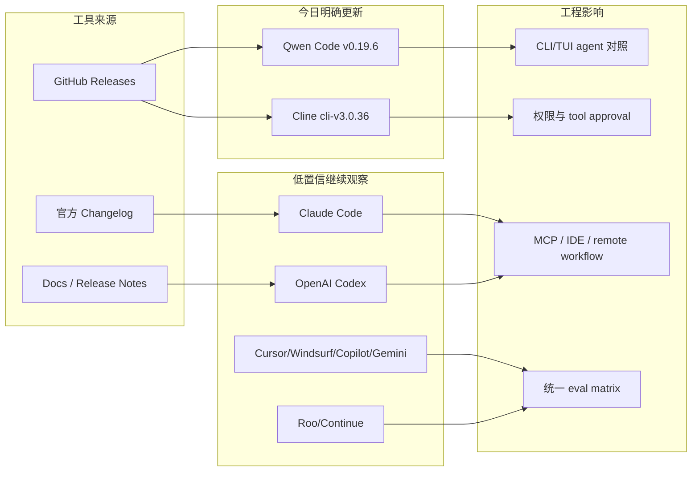

# Coding 工具扫描矩阵 - 2026-07-04

> 类型：Coding 工具 / AI 工具功能更新  
> 返回日报：[[Daily/2026-07-04]]  
> 重点：Claude Tag、agent mode、MCP、IDE 集成、远程执行、权限模式、上下文窗口、CLI/TUI、pricing/rate limit。

## 一句话结论

今日明确新信号集中在开源工具：Qwen Code `v0.19.6` 与 Cline `cli-v3.0.36`；其余大厂/IDE 工具未确认今日高相关更新，保留低置信扫描位。

## 工具扫描矩阵

| 工具 | 厂商 | 来源类型 | 今日状态 | 代表更新 | 对我的影响 | 原文 |
|---|---|---|---|---|---|---|
| Claude Code | Anthropic | Changelog / Release Notes | 低置信 / 未确认今日新增 | 继续观察 Claude Tag、permissions、context、remote execution | 影响团队 agent workflow 与权限边界 | https://docs.anthropic.com/en/release-notes/claude-code |
| OpenAI Codex | OpenAI | Changelog / Docs | 低置信 / 未确认今日新增 | 继续观察 CLI/IDE、background mode、MCP、rate limits | 影响 Codex CLI 与 Hermes/Codex 多 agent 编排 | https://developers.openai.com/codex/changelog |
| Cursor | Cursor | Changelog | 低置信 / 未确认今日新增 | 继续观察 mobile/cloud agent/remote control | 影响远程 agent 监控和任务接力 | https://cursor.com/changelog |
| Windsurf | Windsurf | Changelog | 低置信 / 未确认今日新增 | 继续观察 Agent Command Center / Devin Docs / ACP | 影响 IDE 内 agent 编排和远程任务控制 | https://windsurf.com/changelog |
| GitHub Copilot | GitHub | Changelog / Blog | 低置信 / 未确认今日新增 | 继续观察 agent mode、terminal interface、pricing | 影响企业 IDE agent 标准形态 | https://github.blog/changelog/label/copilot/ |
| Gemini Code Assist | Google | Release Notes | 低置信 / 未确认今日新增 | 继续观察企业 IDE 集成和 policy controls | 影响 Google 生态 coding assistant 落地 | https://cloud.google.com/gemini/docs/codeassist/release-notes |
| Qwen Code | Alibaba/Qwen | GitHub Releases | 有今日 release | `v0.19.6`，2026-07-03T16:36:59Z | 开源 CLI/TUI agent 对照试用 | https://github.com/QwenLM/qwen-code/releases/tag/v0.19.6 |
| Roo Code | Roo Code | GitHub Releases | 无今日新 release | 最新页显示 `v3.54.0`，2026-05-15 | VS Code agent extension 继续观察 | https://github.com/RooCodeInc/Roo-Code/releases/tag/v3.54.0 |
| Cline | Cline | GitHub Releases | 有今日 release | `cli-v3.0.36`，2026-07-03T20:49:27Z | CLI/IDE 双形态 agent loop 值得加入评测 | https://github.com/cline/cline/releases/tag/cli-v3.0.36 |
| Continue | Continue | GitHub Releases | 无今日新 release | 最新可见 `v2.0.0-vscode`，2026-06-19 | IDE extension 观察，今日无明确新功能 | https://github.com/continuedev/continue/releases/tag/v2.0.0-vscode |

## 信息压缩图示

## 对我的影响

| 方向 | 今日信号 | 动作 |
|---|---|---|
| CLI/TUI coding agent | Qwen Code 与 Cline CLI 都有 release | 用同题小任务比较 Codex / Claude / Qwen / Cline |
| 权限模式 | Cline CLI 值得复核 tool approval | 记录命令执行、文件写入、失败恢复 |
| MCP / IDE 集成 | Cline、Roo、Continue 继续作为 IDE agent 观察组 | 关注 MCP server 暴露面和 workspace 隔离 |
| rate limit / pricing | 今日未确认大厂 pricing/rate limit 新项 | 继续保留 Codex / Claude / Copilot 官方源 |

## 可信度与局限性

- GitHub Releases 元数据可用；具体功能变化仍需复核 diff。
- blogwatcher-cli 不可用，大厂工具官方 changelog 扫描低置信。
- 今日重点是“可见 release 信号”，不是完整功能 diff。

## 相关链接

- [[Industry/Tools/2026-07-04/qwen-code-v0-19-6-release-watch]]
- [[Industry/Tools/2026-07-04/cline-cli-v3-0-36-release-watch]]
- [[Daily/2026-07-04]]

## 标签

#ai-radar #coding-agent #codex #claude-code #qwen-code #cline #mcp
