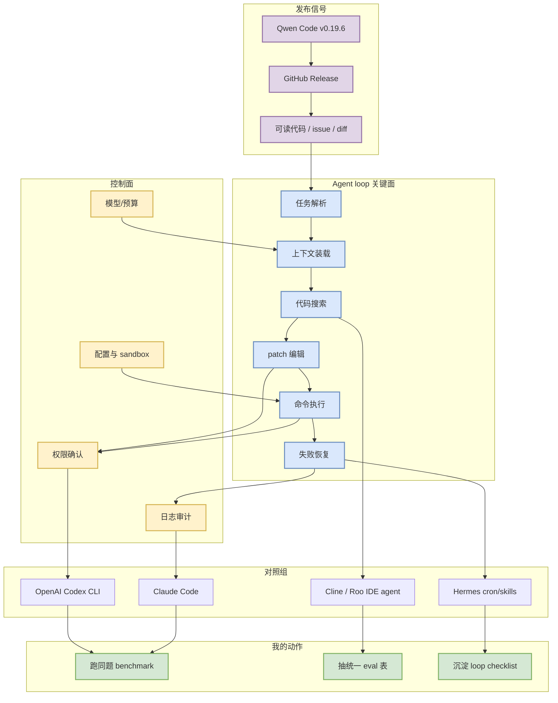
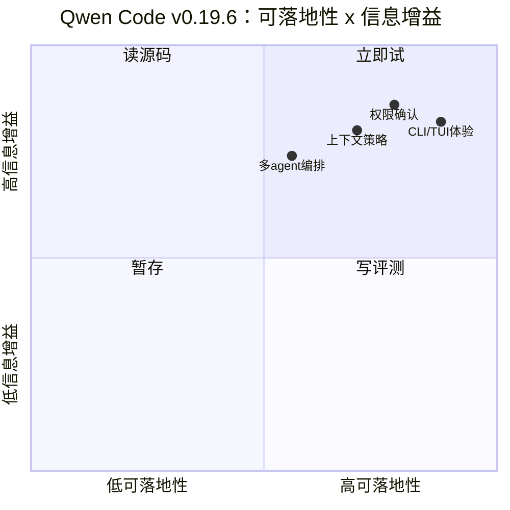

# Qwen Code v0.19.6 release watch

> 类型：Coding 工具更新  
> 大类：Coding 工具 / AI Agent CLI  
> 小类：Open-source coding agent  
> 推荐等级：必读  
> 创建日期：2026-07-04  
> 原文链接：https://github.com/QwenLM/qwen-code/releases/tag/v0.19.6  
> 网页详情：https://github.com/dyt27666-oss/AI-news-report-obsidians/blob/main/Industry/Tools/2026-07-04/qwen-code-v0-19-6-release-watch.md  
> 返回日报：[[Daily/2026-07-04]]

## 一句话结论

Qwen Code 在 2026-07-03T16:36:59Z 发布 `v0.19.6`，是今日最明确的开源 coding-agent CLI/TUI 更新信号，适合继续作为 Codex / Claude Code 的可观察对照组。

## TL;DR

- **它是什么**：QwenLM 维护的开源 coding-agent CLI/TUI release。
- **为什么重要**：开源实现能观察 agent loop、命令执行、文件编辑、权限边界和上下文处理，而闭源工具通常只暴露产品层 changelog。
- **和我相关的点**：适合用同一小型仓库任务对比 Codex CLI、Claude Code、Cline、Roo Code 的权限确认、patch 质量、失败恢复和总结质量。
- **建议动作**：把 `v0.19.6` 纳入 coding-agent eval matrix；若安装成本低，今天跑一次 rummy rules / simulator 小任务。

## 元信息

| 字段 | 内容 |
|---|---|
| 发布方/来源 | QwenLM / GitHub Releases |
| 大厂/实验室 | Alibaba/Qwen |
| 栏目/来源类型 | GitHub Release |
| 作者/机构 | QwenLM |
| 发布时间 | 2026-07-03T16:36:59Z |
| Release tag | `v0.19.6` |
| 原文 | [v0.19.6](https://github.com/QwenLM/qwen-code/releases/tag/v0.19.6) |
| 代码 | https://github.com/QwenLM/qwen-code |
| PDF | 无 |
| 标签 | #coding-agent #qwen-code #cli #tui #agent-loop |

## 信息压缩图示

### 主图：开源 coding agent 观察框架

### 辅助结构：试用优先级

## 专业解读

Qwen Code 的价值不是单个版本号，而是它提供了一个可安装、可读代码、可重复测试的 coding-agent 实验台。对 AI Infra / LLM 工程来说，coding agent 其实是一个受控执行 runtime：它要把自然语言任务转成搜索、编辑、运行测试、复盘总结等动作，同时处理权限边界、上下文裁剪、日志审计和错误恢复。

今日 `v0.19.6` 的 release 元数据说明 Qwen Code 继续高频迭代。即使 release note 未充分展开 diff，也应把它放入固定监控，因为它能补足 Codex / Claude Code 这类闭源工具不透明的部分：prompt/harness 结构、工具调用协议、CLI/TUI 状态机、配置方式和失败恢复策略。

## 通俗解释

把 Qwen Code 当成一个开源版 coding agent 实验台。它未必比 Codex 或 Claude Code 强，但它让我们能看到工具是怎么读文件、改代码、跑命令、展示状态和恢复错误的。

## 关键机制拆解

| 机制 | 解决的问题 | 为什么有效 | 可能的坑 |
|---|---|---|---|
| CLI/TUI agent loop | 把任务拆成连续工具调用 | 适合长任务和可审计执行 | TUI 状态可能难自动化测试 |
| GitHub release cadence | 捕捉功能变化 | 高频 release 暴露方向 | release note 可能不完整 |
| 开源实现 | 可读代码、可复现 | 能抽 harness / prompt / tool 协议 | 工程成熟度需本地验证 |
| 对照 benchmark | 横向比较 Codex / Claude / Cline | 同题更能暴露权限和上下文差异 | 需要控制模型和任务难度 |

## 对我的影响

| 维度 | 影响 | 建议动作 |
|---|---|---|
| AI Infra | 可作为 agent runtime 的轻量样本 | 看工具、日志、状态、sandbox 如何封装 |
| LLM 工程 | 可对比上下文窗口与指令组织 | 记录 prompt/context 策略 |
| RL / Game AI | 可用于自动生成/评测 simulator 代码 | 用 Point Rummy rules task 试跑 |
| Agent / Eval | 适合做 coding-agent benchmark | 与 Codex/Claude Code 同题对比 |

## 可信度与局限性

- 证据强度：中；GitHub release 元数据可靠，但未深入解析 commit diff。
- 局限性：版本发布不等于功能重大变化；仍需复核 changelog / commits。
- 潜在风险：命令执行隔离、prompt injection 防护和文件写入权限需要单独验证。
- 还需要确认：本次 tag 是否包含 CLI/TUI、权限、模型路由、工具调用或上下文处理变化。

## 我应该如何跟进

1. 在隔离目录跑一个小型代码修改任务，对比 Codex CLI 和 Claude Code。
2. 记录权限确认、失败恢复、上下文压缩、日志可读性四个维度。
3. 若表现稳定，把试用流程沉淀到 loop engineering checklist。

## 相关链接

- 原文：https://github.com/QwenLM/qwen-code/releases/tag/v0.19.6
- 代码：https://github.com/QwenLM/qwen-code
- 相关卡片：[[Industry/Tools/2026-07-04/coding-tools-update-matrix]]

## 标签

#ai-radar #coding-agent #qwen-code #cli #tui #agent-loop

