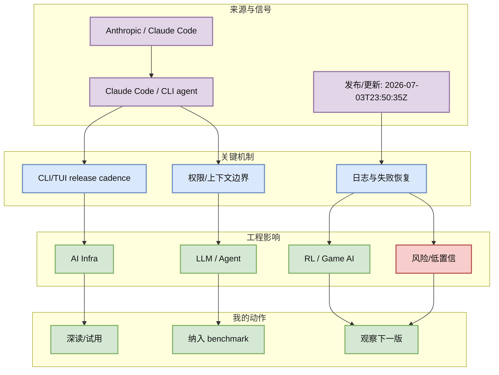
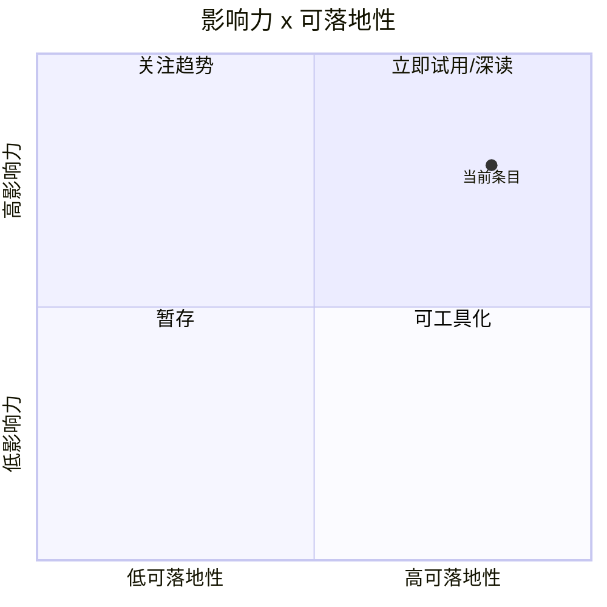

# Claude Code v2.1.201：官方 GitHub release 显示 coding agent CLI 持续快速迭代

> 类型：Coding 工具更新  
> 大类：Coding 工具  
> 小类：Claude Code / CLI agent  
> 推荐等级：必读  
> 创建日期：2026-07-05  
> 原文链接：https://github.com/anthropics/claude-code/releases/tag/v2.1.201  
> 网页详情：https://github.com/dyt27666-oss/AI-news-report-obsidians/blob/main/Industry/Tools/2026-07-05/claude-code-v2-1-201-release-watch.md  
> 返回日报：[[Daily/2026-07-05]]

## 一句话结论

Claude Code 官方 GitHub release 在 7/3 UTC 发布 v2.1.201，说明 CLI/TUI coding agent 仍在高频迭代，值得继续做权限、上下文和远程执行对照。

## TL;DR

- **它是什么**：Anthropic Claude Code 的公开 release。
- **为什么重要**：它是 coding-agent CLI 的事实标杆之一。
- **和我相关的点**：影响多 agent、tmux、远程执行和权限边界。
- **建议动作**：加入 Codex / Qwen Code / Cline 同题 benchmark。

## 元信息

| 字段 | 内容 |
|---|---|
| 发布方/来源 | Anthropic / Claude Code |
| 大厂/实验室 | Anthropic  |
| 栏目/来源类型 | GitHub Release / Changelog |
| 作者/机构 | Anthropic / Claude Code |
| 发布时间 | 2026-07-03T23:50:35Z |
| 原文 | [原文](https://github.com/anthropics/claude-code/releases/tag/v2.1.201) |
| 代码 | https://github.com/anthropics/claude-code/releases/tag/v2.1.201 |
| PDF | 未发现 |
| 标签 | #claude-code #coding-agent #agent-loop |

## 信息压缩图示

### 主图：信号到行动

### 辅助图：影响力 x 可落地性

## 专业解读

Claude Code 官方 GitHub release 在 7/3 UTC 发布 v2.1.201，说明 CLI/TUI coding agent 仍在高频迭代，值得继续做权限、上下文和远程执行对照。 对用户最重要的不是“又一个更新”，而是它暴露了 agent/coding workflow 的真实工程接口：权限、上下文、工具调用、日志、远程执行、失败恢复和评测闭环。若这些接口稳定，就可以把单次 AI coding 变成可复现的 loop；若接口频繁变化，就需要在 harness 层做抽象，避免把业务流程绑死在某一个 IDE 或 CLI。

## 通俗解释

可以把这个条目理解成“AI 编程工具从聊天窗口继续走向自动化工作台”。真正有价值的是能否放进 tmux、CI、远程机器或 Obsidian 知识库流程里，而不是 demo 看起来多聪明。

## 关键机制拆解

| 机制 | 解决的问题 | 为什么有效 | 可能的坑 |
|---|---|---|---|
| CLI/TUI release cadence | 让 agent 能进入 terminal workflow | 适合自动化、cron、远程机器 | 版本变动快 |
| 权限/上下文边界 | 避免 agent 误写或泄漏 | 可通过 harness 固化策略 | 默认配置需复核 |
| 日志与失败恢复 | 让长任务可审计 | 便于多 agent 协作 | 日志格式可能变化 |

## 对我的影响

| 维度 | 影响 | 建议动作 |
|---|---|---|
| AI Infra | 需要把 CLI agent 当成 runtime 组件管理。 | 记录版本、权限、日志和 workspace 隔离。 |
| LLM 工程 | 影响代码生成任务的上下文组织。 | 用同题任务比较上下文压缩效果。 |
| RL / Game AI | 可用于训练环境/评测脚本自动化。 | 先做只读和小范围写入试验。 |
| Agent / Eval | 适合进入 agent-loop benchmark。 | 设计失败恢复与回滚用例。 |

## 可信度与局限性

- 证据强度：来自公开 release/changelog/RSS/GitHub snapshot，可信度中等到高。
- 局限性：未逐条运行工具或复现代码，功能细节仍需本地验证。
- 潜在风险：release 标题不等于稳定 API；rate limit 导致 GitHub broad 数据使用 fallback。
- 还需要确认：许可、版本兼容、企业权限策略、日志可观测性。

## 我应该如何跟进

1. 把该条目加入 coding-agent 对照表：权限、上下文、MCP、CLI/TUI、远程执行、日志。
2. 用同一个小型 repo 做 30 分钟 smoke test，记录失败恢复路径。
3. 若能稳定运行，再纳入 Hermes/Codex/Claude Code 多 agent harness。

## 相关链接

- 原文：https://github.com/anthropics/claude-code/releases/tag/v2.1.201
- 网页详情：https://github.com/dyt27666-oss/AI-news-report-obsidians/blob/main/Industry/Tools/2026-07-05/claude-code-v2-1-201-release-watch.md
- 相关卡片：[[Daily/2026-07-05]]

## 标签

#ai-radar #claude-code #coding-agent #agent-loop
