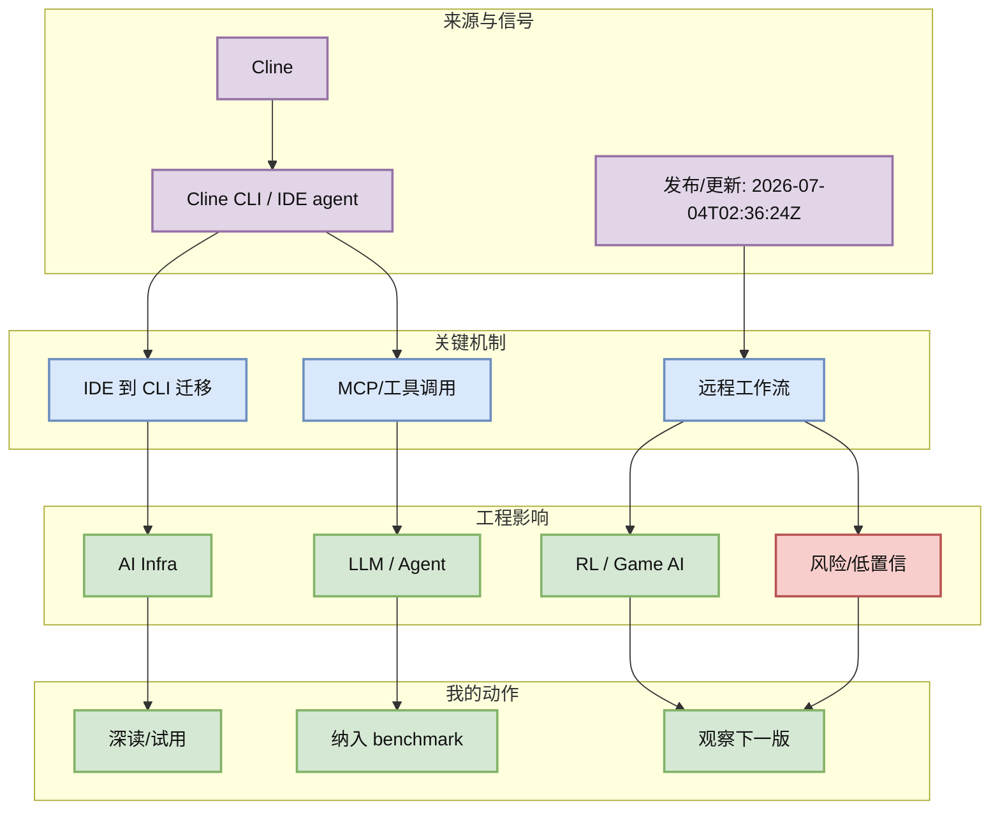
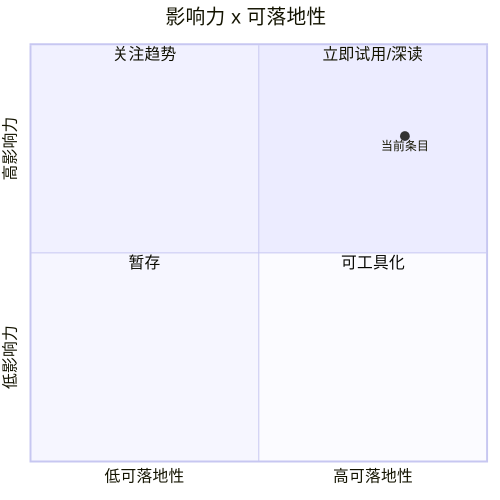

# Cline CLI v3.0.37：IDE agent 继续向 CLI/remote workflow 扩展

> 类型：Coding 工具更新  
> 大类：Coding 工具  
> 小类：Cline CLI / IDE agent  
> 推荐等级：必读  
> 创建日期：2026-07-05  
> 原文链接：https://github.com/cline/cline/releases/tag/cli-v3.0.37  
> 网页详情：https://github.com/dyt27666-oss/AI-news-report-obsidians/blob/main/Industry/Tools/2026-07-05/cline-cli-v3-0-37-release-watch.md  
> 返回日报：[[Daily/2026-07-05]]

## 一句话结论

Cline CLI 在 7/4 UTC 发布 cli-v3.0.37，说明 IDE agent 正在继续补齐命令行入口，适合观察 MCP、权限和远程执行。

## TL;DR

- **它是什么**：Cline 的 CLI release。
- **为什么重要**：CLI 能接入 tmux、CI、远程服务器和自动评测。
- **和我相关的点**：可作为 Claude Code / Codex 的开源对照。
- **建议动作**：测试 MCP、权限提示、日志和 workspace 隔离。

## 元信息

| 字段 | 内容 |
|---|---|
| 发布方/来源 | Cline |
| 大厂/实验室 | Cline |
| 栏目/来源类型 | GitHub Release |
| 作者/机构 | Cline |
| 发布时间 | 2026-07-04T02:36:24Z |
| 原文 | [原文](https://github.com/cline/cline/releases/tag/cli-v3.0.37) |
| 代码 | https://github.com/cline/cline/releases/tag/cli-v3.0.37 |
| PDF | 未发现 |
| 标签 | #cline #coding-agent #mcp |

## 信息压缩图示

### 主图：信号到行动

### 辅助图：影响力 x 可落地性

## 专业解读

Cline CLI 在 7/4 UTC 发布 cli-v3.0.37，说明 IDE agent 正在继续补齐命令行入口，适合观察 MCP、权限和远程执行。 对用户最重要的不是“又一个更新”，而是它暴露了 agent/coding workflow 的真实工程接口：权限、上下文、工具调用、日志、远程执行、失败恢复和评测闭环。若这些接口稳定，就可以把单次 AI coding 变成可复现的 loop；若接口频繁变化，就需要在 harness 层做抽象，避免把业务流程绑死在某一个 IDE 或 CLI。

## 通俗解释

可以把这个条目理解成“AI 编程工具从聊天窗口继续走向自动化工作台”。真正有价值的是能否放进 tmux、CI、远程机器或 Obsidian 知识库流程里，而不是 demo 看起来多聪明。

## 关键机制拆解

| 机制 | 解决的问题 | 为什么有效 | 可能的坑 |
|---|---|---|---|
| IDE 到 CLI 迁移 | 减少 IDE 依赖 | 让 agent 可脚本化 | CLI 功能可能不完整 |
| MCP/工具调用 | 统一外部工具接口 | 便于多工具编排 | 工具权限需收敛 |
| 远程工作流 | 支持服务器端 agent loop | 适合 tmux/cron | 需要审计日志 |

## 对我的影响

| 维度 | 影响 | 建议动作 |
|---|---|---|
| AI Infra | CLI agent 变成可部署组件。 | 纳入远程执行安全检查。 |
| LLM 工程 | 可比较不同 agent 的修改质量。 | 跑统一 coding benchmark。 |
| RL / Game AI | 可自动改训练脚本和评测配置。 | 先限制目录写权限。 |
| Agent / Eval | 开放日志后可做回放评测。 | 设计多轮任务集。 |

## 可信度与局限性

- 证据强度：来自公开 release/changelog/RSS/GitHub snapshot，可信度中等到高。
- 局限性：未逐条运行工具或复现代码，功能细节仍需本地验证。
- 潜在风险：release 标题不等于稳定 API；rate limit 导致 GitHub broad 数据使用 fallback。
- 还需要确认：许可、版本兼容、企业权限策略、日志可观测性。

## 我应该如何跟进

1. 把该条目加入 coding-agent 对照表：权限、上下文、MCP、CLI/TUI、远程执行、日志。
2. 用同一个小型 repo 做 30 分钟 smoke test，记录失败恢复路径。
3. 若能稳定运行，再纳入 Hermes/Codex/Claude Code 多 agent harness。

## 相关链接

- 原文：https://github.com/cline/cline/releases/tag/cli-v3.0.37
- 网页详情：https://github.com/dyt27666-oss/AI-news-report-obsidians/blob/main/Industry/Tools/2026-07-05/cline-cli-v3-0-37-release-watch.md
- 相关卡片：[[Daily/2026-07-05]]

## 标签

#ai-radar #cline #coding-agent #mcp
