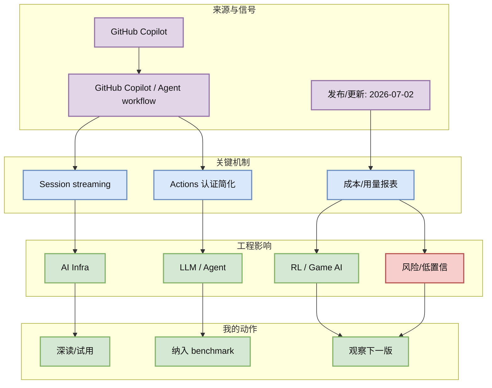
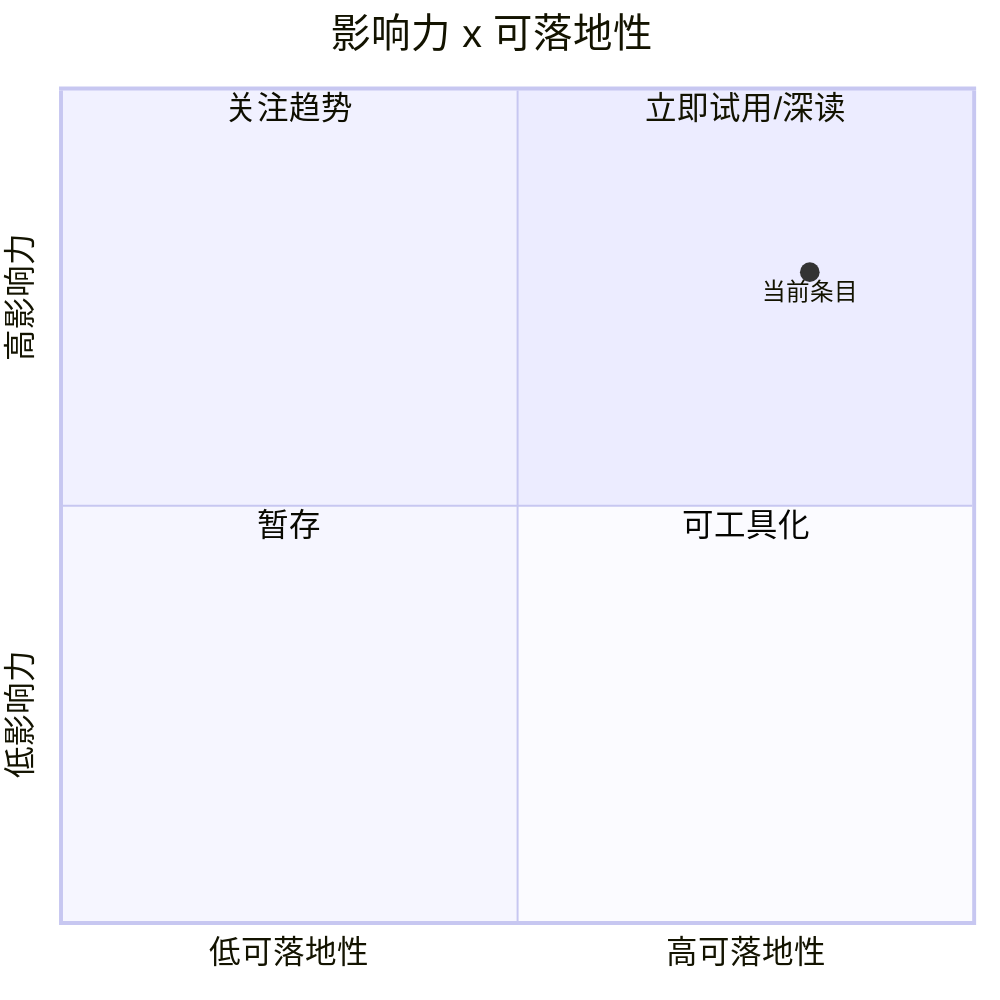

# GitHub Copilot 7/2 changelog：agent session streaming 与 Actions 认证变化值得跟踪

> 类型：Coding 工具更新  
> 大类：Coding 工具  
> 小类：GitHub Copilot / Agent workflow  
> 推荐等级：必读  
> 创建日期：2026-07-05  
> 原文链接：https://github.blog/changelog/2026-07-02-copilot-agent-session-streaming-is-now-in-public-preview  
> 网页详情：https://github.com/dyt27666-oss/AI-news-report-obsidians/blob/main/Industry/Tools/2026-07-05/github-copilot-agent-session-streaming.md  
> 返回日报：[[Daily/2026-07-05]]

## 一句话结论

Copilot agent session streaming public preview 和 Copilot CLI in Actions 免 PAT 两个信号，说明企业 coding agent 正在补齐可观测性和 CI 入口。

## TL;DR

- **它是什么**：GitHub Copilot changelog 中的 agent session streaming / Actions CLI 更新。
- **为什么重要**：企业 coding agent 的关键不是生成代码，而是 session 可观测、认证可控、CI 可接入。
- **和我相关的点**：影响 agent 监控、审计、权限和远程执行。
- **建议动作**：跟踪 session streaming API/日志形态。

## 元信息

| 字段 | 内容 |
|---|---|
| 发布方/来源 | GitHub Copilot |
| 大厂/实验室 | GitHub Copilot |
| 栏目/来源类型 | Changelog / Public Preview |
| 作者/机构 | GitHub Copilot |
| 发布时间 | 2026-07-02 |
| 原文 | [原文](https://github.blog/changelog/2026-07-02-copilot-agent-session-streaming-is-now-in-public-preview) |
| 代码 | 未发现 |
| PDF | 未发现 |
| 标签 | #github-copilot #agent-streaming #ci |

## 信息压缩图示

### 主图：信号到行动

### 辅助图：影响力 x 可落地性

## 专业解读

Copilot agent session streaming public preview 和 Copilot CLI in Actions 免 PAT 两个信号，说明企业 coding agent 正在补齐可观测性和 CI 入口。 对用户最重要的不是“又一个更新”，而是它暴露了 agent/coding workflow 的真实工程接口：权限、上下文、工具调用、日志、远程执行、失败恢复和评测闭环。若这些接口稳定，就可以把单次 AI coding 变成可复现的 loop；若接口频繁变化，就需要在 harness 层做抽象，避免把业务流程绑死在某一个 IDE 或 CLI。

## 通俗解释

可以把这个条目理解成“AI 编程工具从聊天窗口继续走向自动化工作台”。真正有价值的是能否放进 tmux、CI、远程机器或 Obsidian 知识库流程里，而不是 demo 看起来多聪明。

## 关键机制拆解

| 机制 | 解决的问题 | 为什么有效 | 可能的坑 |
|---|---|---|---|
| Session streaming | 让 agent 执行过程可观察 | 便于 review 和中断 | 预览期接口可能变化 |
| Actions 认证简化 | 降低 CI 中使用 Copilot CLI 的摩擦 | 更容易接入自动化 | 权限边界需审计 |
| 成本/用量报表 | 企业落地必须可计量 | 支持 AI credit pool 管理 | 指标口径需确认 |

## 对我的影响

| 维度 | 影响 | 建议动作 |
|---|---|---|
| AI Infra | agent observability 成为基础设施能力。 | 抽象 session log schema。 |
| LLM 工程 | CI 内 coding assistant 更容易落地。 | 验证最小权限配置。 |
| RL / Game AI | 可辅助自动生成评测报告。 | 避免在训练机器上默认授权。 |
| Agent / Eval | streaming 便于做过程级 eval。 | 记录 action trace。 |

## 可信度与局限性

- 证据强度：来自公开 release/changelog/RSS/GitHub snapshot，可信度中等到高。
- 局限性：未逐条运行工具或复现代码，功能细节仍需本地验证。
- 潜在风险：release 标题不等于稳定 API；rate limit 导致 GitHub broad 数据使用 fallback。
- 还需要确认：许可、版本兼容、企业权限策略、日志可观测性。

## 我应该如何跟进

1. 把该条目加入 coding-agent 对照表：权限、上下文、MCP、CLI/TUI、远程执行、日志。
2. 用同一个小型 repo 做 30 分钟 smoke test，记录失败恢复路径。
3. 若能稳定运行，再纳入 Hermes/Codex/Claude Code 多 agent harness。

## 相关链接

- 原文：https://github.blog/changelog/2026-07-02-copilot-agent-session-streaming-is-now-in-public-preview
- 网页详情：https://github.com/dyt27666-oss/AI-news-report-obsidians/blob/main/Industry/Tools/2026-07-05/github-copilot-agent-session-streaming.md
- 相关卡片：[[Daily/2026-07-05]]

## 标签

#ai-radar #github-copilot #agent-streaming #ci
