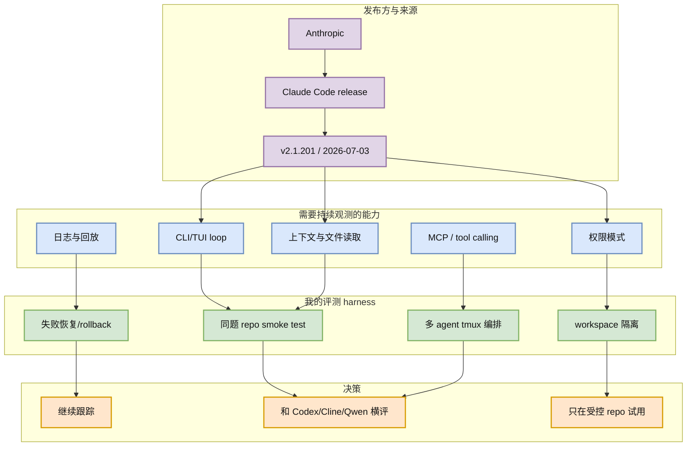

# Claude Code v2.1.201：CLI coding agent 高频迭代仍是对照标杆

> 类型：Coding 工具更新  
> 大类：Coding 工具  
> 小类：Claude Code / CLI agent  
> 推荐等级：必读  
> 创建日期：2026-07-06  
> 原文链接：https://github.com/anthropics/claude-code/releases/tag/v2.1.201  
> 网页详情：https://github.com/dyt27666-oss/AI-news-report-obsidians/blob/main/Industry/Tools/2026-07-06/claude-code-v2-1-201-release-watch.md  
> 返回日报：[[Daily/2026-07-06]]

## 一句话结论

Claude Code 最新公开 release 仍停在 `v2.1.201`（2026-07-03T23:50:35Z），但它继续是 CLI/TUI coding-agent loop 的事实标杆，今天应作为权限、上下文、日志与远程执行能力的对照项。

## TL;DR

- **它是什么**：Anthropic Claude Code 的官方 GitHub Release。
- **为什么重要**：Claude Code 是 terminal-first coding agent 的主要参照物。
- **和我相关的点**：适合和 Codex、Qwen Code、Cline 比较 MCP、权限、workspace 隔离、日志回放。
- **建议动作**：保留在每日 Coding 工具矩阵里，用固定小 repo 做同题 smoke test。

## 元信息

| 字段 | 内容 |
|---|---|
| 发布方/来源 | Anthropic / Claude Code |
| 大厂/实验室 | Anthropic |
| 栏目/来源类型 | GitHub Release / Changelog |
| 作者/机构 | Anthropic |
| 发布时间 | 2026-07-03T23:50:35Z |
| Release tag | `v2.1.201` |
| 原文 | [GitHub Release](https://github.com/anthropics/claude-code/releases/tag/v2.1.201) |
| 代码 | https://github.com/anthropics/claude-code |
| PDF | 未发现 |
| 标签 | #claude-code #coding-agent #agent-loop |

## 信息压缩图示

### 主图：从 release 信号到工程动作

### 辅助结构：对 AI coding 工作流影响矩阵

| 维度 | 影响 | 需要验证的问题 |
|---|---|---|
| CLI/TUI | 能进入 tmux、SSH、CI、cron | 是否有稳定日志与退出码 |
| 权限模式 | 决定能否安全交给 agent 写代码 | 是否支持细粒度 allow/deny |
| 上下文 | 影响长 repo 修复质量 | 是否有可解释的文件选择策略 |
| MCP / Tool use | 决定外部系统集成能力 | 工具调用是否可审计 |
| 回放 | 决定能否做 regression eval | session trace 是否易导出 |

## 专业解读

Claude Code 的价值不在于单个 patch note，而在于它把 coding agent 固定在 terminal workflow 中：开发者可以把它放进远程机器、tmux pane、CI job、review loop 和知识库生成流程。对 AI Infra 工程师来说，这意味着 coding agent 要被当作 runtime 组件管理：版本、权限、workspace、日志和失败恢复都要纳入控制面。

当前公开 release 元数据没有足够信息证明某个新能力今天上线，因此本条标注为“高相关 release watch”，不把它写成未验证的新功能。真正应该沉淀的是对照评测框架：Claude Code、Codex、Cline、Qwen Code 在同一个 repo、同一个 bug、同一组权限下的行为差异。

## 通俗解释

这不是“又发了一个版本”那么简单。Claude Code 代表的是把 AI 编程助手从聊天窗口搬到终端里；一旦进了终端，它就可以被脚本、监控、权限和日志管理起来，才可能成为稳定的工程工具。

## 关键机制拆解

| 机制 | 解决的问题 | 为什么有效 | 可能的坑 |
|---|---|---|---|
| Terminal-first agent | 让 agent 进入真实工程环境 | 适配 ssh/tmux/CI | 误写文件的风险更高 |
| Release cadence | 快速修复/迭代能力 | 说明产品活跃 | API/行为可能变化快 |
| 权限边界 | 控制读写范围 | 可降低误操作风险 | 默认设置需要复核 |
| 日志回放 | 支持审计与 eval | 可复现失败路径 | 日志格式可能不稳定 |

## 对我的影响

| 维度 | 影响 | 建议动作 |
|---|---|---|
| AI Infra | 把 coding agent 当 runtime 管理 | 建版本矩阵、权限矩阵、日志 schema |
| LLM 工程 | 观察上下文选择和工具调用策略 | 用同题任务比较 token/成功率 |
| RL / Game AI | 可自动生成/修复环境与评测脚本 | 先限制在测试目录运行 |
| Agent / Eval | 适合做 loop-level benchmark | 收集 trace、失败、回滚数据 |

## 可信度与局限性

- 证据强度：高；release 元数据来自 GitHub API。
- 局限性：今日未复现该版本功能，也未确认 patch note 细节。
- 风险：不能把 release tag 直接等同于新能力；需要本地 smoke test。
- 数据问题：GitHub broad search 今日部分 rate limit，日报用 fallback 榜单并明确标注。

## 我应该如何跟进

1. 用固定小 repo 跑 Claude Code / Codex / Cline / Qwen Code 同题任务。
2. 记录权限提示、文件读取、命令执行、失败恢复和日志导出能力。
3. 如果 session trace 稳定，再纳入长期 agent-loop regression。

## 相关链接

- 原文：https://github.com/anthropics/claude-code/releases/tag/v2.1.201
- 仓库：https://github.com/anthropics/claude-code
- 返回：[[Daily/2026-07-06]]

## 标签

#ai-radar #claude-code #coding-agent #agent-loop
