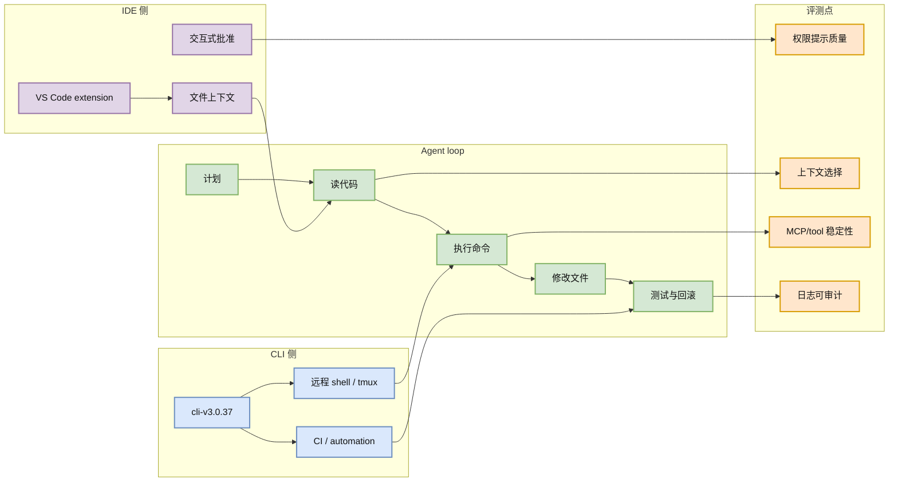

# Cline CLI v3.0.37：IDE agent 继续向 CLI / remote workflow 扩展

> 类型：Coding 工具更新  
> 大类：Coding 工具  
> 小类：Cline / CLI / IDE agent  
> 推荐等级：必读  
> 创建日期：2026-07-06  
> 原文链接：https://github.com/cline/cline/releases/tag/cli-v3.0.37  
> 网页详情：https://github.com/dyt27666-oss/AI-news-report-obsidians/blob/main/Industry/Tools/2026-07-06/cline-cli-v3-0-37-release-watch.md  
> 返回日报：[[Daily/2026-07-06]]

## 一句话结论

Cline 最新可见 CLI release 为 `cli-v3.0.37`（2026-07-04T02:36:24Z），它说明 IDE agent 正在补齐 CLI/远程执行入口，值得放进 coding-agent loop 横评。

## TL;DR

- **它是什么**：Cline 的 CLI release。
- **为什么重要**：Cline 原本强在 VS Code agent 体验，CLI 化后更容易进入远程机器、CI 和多 agent 调度。
- **和我相关的点**：适合观察 agent mode、MCP、权限确认、上下文压缩和任务恢复。
- **建议动作**：作为 Claude Code / Codex 的开源对照组。

## 元信息

| 字段 | 内容 |
|---|---|
| 发布方/来源 | Cline |
| 栏目/来源类型 | GitHub Release |
| 作者/机构 | Cline |
| 发布时间 | 2026-07-04T02:36:24Z |
| Release tag | `cli-v3.0.37` |
| 原文 | [GitHub Release](https://github.com/cline/cline/releases/tag/cli-v3.0.37) |
| 代码 | https://github.com/cline/cline |
| PDF | 未发现 |
| 标签 | #cline #coding-agent #cli-agent |

## 信息压缩图示

### 主图：Cline 从 IDE 到 CLI 的 agent loop

### 辅助结构：横评关注点

| 横评项 | Cline CLI 价值 | 和 Claude Code / Codex 的差异观察 |
|---|---|---|
| IDE 集成 | 原生 VS Code 心智强 | 是否比 terminal-first 更可控 |
| CLI 自动化 | 能进入 remote/CI | 是否有稳定非交互模式 |
| MCP | 适合扩展工具调用 | 工具权限与日志是否透明 |
| 回滚 | 长任务必须可恢复 | 是否记录足够上下文 |

## 专业解读

Cline CLI 的关键意义是“IDE agent 的边界外扩”。如果 agent 只能在 IDE 里运行，它适合个人交互；如果它能稳定作为 CLI 运行，就可以进入远程开发机、CI、批量修复、代码审查流水线和多 agent 编排。对用户的 AI coding workflow 来说，CLI/IDE 双形态工具值得重点观察，因为它可能兼顾交互体验与自动化。

但今天只能确认 release 元数据，不能确认具体功能变化。因此日报将它作为高相关工具更新，而不是宣称某个未验证新功能已上线。下一步应以同题任务跑 smoke test：同一个 bug、同样权限、同样命令预算，比较 Cline、Claude Code、Codex 的成功率与可审计性。

## 通俗解释

Cline 正在从“VS Code 里的 AI 助手”变成“可以在命令行里跑的 AI 助手”。这会让它更容易被放进自动化脚本、远程机器和团队流程里。

## 关键机制拆解

| 机制 | 解决的问题 | 为什么有效 | 风险 |
|---|---|---|---|
| CLI 入口 | 自动化与远程执行 | 可被 shell/tmux/CI 调度 | 权限配置复杂 |
| IDE 上下文 | 理解项目结构 | 与开发者工作区贴近 | 可能绑定 VS Code 心智 |
| MCP/tool use | 接入外部工具 | 扩展执行能力 | 审计与安全边界要明确 |
| Agent loop | 多步计划和修复 | 适合真实工程任务 | 无限循环和误操作风险 |

## 对我的影响

| 维度 | 影响 | 建议动作 |
|---|---|---|
| AI Infra | 可作为 agent runtime 候选 | 测 CLI 非交互执行和日志 |
| LLM 工程 | 观察上下文压缩和 repo repair | 用 TUA-Bench / 小 repo 做横评 |
| Agent Eval | 适合 loop-level 过程评测 | 记录每一步工具调用 |
| RL / Game AI | 可自动改环境脚本 | 限制写入范围并强制测试 |

## 可信度与局限性

- 证据强度：高；release 元数据来自 GitHub API。
- 局限性：未运行 Cline CLI，也未读取完整 release body。
- 风险：CLI release 不等于稳定生产 API。
- 数据问题：今日 GitHub broad search rate-limited，Cline release API 可访问。

## 我应该如何跟进

1. 将 Cline CLI 加入 Claude Code / Codex / Qwen Code 同题横评。
2. 观察其 agent loop 是否支持可导出的 trace 和失败恢复。
3. 重点测试 remote workspace、权限确认、命令输出裁剪。

## 相关链接

- 原文：https://github.com/cline/cline/releases/tag/cli-v3.0.37
- 仓库：https://github.com/cline/cline
- 返回：[[Daily/2026-07-06]]

## 标签

#ai-radar #cline #coding-agent #cli-agent
