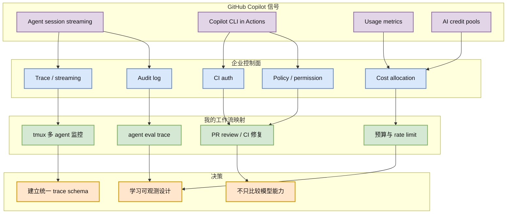

# GitHub Copilot：agent session streaming / CLI in Actions 是企业 coding-agent 可观测性信号

> 类型：Coding 工具更新  
> 大类：Coding 工具 / 企业 AI coding 平台  
> 小类：GitHub Copilot / agent session / CI  
> 推荐等级：必读  
> 创建日期：2026-07-06  
> 原文链接：https://github.blog/changelog/label/copilot/  
> 网页详情：https://github.com/dyt27666-oss/AI-news-report-obsidians/blob/main/Industry/Tools/2026-07-06/github-copilot-coding-agent-observability-watch.md  
> 返回日报：[[Daily/2026-07-06]]

## 一句话结论

GitHub Copilot 近期 changelog 继续围绕 agent session streaming、Actions 中 Copilot CLI 认证、usage metrics 与 credit pools 展开，核心信号是企业 coding agent 正在补齐可观测、可审计和成本治理。

## TL;DR

- **它是什么**：GitHub Copilot changelog / product update watch。
- **为什么重要**：企业采纳 coding agent 的瓶颈不是 demo，而是 trace、权限、CI 接入和成本。
- **和我相关的点**：可借鉴 session streaming / usage metrics 设计自己的 agent-loop observability。
- **建议动作**：把 Copilot 作为“企业化 agent workflow”的对照，不只看代码生成质量。

## 元信息

| 字段 | 内容 |
|---|---|
| 发布方/来源 | GitHub / Microsoft |
| 大厂/实验室 | Microsoft / GitHub |
| 栏目/来源类型 | Changelog / Product Announcement |
| 作者/机构 | GitHub Copilot team |
| 发布时间 | 近期 changelog；今日未确认新增高相关项 |
| 代表链接 | https://github.blog/changelog/label/copilot/ |
| 原文 | [GitHub Copilot Changelog](https://github.blog/changelog/label/copilot/) |
| PDF | 未发现 |
| 标签 | #github-copilot #coding-agent #observability |

## 信息压缩图示

### 主图：企业 coding agent 的控制面

### 辅助结构：能力到工程价值

| 能力 | 解决的问题 | 对我的价值 |
|---|---|---|
| Session streaming | agent 执行过程不可见 | 可做过程级 review 和 debug |
| CLI in Actions | CI 中认证繁琐 | 降低自动修复流水线接入成本 |
| Usage metrics | 成本与使用不可控 | 支持团队级 ROI / rate limit 管理 |
| Credit pools | 企业预算分摊 | 有助于多 agent 任务成本治理 |

## 专业解读

GitHub Copilot 的产品方向说明，企业 coding agent 的关键竞争点正在从“生成代码能力”转向“过程可控”。Session streaming 可以让人看到 agent 在做什么；Actions 中的 CLI 认证降低了 CI agent 的接入门槛；usage metrics 和 credit pools 则说明成本治理变成正式产品能力。对 AI Infra / coding workflow 来说，这些都是 agent runtime control plane 的组成部分。

这类信号值得放进日报，即使不是严格今天发布，因为它直接影响团队如何把 agent 放进 PR、CI、review、远程执行和审计系统。相比个人 IDE 助手，GitHub Copilot 更像企业 workflow 入口。

## 通俗解释

企业不会只因为 AI 会写代码就放心使用。真正需要的是能看到它做了什么、谁授权了它、花了多少钱、出错后怎么追踪。Copilot 的这些更新就是在补这些“管理能力”。

## 关键机制拆解

| 机制 | 解决的问题 | 为什么有效 | 风险 |
|---|---|---|---|
| Session streaming | 黑盒执行 | 实时展示过程 | trace 是否可导出未知 |
| CI 认证 | PAT 管理复杂 | 降低接入成本 | 权限边界需检查 |
| Usage metrics | 使用不可见 | 团队级治理 | 指标粒度可能不足 |
| Credit pools | 成本分摊 | 预算可控 | 可能改变 agent 使用策略 |

## 对我的影响

| 维度 | 影响 | 建议动作 |
|---|---|---|
| AI Infra | agent control plane 需要 trace、auth、budget | 设计统一 session schema |
| LLM 工程 | 评测要覆盖过程，不只覆盖最终 diff | 抽取工具调用和上下文选择 |
| Agent Eval | session streaming 可作为 benchmark 数据源 | 观察是否能导出/回放 |
| 团队流程 | CI agent 更容易上线 | 明确权限和 rollback |

## 可信度与局限性

- 证据强度：中高；来源为 GitHub 官方 changelog feed。
- 局限性：今日 RSS 未确认全新高相关项，使用的是近期高相关信号。
- 风险：功能可用范围、企业计划限制和 trace 导出能力需要进一步确认。

## 我应该如何跟进

1. 建一个 agent session trace 字段草案：prompt、context、tool、diff、test、approval、cost。
2. 对比 Copilot、Claude Code、Codex 是否都能映射到该 schema。
3. 如果 Copilot streaming trace 可导出，纳入过程级 eval 数据源。

## 相关链接

- GitHub Copilot changelog：https://github.blog/changelog/label/copilot/
- 返回：[[Daily/2026-07-06]]

## 标签

#ai-radar #github-copilot #coding-agent #agent-observability
