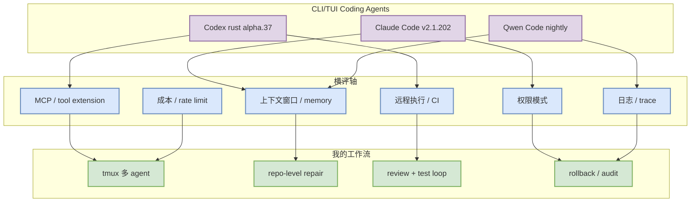

# Claude Code / OpenAI Codex / Qwen Code Release Watch - 2026-07-07

> 日期：2026-07-07  
> 来源类型：GitHub Releases / Changelog watch  
> 原文：https://github.com/anthropics/claude-code/releases/tag/v2.1.202 / https://github.com/openai/codex/releases/tag/rust-v0.143.0-alpha.37 / https://github.com/QwenLM/qwen-code/releases/tag/v0.19.6-nightly.20260707.bcdb44c5d

## 一句话结论

Claude Code、Codex、Qwen Code 今天都有高频 release 信号，说明 CLI/TUI coding agent 正在进入“日更级 runtime 竞争”。

## TL;DR

- Claude Code：`v2.1.202`，2026-07-06T22:51:16Z。
- OpenAI Codex：`rust-v0.143.0-alpha.37`，2026-07-06T18:11:30Z。
- Qwen Code：`v0.19.6-nightly.20260707.bcdb44c5d`，2026-07-07T00:51:04Z。
- 对用户：需要把工具更新纳入横评，而不是只关注模型能力；重点看权限模式、上下文、MCP、CLI/TUI、remote execution、日志可观测性。

## 元信息

| 工具 | 厂商 | 来源类型 | release tag | 发布时间 | 原文 |
|---|---|---|---|---|---|
| Claude Code | Anthropic | GitHub Release / Changelog | v2.1.202 | 2026-07-06T22:51:16Z | https://github.com/anthropics/claude-code/releases/tag/v2.1.202 |
| OpenAI Codex | OpenAI | GitHub Release | rust-v0.143.0-alpha.37 | 2026-07-06T18:11:30Z | https://github.com/openai/codex/releases/tag/rust-v0.143.0-alpha.37 |
| Qwen Code | Alibaba/Qwen | GitHub Release / Nightly | v0.19.6-nightly.20260707.bcdb44c5d | 2026-07-07T00:51:04Z | https://github.com/QwenLM/qwen-code/releases/tag/v0.19.6-nightly.20260707.bcdb44c5d |

## 信息压缩图示

## 功能变化判断

| 维度 | 今日信号 | 对 AI coding 工作流的影响 |
|---|---|---|
| 高频 release | 三个 CLI agent 都有 7/6-7/7 release | 需要固定版本做横评，否则结果漂移 |
| Rust Codex alpha | Codex CLI 仍在快速 alpha 迭代 | 适合跟踪本地执行、权限、TUI 稳定性 |
| Qwen nightly | 开源 CLI agent 日更 | 适合做可 inspect 的 baseline |
| Claude Code | 生态标杆继续更新 | 需要持续观察 permission、MCP、context 与日志 |

## 专业解读

CLI coding agent 的竞争正在从“谁模型强”转向“谁 runtime 稳、权限清晰、trace 完整、能接入 CI/remote”。对工程团队而言，工具日更意味着评测必须记录 release tag，否则同一 benchmark 难以复现。

## 通俗解释

这些工具都在高速更新。今天跑出来的效果，可能明天就变了。所以必须把版本号、权限、命令日志都记下来。

## 对我的影响

- 今日应把 Claude Code v2.1.202、Codex alpha.37、Qwen nightly 纳入 watchlist。
- 横评脚本必须记录 tool version、模型、权限模式、最大步数、token/费用、日志路径。
- 不建议仅凭 release 存在就升级生产工作流；先在 sandbox repo 跑 smoke test。

## 可信度与局限性

- 可信度：高，来自 GitHub Releases。
- 局限：未逐条解析 release body；这里只确认发布时间、tag 和工具方向。

## 我应该如何跟进

1. 对三个工具运行同一 repo repair task。
2. 记录版本和 trace。
3. 比较 context precision、命令安全、失败恢复、rollback 能力。

## 相关链接

- Claude Code v2.1.202：https://github.com/anthropics/claude-code/releases/tag/v2.1.202
- Codex alpha.37：https://github.com/openai/codex/releases/tag/rust-v0.143.0-alpha.37
- Qwen Code nightly：https://github.com/QwenLM/qwen-code/releases/tag/v0.19.6-nightly.20260707.bcdb44c5d

#ai-radar #coding-tools #claude-code #codex #qwen-code #ai-coding
