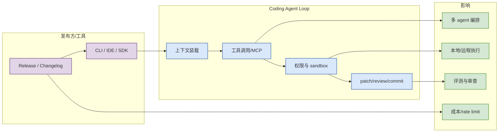

# cline/cline v4.0.8

> 日期：2026-07-12
> 类型：Coding Tool Release / GitHub Release
> 原文：https://github.com/cline/cline/releases/tag/v4.0.8
> 当天日报：[[Daily/2026-07-12]]

## 一句话结论

cline/cline 最新 release v4.0.8 是 coding-agent workflow 的高相关观测点。

## TL;DR

- 核心信号：cline/cline 最新 release v4.0.8 是 coding-agent workflow 的高相关观测点。
- 对我的价值：判断它是否影响 AI Infra runtime、post-training rollout、agent loop、eval harness 或 Point Rummy 业务仿真。
- 建议动作：先读原文/README/release，再决定是否进入试用或复现列表。

## 元信息表

| 字段 | 内容 |
|---|---|
| 来源类型 | Coding Tool Release / GitHub Release |
| 原文 | https://github.com/cline/cline/releases/tag/v4.0.8 |
| 日期 | 2026-07-12 |
| 可信度 | 中；GitHub Search 今日 403，部分榜单为 direct watched repo fallback |

## 信息压缩图

## 辅助结构：影响矩阵

| 维度 | 判断 | 说明 |
|---|---|---|
| AI Infra 价值 | 中到高 | 关注 runtime、serving、training 或工具协议是否可复用。 |
| Coding Agent Loop | 中到高 | 关注上下文、权限、工具调用、patch/review 和多 agent 编排。 |
| RL / Game AI | 中 | 重点看 rollout、eval、reward、仿真或规则抽象是否可迁移。 |
| 风险 | 中 | 需要验证 release notes、benchmark、代码活跃度和 license。 |

## 专业解读

cline/cline 最新 release v4.0.8 是 coding-agent workflow 的高相关观测点。 对 AI Infra / LLM / RL 工程的价值不在标题本身，而在它是否改变了“请求进入系统后如何被调度、执行、评估、回写”的闭环。若它是 serving/training 项目，应重点看调度器、缓存、并行、硬件依赖和 benchmark；若它是 coding-agent 工具，应重点看上下文装载、权限模式、MCP/tool registry、远程执行和 Git workflow。

## 通俗解释

可以把它理解为今天 radar 里的一个“可行动信号”：不是为了收藏链接，而是为了判断它能不能减少工程试错成本、提升 agent 执行可靠性，或给 Point Rummy/游戏 AI 建一个更好的环境与评测基线。

## 关键机制拆解

| 模块 | 需要确认的问题 |
|---|---|
| 输入/接口 | 是否有稳定 CLI/API/SDK，是否适合自动化调用？ |
| 执行/runtime | 是否影响吞吐、延迟、上下文长度、并发或 rollout 成本？ |
| 评测/反馈 | 是否提供 benchmark、tests、examples 或可复现指标？ |
| 生产风险 | 依赖、权限、rate limit、license 和维护节奏是否可控？ |

## 对我的影响

- AI Infra：优先抽取 runtime、scheduler、cache、benchmark、deployment 经验。
- LLM / Agent：优先抽取 agent loop、tool use、eval、memory/context 设计。
- RL / Game AI：优先抽取 rollout、reward、环境并行和评测协议。

## 可信度与局限性

今日 GitHub Search 返回 403 rate limit，direct repo 信息可信但不是全网趋势；star_delta 只代表固定 watched repo 相对昨日日报值，不等同 GitHub 全站增长排行。

## 我应该如何跟进

1. 打开原文核对 release notes/README。
2. 记录是否有 benchmark、examples、docs、license 和 breaking changes。
3. 若与当前工程强相关，安排一次 30-60 分钟 spike。

## 相关链接

- 原文：https://github.com/cline/cline/releases/tag/v4.0.8
- 当天日报：[[Daily/2026-07-12]]

#ai-radar #detail
