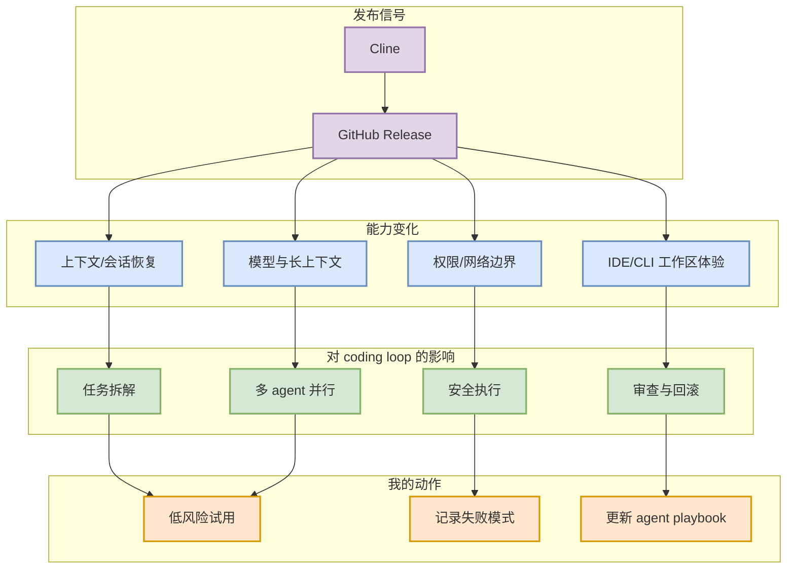

# Cline v4.0.11: Opus 5 / 1M context variants、Kimi K3、telemetry host plugin version

> 类型：Coding 工具 / AI 工具功能更新
> 大类：大厂资讯 / 工具
> 小类：Cline
> 推荐等级：必读
> 创建日期：2026-07-25
> 原文链接：https://github.com/cline/cline/releases/tag/v4.0.11
> 网页详情：https://github.com/dyt27666-oss/AI-news-report-obsidians/blob/main/Industry/Tools/2026-07-25/cline-v4-0-11.md
> 返回日报：[[Daily/2026-07-25]]

## 一句话结论

Cline v4.0.11: Opus 5 / 1M context variants、Kimi K3、telemetry host plugin version，说明 coding agent 正在向更长上下文、更强会话恢复、更细权限边界和多 agent 协作演进。

## TL;DR

- **它是什么**：GitHub Release 中记录的 AI coding 工具功能更新。
- **为什么重要**：这些变化直接影响终端/IDE agent 的上下文管理、权限控制、远程执行和多 agent loop 设计。
- **和我相关的点**：适合评估 tmux 多 agent 监控、代码审查、AI Infra 工程任务拆解时的工具链升级。
- **建议动作**：把该工具加入一周观察列表；只在沙箱/权限策略明确后试用新能力。

## 元信息

| 字段 | 内容 |
|---|---|
| 发布方/来源 | Cline |
| 栏目/来源类型 | GitHub Release |
| 发布时间 | 2026-07-24 / release tag 见原文 |
| 原文 | [原文](https://github.com/cline/cline/releases/tag/v4.0.11) |
| 标签 | #ai-coding #agent-loop #tools |

## 信息压缩图示

### 影响矩阵

| 维度 | 影响 | 建议动作 |
|---|---|---|
| AI Infra | 更适合长任务迁移、错误恢复与安全命令执行 | 在真实 repo 中用小任务验证 |
| LLM 工程 | 长上下文与会话持久化会改变 prompt/context packing 策略 | 记录 token 成本与恢复准确率 |
| RL / Game AI | 可用于仿真环境、评测脚本、bot 策略的多 agent 生成/审查 | 不直接信任生成策略，必须跑评测 |
| Agent / Eval | 更接近可观测 agent loop，需要补充日志与回放 | 建立失败案例库 |

## 专业解读

本次工具更新的共同方向不是“补一个按钮”，而是把 coding agent 从一次性对话推向可恢复、可约束、可协作的工程系统。长上下文和会话历史提升跨文件任务能力，但也增加幻觉持久化风险；网络 allowlist、workspace selector、settings import 等能力则反映出团队开始把 agent 当作生产环境执行器管理。

## 通俗解释

以前的 coding agent 像临时同事，开一个窗口干一件事；现在它们越来越像能记住上下文、能换工作区、能被限制网络权限的长期协作机器人。

## 关键机制拆解

| 机制 | 解决的问题 | 为什么有效 | 可能的坑 |
|---|---|---|---|
| 会话/历史恢复 | 长任务中断后难续跑 | 降低重新加载上下文成本 | 错误假设也会被恢复 |
| 长上下文模型 | 大 repo 理解不足 | 减少遗漏跨文件依赖 | 成本、延迟和注意力稀释 |
| 网络/沙箱权限 | agent 命令风险 | 把执行边界显式化 | 配置复杂，可能误放行 |

## 可信度与局限性

- 证据强度：高，来自 GitHub Release / 官方 release notes。
- 局限性：未完整跑端到端试用，只能判断功能方向。
- 还需要确认：新能力在大型 monorepo、慢测试、网络受限环境中的稳定性。

## 我应该如何跟进

1. 选一个小型 AI Infra repo 对比 Claude Code / Codex / Cline 的恢复能力。
2. 把 network allowlist / workspace selector 纳入 agent 安全检查清单。
3. 记录 token 成本、失败恢复率、误操作次数。

## 相关链接

- 原文：https://github.com/cline/cline/releases/tag/v4.0.11
- 网页详情：https://github.com/dyt27666-oss/AI-news-report-obsidians/blob/main/Industry/Tools/2026-07-25/cline-v4-0-11.md

## 标签

#ai-radar #ai-coding #agent-loop #tools
