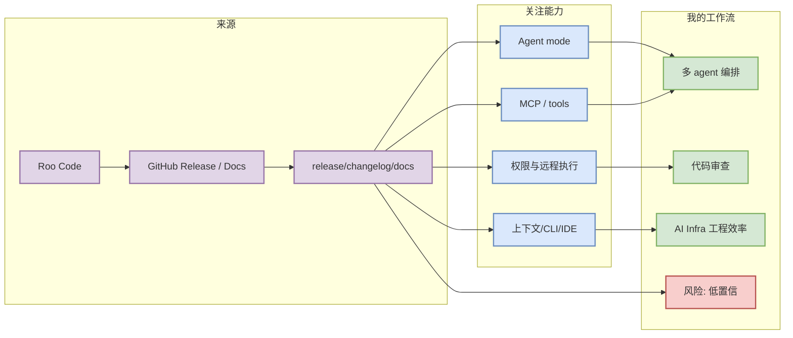

# Roo Code 工具更新扫描

> 类型：Coding 工具
> 大类：Industry / Tools
> 小类：AI coding workflow
> 推荐等级：可 skim
> 创建日期：2026-07-27
> 原文链接：https://github.com/RooCodeInc/Roo-Code/releases/tag/v3.54.0
> 网页详情：https://github.com/dyt27666-oss/AI-news-report-obsidians/blob/main/Industry/Tools/2026-07-27/roo-code.md
> 返回日报：[[Daily/2026-07-27]]

## 一句话结论

Roo Code 今日进入固定 Coding 工具矩阵；更新信号为：v3.54.0 / 2026-05-15。

## TL;DR

- **它是什么**：Roo Code 的 AI coding / agent workflow 工具或相关入口。
- **为什么重要**：权限模式、MCP、上下文窗口、CLI/TUI 和 IDE 集成会直接改变多 agent 开发效率。
- **和我相关的点**：适合监控 agent mode、远程执行、代码审查和 tmux 多 agent 工作流。
- **建议动作**：仅把已验证 release/changelog 当作新功能；访问失败或无 release 时保留低置信观察。

## 元信息

| 字段 | 内容 |
|---|---|
| 工具/厂商 | Roo Code / Roo Code |
| 来源类型 | GitHub Release / Docs |
| 发布时间/release tag | v3.54.0 / 2026-05-15 |
| 原文 | [原文](https://github.com/RooCodeInc/Roo-Code/releases/tag/v3.54.0) |
| 标签 | #coding-tool #ai-agent |

## 信息压缩图示

### 辅助结构：工作流影响矩阵

| 变化类型 | 需要看什么 | 对我的意义 |
|---|---|---|
| CLI/TUI | 命令、权限、交互 | 影响终端多 agent 管理 |
| MCP/tool use | server、approval、sandbox | 影响工具生态接入 |
| IDE 集成 | review、diff、上下文 | 影响日常工程效率 |
| pricing/rate limit | plan、quota、限制 | 影响长期使用成本 |

## 专业解读

Roo Code 的价值不只在“能生成代码”，而在是否能把任务拆解、上下文读取、工具调用、权限确认、测试反馈和代码审查串成稳定 loop。对 AI Infra 工程师来说，这类工具若能稳定处理大仓库、长上下文、终端任务和 CI 反馈，就能明显缩短实验-修复循环。

## 通俗解释

把它当作“会写代码的协作者”。今天的重点是确认它有没有新能力，而不是把未验证网页变化写成确定发布。

## 关键机制拆解

| 机制 | 解决的问题 | 为什么有效 | 可能的坑 |
|---|---|---|---|
| Changelog 扫描 | 捕捉真实功能变化 | 来源可追溯 | 官网可能反爬或延迟 |
| Release tag | 明确版本边界 | 便于回滚/试用 | 有些工具不用 GitHub release |
| Workflow impact | 映射到用户任务 | 避免泛泛新闻 | 需要人工试用确认 |

## 对我的影响

| 维度 | 影响 | 建议动作 |
|---|---|---|
| AI Infra | 提升大仓库维护和实验脚本开发效率 | 关注 CLI 权限和长任务支持 |
| LLM 工程 | 加速 prompt/eval/serving 代码迭代 | 对比上下文策略 |
| RL / Game AI | 辅助环境、baseline、评测脚本开发 | 用在 simulator/evaluator 编写 |
| Agent / Eval | 是 loop engineering 样本 | 记录失败模式 |

## 可信度与局限性

- 证据强度：中等到低，取决于 release/changelog 是否可访问。
- 局限性：未访问正文时，只能作为固定扫描入口和低置信观察。
- 潜在风险：不要把“有入口”解读为“今日有重大新功能”。
- 还需要确认：具体版本、发布时间、breaking changes、rate limit。

## 我应该如何跟进

1. 打开原文确认 release tag 和发布日期。
2. 对比本地正在用的版本和权限配置。
3. 若涉及 MCP/远程执行，单独做安全评估。

## 相关链接

- 原文：https://github.com/RooCodeInc/Roo-Code/releases/tag/v3.54.0
- 网页详情：https://github.com/dyt27666-oss/AI-news-report-obsidians/blob/main/Industry/Tools/2026-07-27/roo-code.md
- 返回日报：[[Daily/2026-07-27]]

## 标签

#ai-radar #coding-tool #agent-workflow
