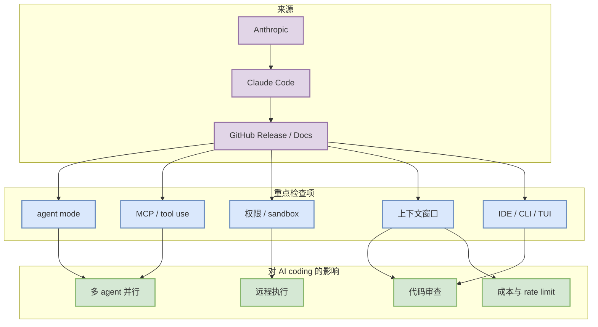

# Claude Code 工具更新扫描 - 2026-07-31

> 工具/厂商：Claude Code / Anthropic  
> 来源类型：GitHub Release / Docs  
> 发布时间或 release tag：v2.1.220 / 2026-07-25  
> 原文：https://github.com/anthropics/claude-code/releases/tag/v2.1.220

## 一句话结论
Claude Code 今日进入 coding tool 矩阵；重点不是夸大功能，而是持续跟踪 agent mode、MCP、权限、CLI/TUI、IDE 集成和 rate limit 对工作流的影响。

## TL;DR
- 今日代表更新：v2.1.220 / 2026-07-25
- 工作流影响：可能影响多 agent 编码、代码审查、远程执行、上下文管理或 IDE/CLI 切换。
- 可信度：GitHub release 为中；官网 changelog 入口为低到中。

## 工具信号图

## 功能变化检查矩阵
| 检查项 | 今日判断 | 为什么重要 |
|---|---|---|
| Agent mode | 需读原文确认 | 决定能否从补全工具升级为任务执行工具。 |
| MCP / 插件 | 需读原文确认 | 影响外部工具、知识库、终端集成。 |
| 权限 / 远程执行 | 需读原文确认 | 影响安全边界和自动化可用性。 |
| 上下文窗口 | 需读原文确认 | 影响大仓库理解和长任务连续性。 |
| Pricing / rate limit | 需读原文确认 | 影响多 agent 并发成本。 |

## 我应该如何跟进
1. 阅读原文 release/changelog，确认是否触及权限、MCP、上下文或远程执行。
2. 若是 CLI/TUI 工具，加入多 agent 监控和代码审查试验。
3. 若只是低置信入口，明天继续观察，不写成确定功能。

## 相关链接
- 原文：https://github.com/anthropics/claude-code/releases/tag/v2.1.220
- 今日日报：[[Daily/2026-07-31]]

#ai-radar #coding-tools #agent-workflow
