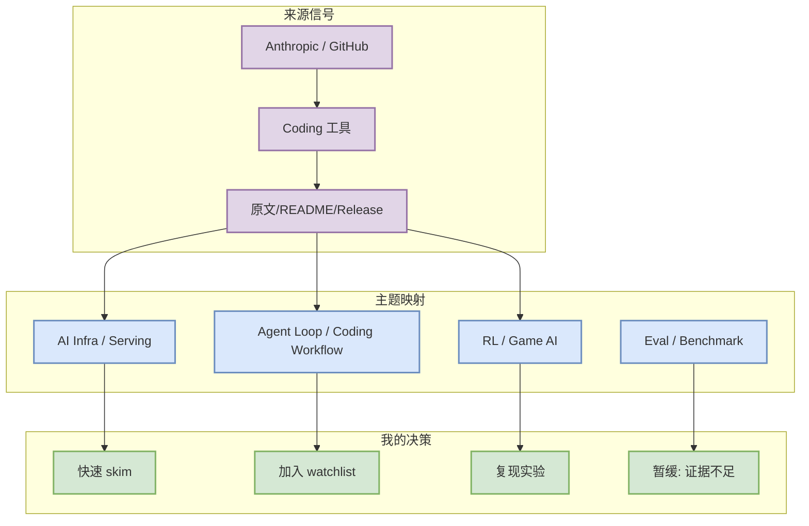
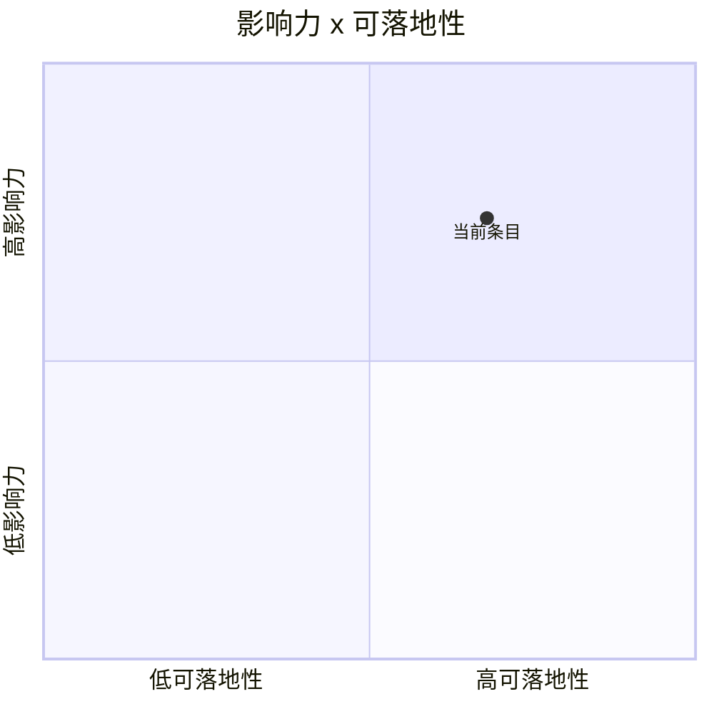

# Claude Code：高增长终端 agent，适合作为多 agent 编排观察对象

> 类型：Coding 工具  
> 大类：AI Radar 详情  
> 小类：Loop Engineer / CLI agent  
> 推荐等级：可 skim / 按需深挖  
> 创建日期：2026-08-05  
> 原文链接：https://github.com/anthropics/claude-code  
> 网页详情：https://github.com/dyt27666-oss/AI-news-report-obsidians/blob/main/Industry/Tools/2026-08-05/claude-code.md  
> 返回日报：[[Daily/2026-08-05]]

## 一句话结论

Claude Code：高增长终端 agent，适合作为多 agent 编排观察对象；今天的价值主要是作为 AI Infra / Loop Engineering / Point Rummy 方向的可复用信号，而不是宣布确定性重大突破。

## TL;DR

- **它是什么**：来自 Anthropic / GitHub 的 Coding 工具 条目，主题为 Loop Engineer / CLI agent。
- **为什么重要**：它落在用户关注的 LLM serving、agent loop、RL/game AI 或 coding workflow 交叉点上。
- **和我相关的点**：可以转化为 watchlist、复现实验、架构对比或业务规则建模参考。
- **建议动作**：先读 README / changelog / abstract，再决定是否进入本周深挖。

## 元信息

| 字段 | 内容 |
|---|---|
| 发布方/来源 | Anthropic / GitHub |
| 栏目/来源类型 | Coding 工具 |
| 发布时间 | 2026-08-05 扫描收录；原始发布时间需以原文为准 |
| 原文 | [原文](https://github.com/anthropics/claude-code) |
| 代码 | https://github.com/anthropics/claude-code |
| PDF | 未发现 |
| 标签 | #ai-radar #loop-engineer---cli-agent |

## 信息压缩图示

## 专业解读

这个条目的核心价值不在“新闻热度”，而在它是否能改变工程循环：训练/推理系统看吞吐、延迟和可维护性；coding agent 看权限、上下文、工具调用与审查闭环；Point Rummy 看规则状态表示、不完美信息决策和可并行仿真。今天由于 GitHub Search 大面积 403，本文按低置信/连续观察方式处理。

## 通俗解释

可以把它理解成一个候选零件：它可能能放进你的 AI 工程流水线或 Rummy 业务建模里，但还需要看说明书、跑样例和确认最近是否维护。

## 关键机制拆解

| 机制 | 解决的问题 | 为什么有效 | 可能的坑 |
|---|---|---|---|
| 元信息扫描 | 避免漏掉固定来源 | 保留 URL、stars、更新时间和来源类型 | Search 403 时覆盖不完整 |
| 主题映射 | 把外部项目映射到 AI Infra/RL/Agent | 便于决定是否深挖 | 标题党或 README 过时 |
| Watchlist 决策 | 避免当天强行过度解读 | 可后续用真实 release/论文复核 | 需要人工复读原文 |

## 对我的影响

| 维度 | 影响 | 建议动作 |
|---|---|---|
| AI Infra | 可作为架构/性能/生态比较对象 | 看 README、issues、release |
| LLM 工程 | 关注 agent、模型适配和上下文管理 | 对比现有 Codex/Claude Code 工作流 |
| RL / Game AI | 若含 Rummy/agent，可抽象环境或策略 | 提取规则、状态、reward 设计 |
| Agent / Eval | 可转化为 loop/eval harness 案例 | 加入 Loop Engineer 观察表 |

## 可信度与局限性

- 证据强度：中低；基于 API 元信息与公开链接。
- 局限性：未阅读全文或源码，不保证功能可用。
- 潜在风险：GitHub Search rate limit 导致候选集合偏向 watchlist。
- 还需要确认：最新 release、benchmark、license、维护活跃度。

## 我应该如何跟进

1. 打开原文确认 README/release 是否和日报描述一致。
2. 若是工具项目，运行最小样例或记录 CLI/IDE 能力变化。
3. 若是 Rummy/论文项目，提取状态表示、动作空间、奖励和评测协议。

## 相关链接

- 原文：https://github.com/anthropics/claude-code
- 网页详情：https://github.com/dyt27666-oss/AI-news-report-obsidians/blob/main/Industry/Tools/2026-08-05/claude-code.md
- 返回日报：[[Daily/2026-08-05]]

## 标签

#ai-radar #detail
