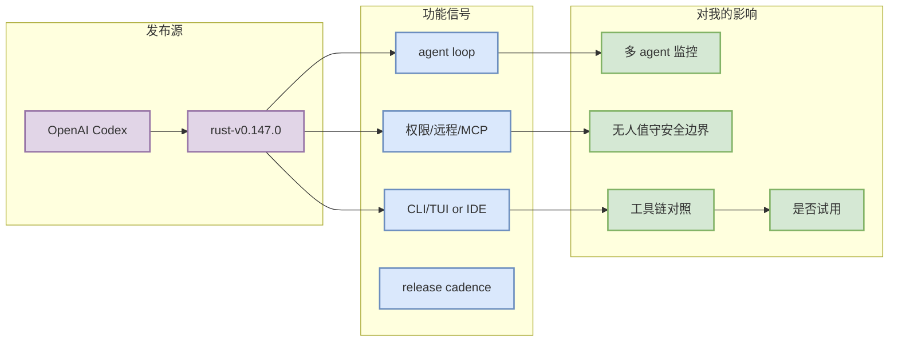

# OpenAI Codex - rust-v0.147.0

> 一句话结论：OpenAI Codex 今日通过 release/direct watch 进入 Coding 工具扫描矩阵；需要关注 agent mode、MCP、权限、远程执行、上下文和 CLI/TUI 体验。

## TL;DR

- 工具/厂商：OpenAI Codex
- 来源类型：GitHub Release / Release Notes
- Release tag：rust-v0.147.0
- 发布时间：2026-08-07
- 原文：https://github.com/openai/codex/releases/tag/rust-v0.147.0

## 信息压缩图示

## Release 摘要

## New Features
- Install portable Agent Plugins and search across local, personal, workspace, and remote plugin catalogs. (#36544, #36409, #36919, #36796)
- Organize conversations into persistent, manually ordered sections and browse long transcripts incremen

## 对 AI coding 工作流的影响

- 若涉及远程执行/权限模式：优先检查无人值守 agent 的安全边界。
- 若涉及插件/MCP：对照 Claude Code、Codex、Gemini CLI、Qwen Code 的扩展模型。
- 若只是维护性 release：保持观察，不升级为必读。

## 可信度与局限性

来自 GitHub Releases direct API；非 GitHub 官方 changelog 页面本轮仅低置信占位。

## 相关链接

- 原文：https://github.com/openai/codex/releases/tag/rust-v0.147.0
- Daily：[[Daily/2026-08-14]]

#ai-radar #coding-tools #agent-loop
