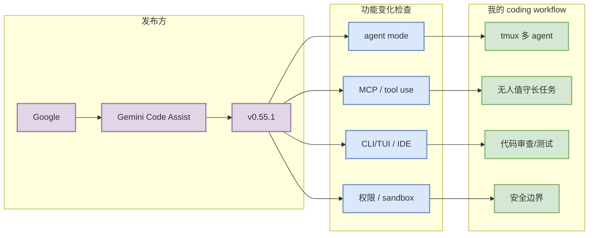

# Gemini Code Assist v0.55.1

> 日期：2026-08-15
> 工具/厂商：Gemini Code Assist / Google
> 来源类型：GitHub Release / Changelog / Docs watch
> 发布时间 / release tag：2026-08-11 / `v0.55.1`
> 原文：https://github.com/google-gemini/gemini-cli/releases/tag/v0.55.1

## 一句话结论
Gemini Code Assist 今天作为 AI coding workflow 固定扫描对象记录；重点观察 agent mode、MCP、权限、CLI/TUI、IDE 集成和远程执行相关变化。

## TL;DR
- 代表更新：Release v0.55.1
- release tag：v0.55.1
- 发布时间：2026-08-11
- 摘要：## What's Changed * fix/verify release npm ci ignore scripts by @rmedranollamas in https://github.com/google-gemini/gemini-cli/pull/28116 * fix(ci): prevent workspace binary shadowing in release verification by @galdawave in https://github.…

## 元信息表
| 字段 | 值 |
|---|---|
| 工具 | Gemini Code Assist |
| 厂商 | Google |
| 来源类型 | Release Notes / Changelog |
| 功能变化关注 | agent mode / MCP / IDE 集成 / 权限模式 / CLI/TUI / remote execution |
| 原文 | https://github.com/google-gemini/gemini-cli/releases/tag/v0.55.1 |

## 信息压缩图示

## 影响矩阵
| 关注项 | 影响 | 下一步 |
|---|---|---|
| agent loop | 影响任务拆解/恢复/上下文管理 | 对照本地 Hermes/Codex/Claude Code 工作流 |
| MCP / tool use | 影响工具生态接入 | 检查是否有新 server/plugin pattern |
| 权限 / sandbox | 影响无人值守安全 | 对照 approval、workspace 写入边界 |
| CLI/TUI/IDE | 影响多窗口监控效率 | 试用 release 或看 diff |

## 可信度与局限性
若 release body 未可靠抽取，只保留 release tag 和官方链接；需要人工打开原文确认具体 changelog。

## 相关链接
- 原文：https://github.com/google-gemini/gemini-cli/releases/tag/v0.55.1
- Daily：[[Daily/2026-08-15]]

#ai-radar #coding-tools #loop-engineering
