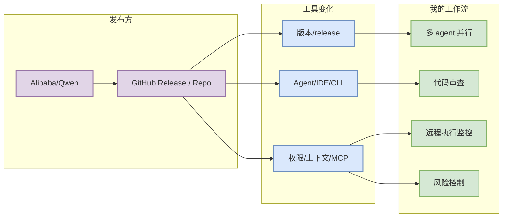

# Qwen Code direct watched repo update

> 类型：Industry / Tool
> 大类：工具更新
> 小类：AI coding workflow
> 推荐等级：必读
> 创建日期：2026-08-16
> 原文链接：https://github.com/QwenLM/qwen-code/releases
> 网页详情：https://github.com/dyt27666-oss/AI-news-report-obsidians/blob/main/Industry/Tools/2026-08-16/qwen-code-direct-watch.md
> 返回日报：[[Daily/2026-08-16]]

## 一句话结论
Qwen Code 进入 watched growth 表，继续作为本地/开源 coding agent 观察项。

## TL;DR
- **它是什么**：Alibaba/Qwen 的 GitHub Release / Repo 信号。
- **为什么重要**：开源 coding agent 可用于私有化、低成本和中文工程场景，但要验证稳定性与权限。
- **和我相关的点**：重点关注 agent mode、MCP、权限、上下文、CLI/TUI、远程执行和 review loop。
- **建议动作**：看 release/changelog diff，决定是否更新本地多 agent 工作流。

## 元信息
| 字段 | 内容 |
|---|---|
| 发布方/来源 | Alibaba/Qwen |
| 栏目/来源类型 | GitHub Release / Repo |
| 发布时间 | 2026-08-16 扫描 |
| 原文 | [原文](https://github.com/QwenLM/qwen-code/releases) |
| 标签 | #coding-agent #tooling |

## 信息压缩图示

### 影响矩阵
| 维度 | 影响 | 建议动作 |
|---|---|---|
| AI coding | 开源 coding agent 可用于私有化、低成本和中文工程场景，但要验证稳定性与权限。 | 检查 release notes |
| Infra 工程 | 可能改变代码生成/审查吞吐 | 小范围试用 |
| 风险 | release 元信息不能代表功能全部变化 | 不自动升级生产工作流 |

## 专业解读
工具 release 对工程效率的影响往往不在模型能力本身，而在权限边界、上下文注入、MCP 工具调用、IDE 集成和长任务可观测性。今日应把这些 release 当作 workflow regression/upgrade 候选，而不是只看版本号。

## 通俗解释
这类更新就像 IDE/助手换了新零件：可能更顺手，也可能改变权限和稳定性，需要先看说明再升级。

## 我应该如何跟进
1. 查看 changelog 中是否有权限/MCP/remote execution 变化。
2. 在非关键仓库跑一次小任务。
3. 如果影响 review loop，再更新本地工具配置。

## 相关链接
- 原文：https://github.com/QwenLM/qwen-code/releases
- 网页详情：https://github.com/dyt27666-oss/AI-news-report-obsidians/blob/main/Industry/Tools/2026-08-16/qwen-code-direct-watch.md

## 标签
#ai-radar #coding-tools #agent
