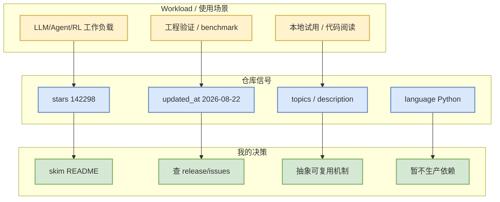

# anthropics/claude-code

> 日期：2026-08-22  
> 来源类型：GitHub repository / direct watched fallback  
> 原文：[anthropics/claude-code](https://github.com/anthropics/claude-code)

## 一句话结论
Claude Code is an agentic coding tool that lives in your terminal, understands your codebase, and helps you code fast... 这是 `Anthropic coding agent` 的固定观察项；今日 GitHub Search 受 403 限流影响，所以本页强调 provenance 与可行动观察，不把它包装成完整全网排名。

## TL;DR
- stars/forks：142298 / 22817；语言：Python。
- 最近更新：2026-08-22T00:54:40Z；topics：无。
- 增长依据：historical_snapshot + direct watched repo fallback；非完整全网日增；stars_delta：145。
- 对用户价值：用于 AI Infra、LLM serving/training 或 coding-agent loop 的工程观察；若是 Rummy 项目，则用于规则、bot、rollout/evaluator 拆解。

## 元信息表
| 字段 | 值 |
|---|---|
| repo | `anthropics/claude-code` |
| stars | 142298 |
| forks | 22817 |
| language | Python |
| updated_at | 2026-08-22T00:54:40Z |
| pushed_at | 2026-08-21T19:54:23Z |
| topics | 无 |
| 原文 | https://github.com/anthropics/claude-code |

## 信息压缩图示

## 机制 / 影响矩阵
| 维度 | 观察 | 对我的影响 |
|---|---|---|
| 工程成熟度 | stars、forks、更新频率只是代理指标 | 先 skim，不直接引入生产 |
| AI Infra / Agent 相关性 | Claude Code is an agentic coding tool that lives in your terminal, understands your codebase, and helps you code fast... | 可转化为 serving、agent loop 或 evaluator 设计线索 |
| 风险 | GitHub Search 403 后使用 direct fallback | 排名非完整全网，需明日继续比较 |

## 专业解读
该仓库的价值不在于单日排名，而在于它对应的工程组件是否能进入用户的 AI Infra / LLM / RL / coding-agent workflow。对 serving/runtime 项目重点看 scheduler、KV cache、batching、kernel 与 benchmark；对 coding-agent 项目重点看权限模式、MCP、上下文管理、远程执行和验证 loop；对 Rummy 项目重点抽象状态机、动作空间、奖励、对手建模与评测 harness。

## 通俗解释
把这个项目当作一个“工程信号灯”：它告诉我们社区在把注意力放到哪类工具或方法上。今天的信号受 API 限流影响，所以更适合列入观察清单，而不是立刻做架构决策。

## 可信度与局限性
- 可信度：中。元数据来自 GitHub API/direct fallback。
- 局限：Search 403，广义榜单不是完整全网 Top 10；需要结合 release notes / issues / benchmark 复核。

## 我应该如何跟进
1. 明天比较 stars_delta 是否持续。
2. skim README、release、issues 中的 benchmark 或 breaking change。
3. 若与当前工作流强相关，再做最小复现实验。

## 相关链接
- 原文：https://github.com/anthropics/claude-code
- 今日日报：[[Daily/2026-08-22]]

#ai-radar #github #anthropic-coding-agent
