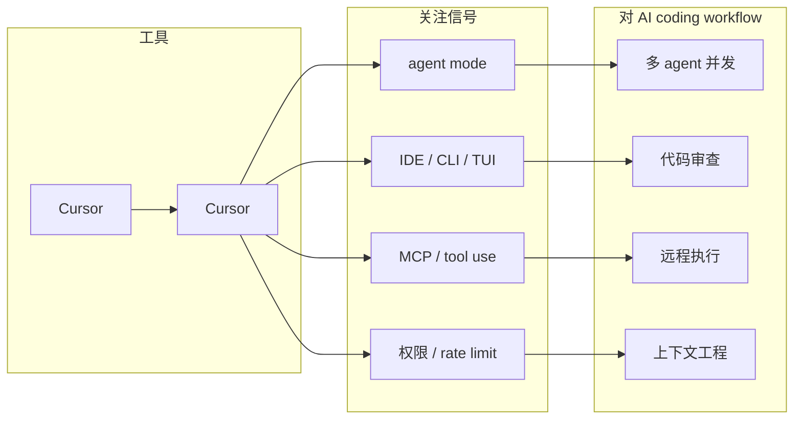

# Cursor 功能更新扫描

> 工具/厂商：Cursor / Cursor  
> 来源类型：Changelog  
> 创建日期：2026-08-23  
> 原文链接：https://cursor.com/changelog  
> 返回日报：[[Daily/2026-08-23]]

## 一句话结论
今日 Cursor 未确认高置信重大新功能；保留固定扫描，重点关注 agent mode、MCP、IDE 集成、远程执行、权限模式、上下文窗口、CLI/TUI 与 pricing/rate limit。

## 信息压缩图示

## 对我的影响
未确认今日高相关新项；继续观察 agent mode、pricing/rate limit。

## 相关链接
- 原文：https://cursor.com/changelog
- 网页详情：https://github.com/dyt27666-oss/AI-news-report-obsidians/blob/main/Industry/Tools/2026-08-23/Cursor-scan.md

#ai-radar #coding-tools
