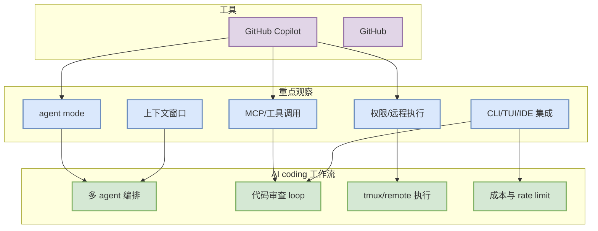

# GitHub Copilot - Coding 工具固定扫描 - 2026-08-24

> 一句话结论：今日对 GitHub Copilot 做了固定扫描；未确认高置信重大功能变化，继续观察 agent mode、MCP、权限、上下文、CLI/TUI、pricing/rate limit。

## TL;DR
- 工具/厂商：GitHub Copilot / GitHub
- 来源类型：Changelog / Blog
- 代表更新：未确认今日新 tag
- 原文：https://github.blog/changelog/label/copilot/
- 对我的影响：影响 AI coding workflow 的功能变化需要进入 sandbox 验证，而不是只看 changelog 标题。

## 功能变化观察图

## 影响矩阵
| 功能 | 今日状态 | 影响 |
|---|---|---|
| agent mode / loop | 低置信观察 | 决定是否适合多 agent 自动化 |
| MCP / tool use | 低置信观察 | 决定能否统一工具注册和权限边界 |
| IDE / CLI / TUI | 低置信观察 | 决定本地开发体验和远程执行方式 |
| pricing / rate limit | 低置信观察 | 决定 cron、批量 review、长任务成本 |

## 相关链接
- 原文：https://github.blog/changelog/label/copilot/
- 今日日报：[[Daily/2026-08-24]]

#ai-radar #coding-tools #loop-engineering
