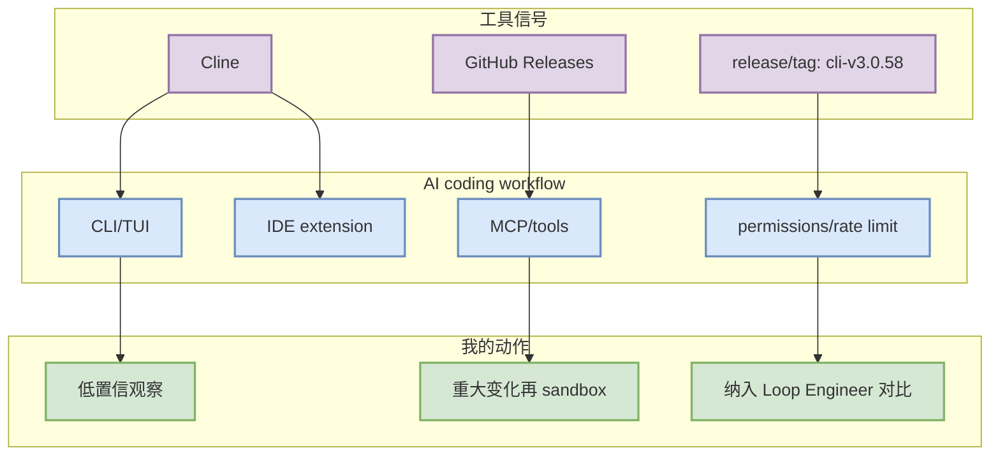

# Cline 工具更新扫描 - 2026-08-25

> 一句话结论：今日 Cline 未确认高置信重大功能变化；若 GitHub release 可读，最新 tag/发布时间见元信息。

## TL;DR
- 工具/厂商：Cline / Cline
- 来源类型：GitHub Releases
- 功能关注：Claude Tag、agent mode、MCP、IDE 集成、远程执行、权限模式、上下文窗口、CLI/TUI、pricing/rate limit。
- 最新 release/tag：cli-v3.0.58；发布时间：2026-08-24T23:07:51Z
- 原文：https://github.com/cline/cline/releases

## 工具工作流影响图

## 元信息
| 字段 | 值 |
|---|---|
| 工具/厂商 | Cline / Cline |
| 来源类型 | GitHub Releases |
| 功能变化 | 今日未确认重大变化，保持低置信观察 |
| 发布时间 / release tag | 2026-08-24T23:07:51Z / cli-v3.0.58 |
| release 链接 | https://github.com/cline/cline/releases/tag/cli-v3.0.58 |
| 原文链接 | https://github.com/cline/cline/releases |
| 对我的影响 | 影响 coding-agent loop、权限、上下文和多 agent 工程效率时再升级为必读 |

## 可信度与局限性
GitHub release metadata 若可访问则可信；产品网页/changelog 未做全文抓取时，不把状态升级为高置信。

#ai-radar #coding-tools #loop-engineering
