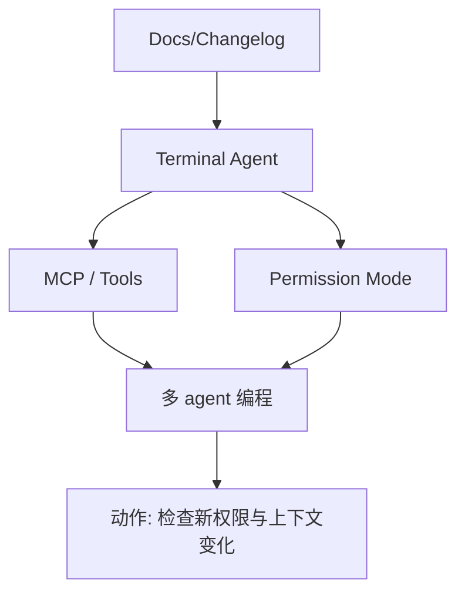
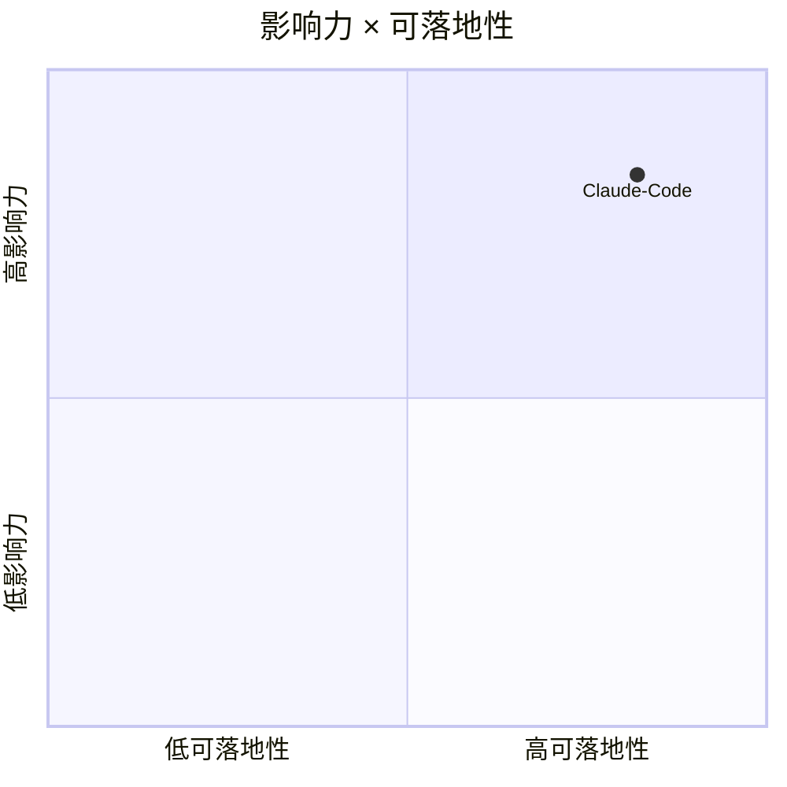

# Claude Code 固定观察

> 类型：Coding 工具观察
> 创建日期：2026-08-26
> 原文链接：https://docs.anthropic.com/en/release-notes/claude-code
> 返回日报：[[Daily/2026-08-26]]

## 一句话结论

Claude Code 是 terminal coding-agent workflow 的高优先级固定观察对象。

## 信息压缩图示

## 对我的影响

重点关注 Claude Tag、权限模式、MCP、远程执行、CLI/TUI 体验和上下文窗口。

#ai-radar #claude-code #coding-tools
