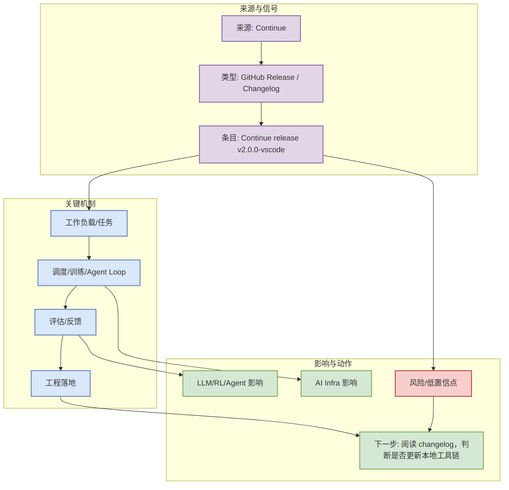
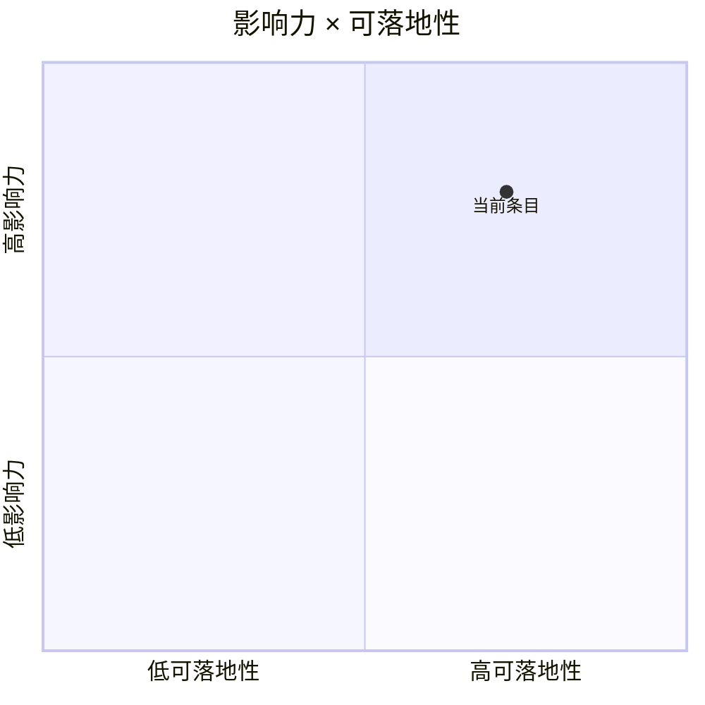

# Continue release v2.0.0-vscode

> 类型：Coding 工具更新
> 大类：AI Radar
> 小类：CodingTools
> 推荐等级：可 skim
> 创建日期：2026-08-26
> 原文链接：https://github.com/continuedev/continue/releases/tag/v2.0.0-vscode
> 网页详情：https://github.com/dyt27666-oss/AI-news-report-obsidians/blob/main/Industry/Tools/2026-08-26/Continue-v2.0.0-vscode.md
> 返回日报：[[Daily/2026-08-26]]

## 一句话结论

Continue 最新 release/changelog 信号：v2.0.0-vscode。

## TL;DR

- **它是什么**：Continue release v2.0.0-vscode
- **为什么重要**：Coding 工具更新会影响多 agent 编程、IDE/CLI 切换、权限模式、上下文窗口和 MCP/插件生态。
- **和我相关的点**：面向 AI Infra / LLM 工程 / RL 或 coding-agent 工作流，优先看能否转化为可复现的服务、训练、评测或工程效率改进。
- **建议动作**：阅读 changelog，判断是否更新本地工具链

## 元信息

| 字段 | 内容 |
|---|---|
| 发布方/来源 | Continue |
| 栏目/来源类型 | GitHub Release / Changelog |
| 发布时间 | 2026-08-26 |
| 原文 | [原文](https://github.com/continuedev/continue/releases/tag/v2.0.0-vscode) |

## 信息压缩图示

### 主图：信号到行动

### 辅助图：影响力 × 可落地性

## 专业解读

Coding 工具更新会影响多 agent 编程、IDE/CLI 切换、权限模式、上下文窗口和 MCP/插件生态。 对用户而言，重点不是“看热闹”，而是判断它是否改变 serving/training/eval/coding-agent loop 的默认做法：是否有可直接试用的代码、是否暴露新的调度或上下文工程模式、是否能进入现有 benchmark/回归测试。

## 通俗解释

可以把它理解为一个今日信号：如果它是项目，就看是否能直接拉到本地跑；如果它是论文，就看是否给了新的训练/评估配方；如果它是工具更新，就看是否减少多 agent 编程和代码审查中的人工切换成本。

## 关键机制拆解

| 机制 | 解决的问题 | 为什么有效 | 可能的坑 |
|---|---|---|---|
| 来源信号过滤 | 信息过载 | 只保留 AI Infra/LLM/RL/Agent 强相关项 | API 403 时覆盖不完整 |
| 工程映射 | 从新闻到行动 | 映射到 serving、训练、评测或 coding loop | 需要真实 benchmark 验证 |
| 跟进动作 | 防止只读不做 | 给出试用/复现/观察策略 | 需要排期和环境 |

## 对我的影响

| 维度 | 影响 | 建议动作 |
|---|---|---|
| AI Infra | 关注调度、吞吐、部署和成本信号 | 进入观察或小规模试用 |
| LLM 工程 | 关注上下文、工具调用、post-training 和 eval | 结合现有代码库做 smoke test |
| RL / Game AI | 关注 self-play、环境、奖励和评测 | 仅保留强相关或业务可迁移项 |
| Agent / Eval | 关注 harness、MCP、权限和回归评测 | 用作 coding-agent 工作流素材 |

## 可信度与局限性

- 证据强度：中等；GitHub direct GET 可信，Search 与部分网页源存在 rate limit / 访问失败。
- 局限性：无法保证覆盖全部互联网更新；增长榜为 watched repo fallback，非完整全网日增。
- 还需要确认：release note 具体 changelog、benchmark、真实生产案例。

## 我应该如何跟进

1. 打开原文确认最新 README / release note。
2. 若是 infra/tool 项目，拉取仓库跑最小示例或查看 benchmark。
3. 若是论文，优先看方法图、实验设置和是否有代码。

## 相关链接

- 原文：https://github.com/continuedev/continue/releases/tag/v2.0.0-vscode
- 网页详情：https://github.com/dyt27666-oss/AI-news-report-obsidians/blob/main/Industry/Tools/2026-08-26/Continue-v2.0.0-vscode.md
- 返回日报：[[Daily/2026-08-26]]

## 标签

#ai-radar #CodingTools
