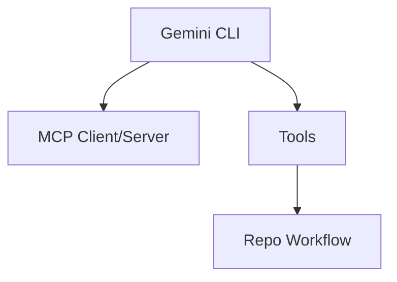

# Gemini CLI v0.57.0

> 类型：Coding 工具更新
> 创建日期：2026-08-26
> 原文链接：https://github.com/google-gemini/gemini-cli/releases/tag/v0.57.0
> 返回日报：[[Daily/2026-08-26]]

## 一句话结论

Gemini CLI 是 Google 生态 terminal AI agent 的重要观察对象。

#ai-radar #gemini #coding-tools
