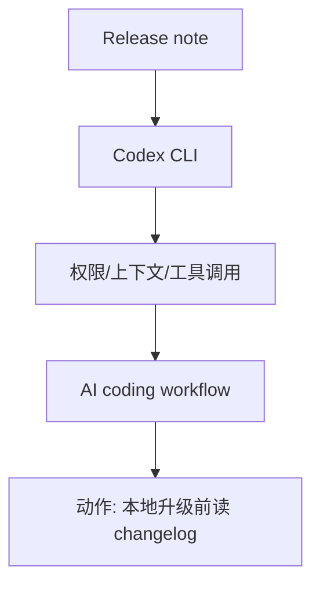
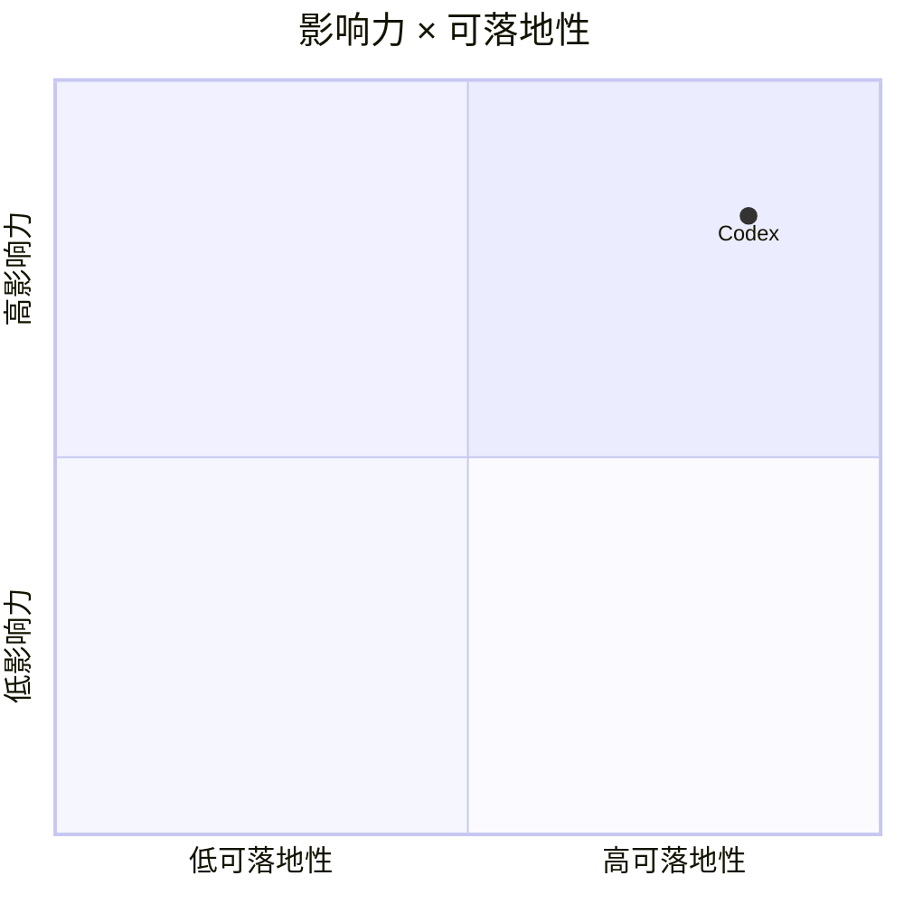

# OpenAI Codex rust-v0.149.1

> 类型：Coding 工具更新
> 创建日期：2026-08-26
> 原文链接：https://github.com/openai/codex/releases/tag/rust-v0.149.1
> 返回日报：[[Daily/2026-08-26]]

## 一句话结论

OpenAI Codex release 需要跟踪其 CLI/IDE/远程任务和权限模式变化。

## 信息压缩图示

## 对我的影响

影响多 agent 编程、代码审查、命令行 coding-agent 分派和远程执行策略。

#ai-radar #coding-tools #codex
