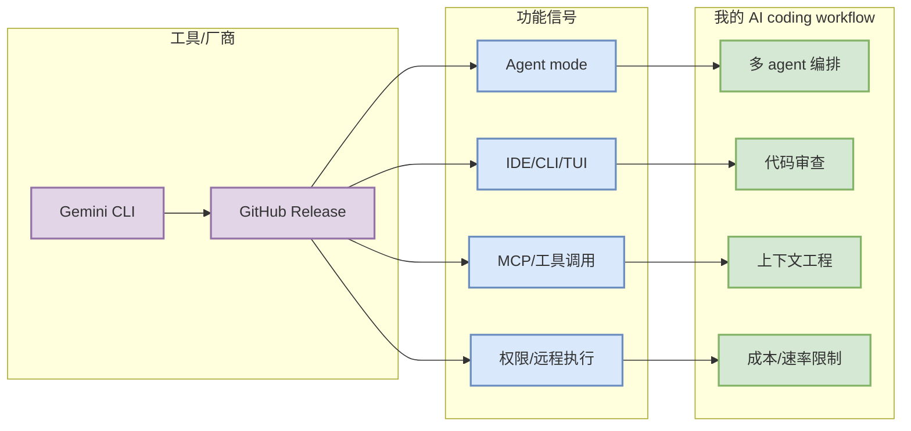

# Gemini CLI - Release v0.59.0-nightly.20260826.g64b5b79a6

> 一句话结论：Gemini CLI 今日被纳入 Coding 工具矩阵；本次记录聚焦 agent mode、MCP、IDE/CLI、权限和上下文窗口等对 AI coding workflow 的影响。

## TL;DR

- 工具/厂商：Gemini CLI
- 来源类型：GitHub Release
- 发布时间 / release tag：2026-08-26
- 原文链接：https://github.com/google-gemini/gemini-cli/releases/tag/v0.59.0-nightly.20260826.g64b5b79a6
- 功能变化：## What's Changed * Changelog for v0.58.0-preview.0 by @gemini-cli-robot in https://github.com/google-gemini/gemini-cli/pull/29082 * chore(release): bump version to 0.59.0-nightly.20260825.g812f7a2bc by @gemini-cli-robot in https://github.c
- 对我的影响：用于判断是否改变 tmux 多 agent、代码审查、远程执行、MCP 工具接入和上下文管理工作流。

## 元信息表

| 字段 | 内容 |
|---|---|
| 工具 | Gemini CLI |
| 来源类型 | GitHub Release |
| 标题/Tag | Release v0.59.0-nightly.20260826.g64b5b79a6 |
| 发布时间 | 2026-08-26 |
| 原文 | https://github.com/google-gemini/gemini-cli/releases/tag/v0.59.0-nightly.20260826.g64b5b79a6 |

## 信息压缩图示

## 影响矩阵

| 变化类型 | 今日观察 | 影响 |
|---|---|---|
| Agent 能力 | ## What's Changed * Changelog for v0.58.0-preview.0 by @gemini-cli-robot in https://github.com/google-gemini/gemini-cli/pull/29082 * chore(release): bump version to 0.59.0-nightly.20260825.g812f7a2bc by @gemini-cli-robot in https://github.c | 影响能否把复杂任务交给 coding agent 自主闭环 |
| MCP / 工具 | 保留扫描 | 影响工具生态接入和权限隔离 |
| IDE / CLI | 保留扫描 | 影响日常开发入口与 tmux/TUI 组合 |
| 定价 / rate limit | 未发现可靠新项 | 需要继续观察是否影响高频使用成本 |

## 专业解读

Coding 工具的高价值信号不只是“发布了新版本”，而是是否改变任务分解、权限边界、上下文装载、工具调用和评测反馈回路。今天该工具的记录用于固定覆盖矩阵与后续 diff 基线。

## 通俗解释

如果一个 coding agent 更新能让它更会调用工具、更安全地改代码、更容易接入 IDE/CLI，就可能直接提升开发效率；否则只是普通版本更新，先观察即可。

## 可信度与局限性

- 若来源为 GitHub Release，则元数据来自 API。
- 若来源为 changelog/docs 页面，则只记录访问状态，不臆造未解析出的新功能。

## 跟进

- 阅读原文 release/changelog。
- 若出现 MCP、agent mode、remote execution、权限模式变化，安排实际试用。

## 相关链接

- 原文：https://github.com/google-gemini/gemini-cli/releases/tag/v0.59.0-nightly.20260826.g64b5b79a6
- 今日日报：[[Daily/2026-08-27]]

#ai-radar #coding-tools #ai-coding
