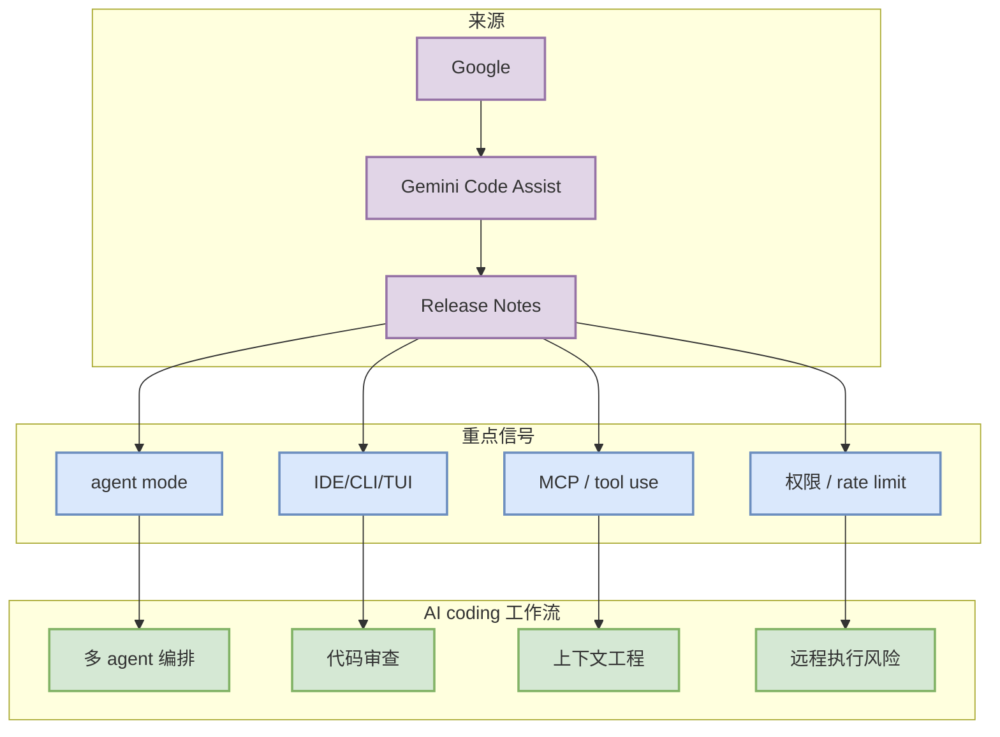

# Gemini Code Assist 工具更新扫描

> 类型：Coding 工具 / AI 工具功能更新
> 工具/厂商：Gemini Code Assist / Google
> 来源类型：Release Notes
> 发布时间/release tag：2026-08-25T18:37:14Z
> 原文链接：https://github.com/google-gemini/gemini-cli/releases/tag/v0.57.0
> 返回日报：[[Daily/2026-08-28]]

## 一句话结论
Gemini Code Assist 今日保留固定扫描；重点观察 agent mode、MCP、IDE/CLI 集成、权限模式、上下文窗口、pricing/rate limit 对 AI coding 工作流的影响。

## TL;DR
- **代表更新**：Release v0.57.0
- **功能变化**：## What's Changed
* fix(core): dynamically resolve Cloud Workstations proxy redirect URI for OAuth flows by @amelidev in https://github.com/google-gemini/gemini-cli/pull/28688
* fix(core): resolve swallowed directory mis
- **对我的影响**：若涉及 CLI/TUI、MCP、权限和远程执行，会直接影响多 agent 编排、tmux 监控和代码审查闭环。

## 信息压缩图示

## 关键机制拆解
| 观察点 | 为什么重要 | 今日状态 |
|---|---|---|
| release/changelog | 捕捉破坏性和效率变化 | v0.57.0 |
| MCP/tool use | 决定可扩展工具生态 | 需人工深读 |
| 权限/远程执行 | 决定安全边界 | 需人工深读 |

## 相关链接
- 原文：https://github.com/google-gemini/gemini-cli/releases/tag/v0.57.0
- 网页详情：https://github.com/dyt27666-oss/AI-news-report-obsidians/blob/main/Industry/Tools/2026-08-28/Gemini-Code-Assist-v0.57.0.md

#ai-radar #coding-tools #agent
