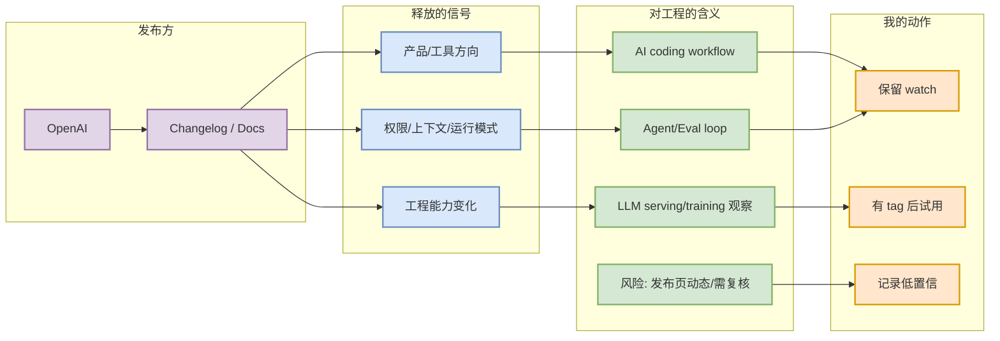

# OpenAI Codex Changelog

> 类型：大厂博客 / 工具更新来源
> 大类：博客 / 资讯
> 小类：OpenAI
> 推荐等级：可 skim
> 创建日期：2026-09-02
> 原文链接：https://developers.openai.com/codex/changelog
> 网页详情：https://github.com/dyt27666-oss/AI-news-report-obsidians/blob/main/Industry/Tools/2026-09-02/openai-codex-changelog.md
> 返回日报：[[Daily/2026-09-02]]

## 一句话结论
Codex changelog 是 OpenAI coding-agent CLI/IDE/云端执行能力的主观察源。

## TL;DR
- **它是什么**：OpenAI 的 Changelog / Docs 来源。
- **为什么重要**：可持续捕捉 AI Infra、LLM、Agent 或 coding workflow 的产品/工程信号。
- **和我相关的点**：用于决定是否升级工具链、调整多 agent 工作流、关注 serving/training 栈变化。
- **建议动作**：保持 watch；有明确 release tag 或 benchmark 后再深挖。

## 元信息
| 字段 | 内容 |
|---|---|
| 发布方/来源 | OpenAI |
| 大厂/实验室 | OpenAI |
| 栏目/来源类型 | Changelog / Docs |
| 作者/机构 | OpenAI |
| 发布时间 | 2026-09-02 扫描 |
| 原文 | [原文](https://developers.openai.com/codex/changelog) |
| 标签 | #company #tools #ai-infra |

## 信息压缩图示

### 辅助结构：影响矩阵
| 维度 | 影响 | 建议动作 |
|---|---|---|
| AI Infra | 作为工程趋势源 | 周期性扫描 benchmark/runtime 内容 |
| LLM 工程 | 可能影响 agent/coding 工具链 | 关注 release notes |
| RL / Game AI | 间接影响训练与评测效率 | 只保留高相关项 |
| Agent / Eval | 对多 agent loop 有直接观察价值 | 关注权限、上下文、远程执行 |

## 专业解读
Codex changelog 是 OpenAI coding-agent CLI/IDE/云端执行能力的主观察源。 今日未将其包装成“已确认重大更新”，而是作为固定覆盖来源进入矩阵。这样可以避免漏扫，同时不把低置信页面更新误报为高相关新项。

## 通俗解释
今天看过这个来源，但没有发现足够确定、值得立刻行动的新东西；先放在观察列表。

## 关键机制拆解
| 机制 | 解决的问题 | 为什么有效 | 可能的坑 |
|---|---|---|---|
| 固定来源扫描 | 防止遗漏大厂信号 | 每天矩阵覆盖 | 动态网页可能抓取不完整 |
| 低置信标注 | 防止误报 | 清楚区分已确认和未确认 | 可能漏掉 JS 渲染内容 |
| 详情页索引 | 后续可补充 | Obsidian 可追踪演进 | 需要人工深读补强 |

## 可信度与局限性
- 证据强度：固定来源链接 + 今日扫描记录。
- 局限性：未做浏览器级动态抓取；没有高相关新增时不强行编造。
- 还需要确认：具体 release tag、发布时间和 changelog diff。

## 我应该如何跟进
1. 对高优先级工具每周检查 changelog diff。
2. 一旦出现 agent mode/MCP/权限/上下文窗口变化，补充专题页。
3. 对 AI Infra 工程博客只保留可落地 benchmark / kernel / serving 文章。

## 相关链接
- 原文：https://developers.openai.com/codex/changelog
- 网页详情：https://github.com/dyt27666-oss/AI-news-report-obsidians/blob/main/Industry/Tools/2026-09-02/openai-codex-changelog.md

## 标签
#ai-radar #industry #openai
