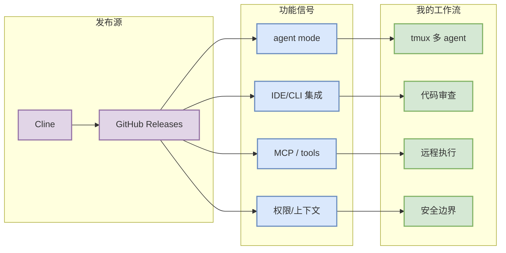
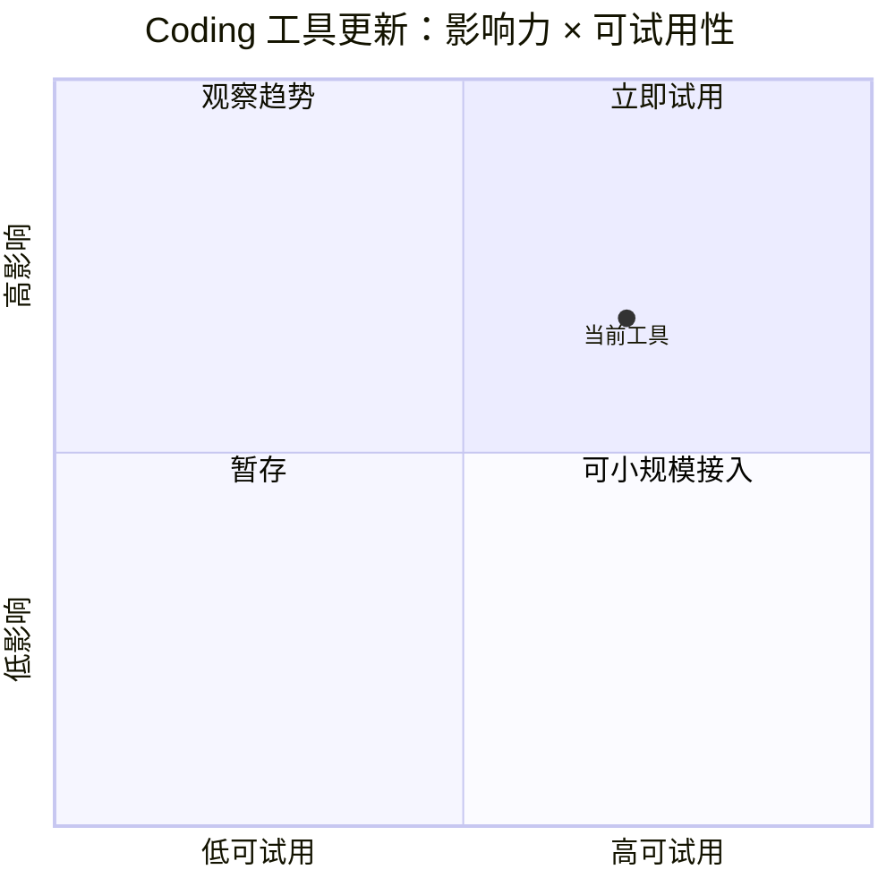

# Cline 功能更新扫描

> 类型：Coding 工具更新
> 大类：Industry / Tools
> 小类：AI coding workflow
> 推荐等级：可 skim
> 创建日期：2026-09-06
> 原文链接：https://github.com/cline/cline/releases/tag/desktop-v0.0.23
> 网页详情：https://github.com/dyt27666-oss/AI-news-report-obsidians/blob/main/Industry/Tools/2026-09-06/cline.md
> 返回日报：[[Daily/2026-09-06]]

## 一句话结论
Cline 今日通过 GitHub Releases 扫描到状态：已扫描；代表更新为 desktop-v0.0.23（2026-09-03）。

## TL;DR
- **它是什么**：Cline 相关 AI coding 工具/插件/CLI。
- **为什么重要**：coding agent 的 release 节奏会改变本地多 agent 编排、IDE 集成、权限与上下文窗口策略。
- **和我相关的点**：开源 coding agent/IDE 插件可作为本地 loop-engineering 对照实现
- **建议动作**：若 tag/功能与 MCP、agent mode、CLI/TUI 或权限有关，进入试用。

## 元信息
| 字段 | 内容 |
|---|---|
| 工具/厂商 | Cline / Cline |
| 来源类型 | GitHub Releases |
| 发布时间/release tag | desktop-v0.0.23（2026-09-03） |
| 原文 | [原文](https://github.com/cline/cline/releases/tag/desktop-v0.0.23) |

## 信息压缩图示

## 专业解读
本页重点不是复述 release notes，而是判断它是否改变 coding-agent loop 的关键变量：上下文注入、工具调用协议、权限模型、日志/评测闭环、IDE 与 CLI 的切换成本。今日结果若为低置信，需要后续人工打开原文确认细节。

## 对我的影响
| 维度 | 影响 | 建议动作 |
|---|---|---|
| AI Infra | 可能改进代码生成/调试效率 | 关注远程执行和权限 |
| LLM 工程 | 影响 prompt/context engineering | 对比 Claude Code/Codex |
| Agent / Eval | 可作为 loop harness 样例 | 检查日志、eval、rollback |

## 相关链接
- 原文：https://github.com/cline/cline/releases/tag/desktop-v0.0.23
- 网页详情：https://github.com/dyt27666-oss/AI-news-report-obsidians/blob/main/Industry/Tools/2026-09-06/cline.md

## 标签
#ai-radar #coding-tools #agent #loop-engineering
