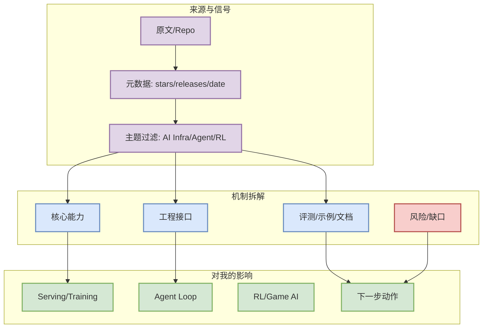

# Roo Code

> 一句话结论：Roo Code 今日 release/changelog 扫描结果：Release v3.54.0 / v3.54.0 / 2026-05-15。关注 agent mode、MCP、IDE 集成、CLI/TUI、权限模式、上下文窗口、pr

## TL;DR

- 来源类型：Coding Tool Release
- 原文：https://github.com/RooCodeInc/Roo-Code/releases/tag/v3.54.0
- 今日判断：与 AI Infra / LLM / Agent / RL / Coding workflow 的交集明确时才进入日报；低置信项仅作观察。

## 元信息

| 字段 | 内容 |
|---|---|
| 日期 | 2026-09-07 |
| 类型 | Coding Tool Release |
| 原文 | [link](https://github.com/RooCodeInc/Roo-Code/releases/tag/v3.54.0) |

## 信息压缩图示

## 专业解读

Roo Code 今日 release/changelog 扫描结果：Release v3.54.0 / v3.54.0 / 2026-05-15。关注 agent mode、MCP、IDE 集成、CLI/TUI、权限模式、上下文窗口、pricing/rate limit 对 AI coding 工作流的影响。

## 机制 / 影响矩阵

| 维度 | 观察 | 对我的影响 |
|---|---|---|
| 工程价值 | 是否能降低上下文构建、推理、训练或 agent loop 成本 | 决定是否进入 spike / benchmark |
| 可信度 | 基于公开元数据、release、论文摘要或官方页面 | API 失败处明确标低置信 |
| 后续动作 | 读 README / release / paper，抽象可复用机制 | 形成试用清单或业务建模 checklist |

## 通俗解释

这条信息的价值不在“热闹”，而在它是否能变成可操作的工程动作：更好的模型服务、更可靠的 agent 循环、更清晰的 Rummy/游戏 AI 状态建模，或更高效的 coding workflow。

## 可信度与局限性

- GitHub Search 今日在部分查询后 403，因此 broad/loop 榜单含 direct watched repo fallback / snapshot fallback。
- 公司博客矩阵保留扫描位；未抓到高相关新项时不编造。
- 论文若只拿到搜索页/摘要页，则标注低置信。

## 我应该如何跟进

1. 打开原文确认 release/paper 细节。
2. 若涉及 serving/training/agent loop，加入小规模 spike。
3. 若涉及 Point Rummy，抽象 state/action/reward/evaluator。

## 相关链接

- [原文](https://github.com/RooCodeInc/Roo-Code/releases/tag/v3.54.0)
- [[Daily/2026-09-07]]

#ai-radar #coding-tool-release
