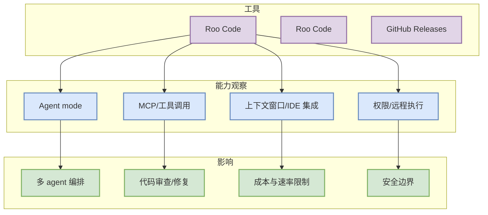

# Roo Code 工具更新扫描 - 2026-09-08

> 一句话结论：Roo Code 今日进入 Coding 工具固定矩阵；重点观察 agent mode、MCP、IDE/CLI、权限与上下文窗口变化。

## TL;DR
- 工具/厂商：Roo Code / Roo Code
- 来源类型：GitHub Releases
- 今日状态：已扫描
- 代表更新：GitHub release 入口已记录
- 原文：https://github.com/RooCodeInc/Roo-Code/releases

## Coding workflow 影响图

## 对我的影响
VS Code agent/权限/MCP 生态观察。如果 release 内容确认包含权限模式、MCP、远程执行、agent loop 或上下文窗口变化，应升级为必读并做实测。

## 相关链接
- 原文：https://github.com/RooCodeInc/Roo-Code/releases
- Daily：[[Daily/2026-09-08]]

#ai-radar #coding-tools
