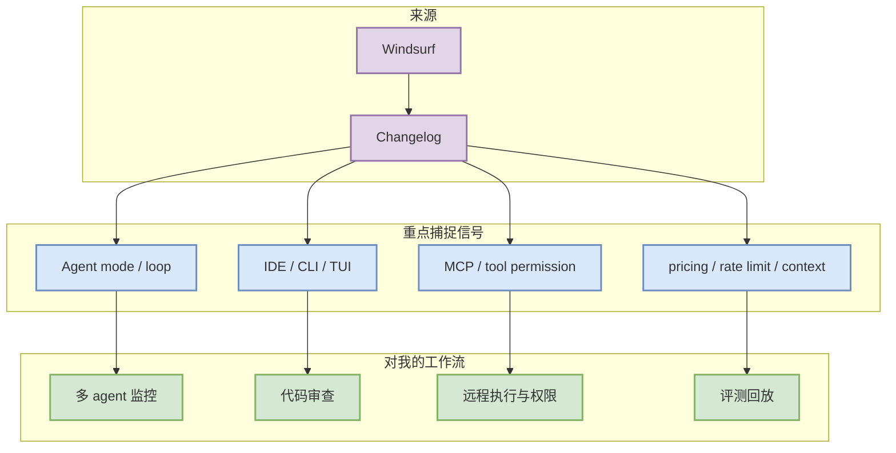

# Windsurf 工具更新扫描 - 2026-09-09

> 类型：Coding 工具 / AI 工具功能更新
> 工具/厂商：Windsurf / Windsurf
> 来源类型：Changelog
> 创建日期：2026-09-09
> 原文链接：https://windsurf.com/changelog
> 返回日报：[[Daily/2026-09-09]]

## 一句话结论
今日 Windsurf 保留固定扫描位；未确认需要升级为必读的新功能，但该来源继续影响 AI coding workflow 的权限、上下文、CLI/TUI 和 agent loop 设计。

## TL;DR
- **它是什么**：Windsurf 的 changelog/release 固定观察卡。
- **为什么重要**：coding-agent 工具的变化会直接影响多 agent 编排、代码审查、远程执行、权限模式和上下文窗口策略。
- **和我相关的点**：Cascade/agent loop/IDE 集成。
- **建议动作**：若后续出现 Claude Tag、agent mode、MCP、IDE 集成、pricing/rate limit 或远程执行变化，立即升级为深度阅读。

## 信息压缩图示

## 专业解读
固定工具扫描矩阵的价值是避免只追随热门 GitHub repo，而漏掉产品 changelog 中对工程效率影响更大的能力变化。今日没有把未确认更新写成事实，后续需要结合 release tag 和发布时间复核。

## 对我的影响
| 维度 | 影响 | 建议动作 |
|---|---|---|
| AI coding workflow | Cascade/agent loop/IDE 集成 | 每周对照 Codex / Claude Code / Cline / Continue |
| 权限与安全 | 关注 tool permission 和远程执行 | 建立默认最小权限策略 |
| Eval loop | 关注日志和回放能力 | 纳入 coding-agent 评测 checklist |

## 相关链接
- 原文：https://windsurf.com/changelog
- 返回日报：[[Daily/2026-09-09]]

#ai-radar #coding-tools #loop-engineering
