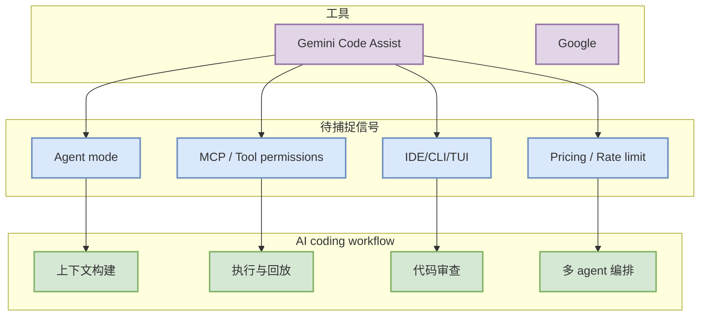

# Gemini Code Assist 工具更新扫描 - 2026-09-10

> 工具/厂商：Gemini Code Assist / Google  
> 来源类型：Changelog / Release Notes / Docs / GitHub Release  
> 原文：[https://cloud.google.com/gemini/docs/codeassist/release-notes](https://cloud.google.com/gemini/docs/codeassist/release-notes)

## 一句话结论
今日未确认 Gemini Code Assist 有必须进入“必读”的高相关新功能，但它仍是 coding-agent loop 的固定观察对象。

## TL;DR
- 今日状态：已扫描 / 低置信。
- 重点关注：agent mode、MCP、IDE 集成、远程执行、权限模式、上下文窗口、CLI/TUI、pricing/rate limit。
- 对我的影响：Google 生态 coding assistant 与 CLI/TUI agent 对照。

## 信息压缩图示

## 影响矩阵
| 观察项 | 为什么重要 | 今日动作 |
|---|---|---|
| 权限/远程执行 | 影响多 agent 安全边界 | 保留扫描 |
| 上下文窗口 | 影响大代码库任务质量 | 保留扫描 |
| MCP/插件 | 影响工具生态组合 | 保留扫描 |
| release tag | 判断是否需要升级 | 下次复核 |

#ai-radar #coding-tools #loop-engineering
